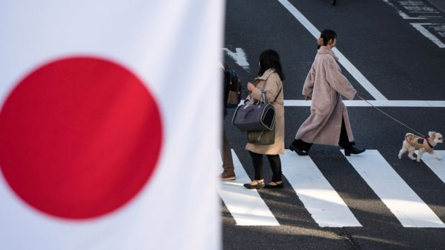
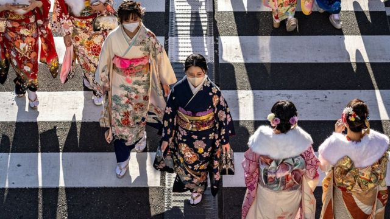
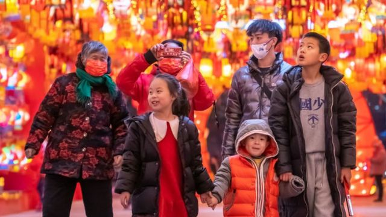

# [World] 日本“失落三十年”、乌克兰获坦克援助、美国枪击案等本周更多重要故事

#  日本“失落三十年”、乌克兰获坦克援助、美国枪击案等本周更多重要故事

> 图像来源，  Tomohiro Ohsumi

**1991年泡沫爆破后，日本至今尚未完全恢复元气。这个曾经象征着未来的亚洲国家，如今面对严重的人口萎缩，却仍然拒绝变革和接受外来移民。**

在欧洲，俄乌战争传来重要突破，德国和美国相继宣布将运送坦克到乌克兰。

农历新年之际，中国迎来疫情解封后首个春节，但在地球的另一端，美国加州接连发生多宗枪击案，枪手和受害人不少是亚裔人士。

刚刚过去的一周，BBC中文有以下新闻内容受到读者关注。如果你错过了，带你一一回顾。

##  1\. 日本“失落三十年”仍陷困境

> 图像来源，  Getty Images
>
> 图像加注文字，1月9日，在日本神奈川县横滨，年轻女性穿着和服庆祝“成人式”。

几十年来，日本一直在低迷的经济中挣扎，现在面临人口老龄化与萎缩。

但即使深陷困境，日本仍然对过去顽固地依恋，拒绝变革，社会维持着父权制，对移民的敌意也毫无动摇。

背后原因之一，是僵化的等级制度决定了谁掌握权力。目前这个以男性为主的统治阶层，被民族主义和日本的特殊信念所定义。

##  2\. 美德援助乌克兰主战坦克

一直不愿提供特定武器的美国和德国，将分别向乌克兰运送31辆美制“M1艾布兰”（M1 Abrams）坦克，以及14辆“豹2”（Leopard 2）作战坦克，以支持抗击俄罗斯的入侵。

乌克兰总统泽连斯基形容“这是通往胜利之路的重要一步”，并在推特上称“自由世界前所未有地团结在一起”。

##  3\. 美国加州三天内三宗枪击案

美国加州三天内发生三宗严重枪击案，1月21日蒙特利公园市（Monterey Park）舞厅枪击案11死，23日半月湾（Half Moon Bay）两处农场枪击案7死1伤，同日北加州奥克兰（Oakland）一个加油站也爆发枪战1死7伤。

在前两宗案件，枪手和受害人都是亚裔或华裔人士。

##  4\. 农历新年名称争议

> 图像来源，  Getty Images

网络出现农历新年的“名称归属权之争”，包括这个传统节日在英语中该被称作“Lunar New Year”，还是“Chinese New Year”？

迪士尼度假区在推特上发文时使用“Lunar New Year”，而非“Chinese New Year”，遭中国网民批评。不久后，大英博物馆在网络帖子中使用“Korean Lunar New Year”（韩国阴历/农历新年）也引发争议。

学者对BBC中文分析指，有关争议是背后是多元文化和跨国背景下的文化敏感性问题。

##  5\. 中国疫情推高棺材销售

中国官方公布的新冠死亡病例都发生在医院，但在医疗设施匮乏的农村地区，在家死亡的人大多没有被统计在内。

BBC发现的证据表明，死亡人数相当多，而且还在不断上升，

