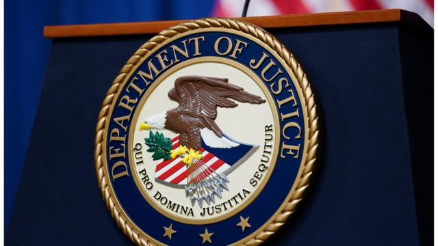

# [World] 中国工程师因在美国从事间谍活动被判入狱八年

#  中国工程师因在美国从事间谍活动被判入狱八年

  * Nicholas Yong 
  * BBC记者 

> 图像来源，  Reuters

**一名中国工程师因在美国从事间谍活动被判入狱八年，此案与中国窃取航空商业机密有关。**

美国司法部称，31岁的纪超群（音译）曾物色科学家和工程师，作为可能的招聘对象。

他还加入了美国陆军预备役，并对征兵人员撒谎。

美国当局称，纪超群在一个重要的中国国家情报机构的指导下工作。

去年9月，他被定罪，因为他在没有通知美国司法部长的情况下充当外国政府的代理人（间谍案中使用的一项指控），且向美国陆军做出虚假陈述。

根据美国司法部的一份声明，纪超群10年前持学生签证来到美国。

他被指控向江苏省国家安全厅提供有关八个人的信息，以进行可能的招聘。

这些人都来自中国大陆或台湾，已经入籍美国，其中一些人是美国国防承包商。

2016年，纪超群还加入了美国陆军预备役，该计划招募有对国家利益重要技能的外国人。美国官员表示，他在申请和采访中撒谎，称自己在过去七年里没有与外国政府联系过。

纪超群最终于在2018年9月被捕，此前他与一名假扮成中国国家安全部代表的美国卧底执法人员会面。

在那些会面中，纪超群解释说，有了他的军籍证件，他就可以参观航空母舰并拍摄照片。他还说，一旦他获得了美国公民身份并通过安全调查，他将去中央情报局、联邦调查局或美国宇航局求职。

美国官员称，纪超群打算在其中一家机构进行网络安全工作，这样他就可以访问所有数据库，包括科学研究的数据库。

美国当局表示，纪超群接受了中国国安部一位知名官员徐延军的指令，徐延军是首位被引渡到美国受审的中国情报官员。

去年，徐延军因密谋窃取通用电气等美国航空航天公司的商业机密，被判在联邦监狱服刑20年。

本月早些时候，通用电气前雇员郑晓庆（音译）因将雇主的机密信息泄露给中国政府，在美国被判刑两年。

去年7月，美国联邦调查局局长克里斯托弗·雷（Christopher Wray）表示，中国旨在“洗劫”西方公司的知识产权，这样就可以加快自己的工业发展，最终主导重要行业。

中国当时回应称，克里斯托弗·雷是在“抹黑中国”，具有“冷战思维”。

