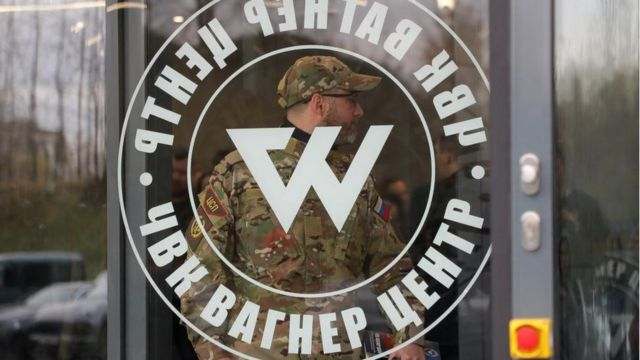
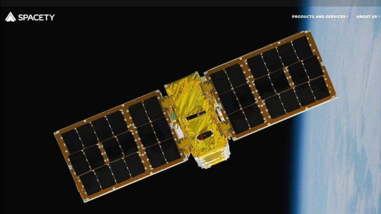

# [World] 乌克兰战争：美国制裁帮助俄罗斯雇佣军瓦格纳集团的中国公司

#  乌克兰战争：美国制裁帮助俄罗斯雇佣军瓦格纳集团的中国公司

8 小时前

> 图像来源，  Reuters
>
> 图像加注文字，瓦格纳集团是俄罗斯战争努力的一个关键伙伴，数万名瓦格纳雇佣军被派往乌克兰

**美国1月26日宣布制裁一家中国公司。这家公司涉嫌向俄方提供乌克兰的卫星图像，支持了俄雇佣军“瓦格纳集团”的作战行动。**

长沙“天仪空间科技研究院”是被美国财政部制裁的16家实体之一，也被称为 Spacety China，在北京和卢森堡设有办事处。

瓦格纳集团在乌克兰战争中为俄罗斯提供了数万名雇佣兵战士。

美国财政部的外国资产控制办公室在一份声明中表示，Spacety China 已向总部位于俄罗斯的技术公司 Terra Tech 提供了乌克兰地点的合成孔径雷达 (SAR) 卫星图像。

声明称，“收集这些图像是为了让瓦格纳能够在乌克兰开展作战行动。”美国财政部还宣布制裁这家中国公司位于卢森堡的子公司。

制裁内容包括，不得向目标实体转让、支付或出口在美国的任何资产或利益。

Spacety China 尚未对美国此举作出回应。

作为俄罗斯的亲密盟友，中国一直试图在乌克兰战争中将自己定位为中立方。中国曾因拒绝谴责俄罗斯入侵乌克兰而受到美国及其盟国的批评。

##  谁是 Spacety China?

> 图像来源，  AFP
>
> 图像加注文字，Spacety China 称自己是遥感卫星及科研卫星的“引领者”

在网站上，Spacety China 称公司“专注于SAR星座建设和SAR 卫星数据服务”，是商业化 SAR 遥感卫星及科研卫星的“开拓者和引领者”。

网站称，天仪研究院成立于2016年，共执行14次太空任务、发射卫星25颗、商业用户超过200家，目标是在2030年成为“世界一流的小卫星研制及数据服务商”。

SAR 是一种雷达技术，可以使用更短的天线提供更高分辨率的图像。

据 Spacety China 网站称，该公司的首席执行官杨峰是中国科学技术部的专家库专家、长沙市人大代表。

网站还列出了这家公司的一些合作伙伴，其中包括国有企业中国航天科技集团和中国电子科技集团等。

##  瓦格纳集团在乌克兰做了什么？

> 图像来源，  Reuters
>
> 图像加注文字，普里戈津最著名的照片之一是他正在为普京上菜（2011年11月11日，莫斯科郊外一家餐厅）。随后他获得“普京大厨”这个昵称。

去年3月，俄罗斯入侵乌克兰不久，美国官员就表示至少有一千名瓦格纳雇佣军部署在乌克兰东部： “我们知道他们在那里，”五角大楼新闻秘书约翰·柯比 （John F. Kirby）在去年3月份的简报会上说。 “我们知道，他们想扩大在乌克兰的存在。”
 英国国防部2023年1月情报更新称  ，“几乎可以肯定”瓦格纳现在在乌克兰指挥大约五万战士。

情报还说，瓦格纳组织去年开始大规模招募作战人员，因为俄罗斯在为正规军征兵上遇到困难。

美国国家安全委员会估计，派往乌克兰的大约80%的瓦格纳战士是从监狱招募的。

瓦格纳在俄罗斯的乌克兰战争努力中发挥着关键作用，并积极参与了俄罗斯试图夺取对乌克兰东部城市巴赫穆特（Bakhmut）控制的行动。

瓦格纳集团由叶夫根尼·普里戈津（Yevgeny Prigozhin）指挥，他是俄罗斯总统普京的亲密盟友。

##  美国为什么加大制裁？

除 Spacety China 外，被指构成瓦格纳全球支持网络一部分的其他 15 个实体、8 名个人和 4 架飞机（其中许多位于俄罗斯）也受到了美国制裁。

其中包括设在中非的 Sewa Security Services 和设在阿拉伯联合酋长国的 Kratol Aviation，他们被指提供飞机在中非、利比亚和马里之间运送人员和设备。

美国财政部和国务院在26日还宣布，将瓦格纳集团定性为“重大跨国犯罪组织”。

国务卿布林肯在一份声明中说，新的制裁意在“进一步阻碍克里姆林宫武装其战争机器的能力，”并称这一行动还能“促进对俄罗斯和其他相关侵权行为负责人的问责，对俄罗斯国防部进一步施压。”

美国财政部长耶伦（Janet Yellen）也表示：“对瓦格纳扩大制裁，以及对他们的同伙和其他支持俄罗斯军事综合体的公司实施新的制裁，将进一步阻碍普京武装和装备他的战争机器的能力。”

