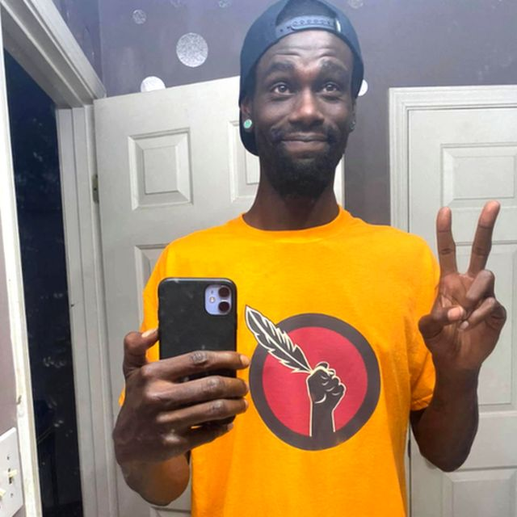
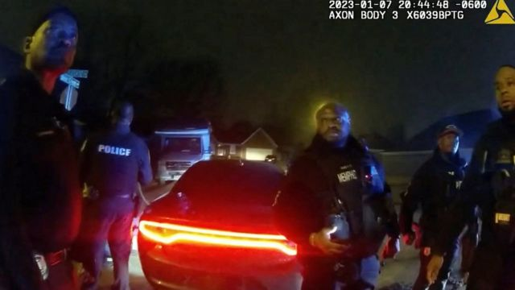
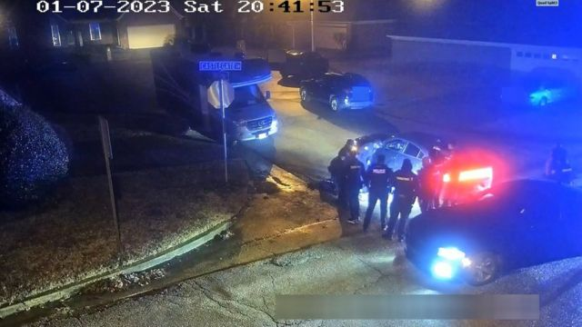
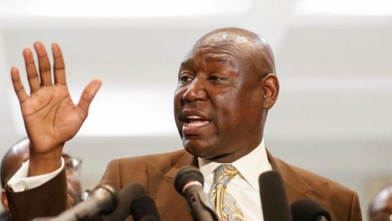

# [World] 美国再现警察施暴事件，尼科尔斯之死引发抗议和立法呼吁

#  美国再现警察施暴事件，尼科尔斯之死引发抗议和立法呼吁

> 图像来源，  Reuters
>
> 图像加注文字，尼科尔斯

**1月7日，29岁的非裔男子泰尔·尼科尔斯（Tyre Nichols）在美国田纳西州被5名警察殴打，随后死亡。代表尼科尔斯家人的律师呼吁美国国会通过警察改革紧急立法。**

##  发生了什么？

29岁的黑人尼科尔斯在1月7日因涉嫌鲁莽驾驶被警方拦截，三天后死亡。尼科尔斯的家人表示，尸检显示他遭到了严重殴打。

上周五，警方公布了四段有关视频，里面充满了暴力和咒骂。

视频显示，警察拦截了尼科尔斯的车辆，并且命令他下车。两名警察将尼科尔斯按倒在地，其他人则轮流对他拳打脚踢，并用一根警棍殴打他。

尼科尔斯的母亲说，当孟菲斯警察“谋杀”他时，她的儿子离家只有70米。

> 图像来源，  Reuters
>
> 图像加注文字，视频截图

> 图像来源，  Memphis Police
>
> 图像加注文字，视频截图

涉事警察都是黑人，他们面临严重伤害、严重绑架、不当行为和压迫罪指控。

监狱记录显示，塔达里乌斯·宾（Tadarrius Bean）、德米特里厄斯·黑利（Demetrius Haley）、小戴斯蒙·米尔斯（Desmond Mills Jr）、埃米特·马丁三世（Emmitt Martin III）和贾斯汀·史密斯（Justin Smith）被拘留。

这5名警察都是在过去6年里加入孟菲斯警察局的，在一项调查发现他们“对尼科尔斯的身体伤害负有直接责任”后，他们被解雇。

上周四（1月26日）的新闻发布会上，其中两名警察的律师表示，他们的当事人计划对这些指控进行抗辩。

马丁的一名律师表示，他的死亡“让警察感到震惊”。

“那天晚上那里没有人想让泰尔·尼科尔斯死，”律师梅西（William Massey）说。

##  呼吁立法

尼科尔斯家人的代表称，他是一个四岁儿子的父亲，也是一个滑板爱好者。他在联邦快递公司工作，最近还参加了一个摄影班。

视频发布后，孟菲斯发生了和平抗议活动，一些示威者阻塞了该市的一条主要公路，美国其他地方也举行了小规模示威活动。

许多抗议者举着横幅，要求为尼科尔斯伸张正义，并结束“警察恐怖”。

代表尼科尔斯家人的律师呼吁美国国会通过紧急警察改革立法。

在接受美国媒体采访时，本·克伦普（Ben Crump）敦促总统拜登用尼科尔斯的死为乔治·弗洛伊德警务公正法案争取支持。

他还说，尼科尔斯的母亲希望儿子的死能带来改变。

> 图像来源，  Reuters
>
> 图像加注文字，本·克伦普（Ben Crump）

“她从内心深处相信，泰尔带着使命来到这里的，她认为这场悲剧会带来好的变化，”克伦普说。

乔治·弗洛伊德警务公正法案于2021年推出。此前，一名白人警察跪在黑人弗洛伊德脖子上超过9分钟，随后弗洛伊德死亡，他的死引发了国际抗议。

该法案将禁止警察使用锁喉动作，并让起诉违规警察变得更容易。

2021年3月，当时由民主党控制的众议院议员通过了这项法案，但后来遭到参议院的反对。

“如果我们不以他的悲惨死亡为契机通过乔治·弗洛伊德警务公正法案，我们应该感到羞愧，”克伦普对CNN表示。

这位律师说，如果法律不改变，死于警察之手的事件还会继续发生。

