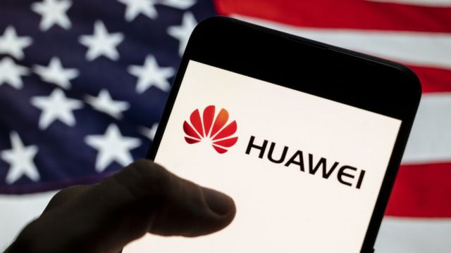

# [World] 美中科技战：美国据报停止美企对华为出口 中国谴责“科技霸权”

#  美中科技战：美国据报停止美企对华为出口 中国谴责“科技霸权”

> 图像来源，  Getty Images

**有报导称，美国政府已停止批准美国企业向中国科技巨头华为出口大部分产品和技术的许可证。**

与此同时，拜登政府也在继续收紧对中国出口技术的法规与政策。

华盛顿此前曾指责华为对美国国家安全构成威胁，并与中共合作。华为和北京方面一再否认上述指控。

国际媒体中首先报导美国进一步收紧对华为出口限制的英国媒体《金融时报》报道称，美国商务部已告知一些美国公司，将不再为向华为出口技术颁发许可证。

报导称，此举正值华盛顿采取行动、逐步全面禁止向中国电信设备巨头出售美国技术之际。

##  美国“不断评估政策和法规”

美国商务部发言人告诉BBC，“我们与能源部、国防部和国务院的跨部门出口管制合作伙伴密切合作，不断评估政策和法规，并定期与外部利益相关者沟通。”

发言人还说，对与特定公司的对话或相关考量不予置评。

《金融时报》报道还援引智库“新美国安全中心”（CNAS）的技术专家拉瑟尔（Martijn Rasser）说，华盛顿的最新举措是“相当重要一步”。

他说，（美国）商务部的举动部分原因是，华为公司与四年前专注5G时相比已经有了很大的变化，比如华为向海底电缆、云计算等领域扩展业务。

> 图像来源，  AFP

##  中国谴责“科技霸权”

华为尚未对有关报道发表评论。

中国外交部发言人毛宁在1月31日的例行记者会表示，中方对有关报道表示“严重关切”、正密切关注有关动向。

发言人还指责美国的行为是“赤裸裸的科技霸权”。

拜登政府一直在收紧对华为的限制。华盛顿和北京之间的政治紧张在台湾问题上升温，而世界上大多数芯片（晶片）都是台湾制造的。

10月份，美国负责工业和安全的商务部副部长艾伦·埃斯特维兹（Alan Estevez）表示，“我们正在尽一切努力保护我们的国家安全，并防止具有军事用途的敏感技术被中国的军事，情报和安全部门收购。”

毛宁在31日的记者会上还说，中方坚决反对美方“泛化国家安全概念”、无理打压中国企业，她还谴责这种做法“违背市场经济原则和国际经贸规则，有损国际社会对于美国营商环境的信心”，是“赤裸裸的科技霸权”。

##  华为和美中博弈

几年来，总部位于深圳的华为一直面临美国对5G电信设备和人工智能技术的出口限制。

2019年，在特朗普担任总统期间，美国官员将华为公司列入所谓的“实体名单”。

这意味着美国公司需要从政府获得出口或转让某些技术的许可证，特别是在担心这些技术会被中国军方使用的情况下。

但是，此后，包括英特尔和高通在内的一些美国公司也获得了许可证，向华为提供与5G无关的技术。

有分析曾经形容，中国的科技巨头华为公司已成为美中贸易战，甚至是美中全球博弈的一个重要筹码。

