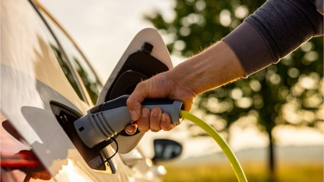

# [World] 全球投资竞争：英国是否已经落后

#  全球投资竞争：英国是否已经落后

> 图像来源，  Getty Images
>
> 图像加注文字，对推进能源转型、对绿色能源产业的投资是全球投资竞争中的重要领域。

**BBC经济事务编辑费萨尔·伊斯兰（Faisal Islam）分析2023年开端全球投资竞争格局，并质疑英国是否已经在全球的投资争夺中落后。**

当美国国会去年夏天通过拜登总统的《降低通胀法案》时，该法案似乎是建立在良好的意图之上的。该法案旨在促进美国的绿色经济和应对气候变化，包括为购买电动汽车和其他环保产品提供数十亿美元的补贴。

但是，这些补贴只提供给购买美国制造产品的消费者，有关的规定激怒了许多欧洲国家。他们认为这是一种伪装的企图，通过吸引欧洲公司将工厂迁往美国，从而来抢夺包括英国在内的欧洲高科技制造业份额。

欢迎关注全球绿色技术主导地位的竞赛，在这场竞争中，地球的未来和全球经济与一场潜在的风险地缘政治游戏交织在一起。

美国和欧盟争执不下，但一些东亚国家也在表达他们的不满，一些英国商界人士想知道英国在这个日益扩大的争吵中究竟处于什么位置。

虽然大多数国家都在补贴绿色技术，但拜登专门针对北美制造的汽车提供资金，这吓坏了许多盟友。购买在美国组装的乘用车的人现在有资格获得高达7千5百美元（约6千英镑）的税收减免。

##  买欧洲的？

许多欧洲公司都在拜登公布的《降低通胀法案》时宣布的美国汽车生产投资者名单上。但受影响的不仅仅是汽车业。

挪威化肥制造商Yara的老板霍尔斯特告诉BBC：“美国正在建立一个投资体系，为碳封存提供奖励，并为转向绿色制造提供奖励，以真正激励和推动投资的水平。”

但他表示，现在许多（欧洲）公司都在问：这对欧洲企业有什么好处？欧洲企业正在不停关闭，把新的投资投向美国。

与此同时，法国财政部长布鲁诺·勒梅尔告诉BBC：“我们不应该低估《降低通胀法案》的影响......法国总统马克龙已经非常清楚……首先，我们希望从美国政府那里得到一些让步。我们是朋友和盟友，所以我们希望获得一些豁免照顾。”

勒梅尔表示，他将很快与德国同行一起前往华盛顿表达这些担忧。事实上，德国总理舒尔茨已经与美国高级参议员和国会议员就《降低通胀法案》进行了直接讨论。

勒梅尔也不排除欧洲推出自己的“购买欧洲产品”绿色科技补贴作为回应美国举措的想法。

他表示，每个人心里都明白，在绿色产业这样的战略部门，总需要找到的某个时机，需要更多投资并进行某种欧洲式产品回购。

传统上，爱尔兰的领导人利奥·瓦拉德卡是美国在欧洲最亲密的盟友，而瓦拉德卡更为坦率。他表示，爱尔兰对美国的《降低通货膨胀法》并不满意。

瓦拉德卡表示，欧盟必须对美国的举措做出回应，这几乎肯定会涉及向欧洲企业提供国家援助和补贴。困难在于这样的话，欧美最终会陷入一场补贴战，一场补贴竞争。

显而易见的是，欧盟即将对美国的大规模吸引投资计划做出回应，尽管欧盟成员国也担心引发贸易战。白宫也意识到了这些问题，并成立了一个美欧工作组来考虑这些问题。

##  英国的立场如何？

英国在上述竞争中的立场不太确定。

虽然英国广播公司BBC了解到，英国商业和贸易部长们都向美国同行提出了他们的担忧，但他们的确切要求尚不清楚。英国商务大臣格兰特·沙普斯表示，英国不需要美国式的一揽子绿色激励措施，因为英国已经“在这场游戏中处于领先地位”。

他告诉BBC，实际上，英国已经进行了投资以获得可再生能源，这就是美国《降低通货膨胀法案》的全部内容。英国十年前就做到了这一点。

沙普斯说，这就是为什么英国不仅拥有世界上最大的海上风电场，还拥有第二大，第三，第四，还有另一个更大的风电场。

他还相信，绿色投资的问题最终可能会成为欧盟和美国的一场瓜分，英国不会在这个问题上被忽视。

他说，他与拜登的气候特使约翰·克里进行了交谈，沙普斯表示，美国正在做的大部分事情都是受欢迎的。实际上可能影响英国的那部分是保护主义的部分，它们是这项新法案需要摒弃的一部分内容。

##  美国方面怎么想？

按照英国政府领导人目前的说法是，他们与美国同行讨论了美国《降低通胀法案》后，认为这完全是意外，在起草这项立法时，美国“只是忘记了”欧洲，并在经济上对欧洲进行了“半侵略”。

令欧洲人放心的是，这一切都是为了针对中国，而不是欧洲。但毫无疑问的是，欧洲主要制造商正在日益关注这个涉及欧洲利益的问题。

一位欧洲领导人表示，虽然净零排放的需求确实倾向于要求欧洲在欧洲本土完成更多产品制造，北美也是如此，但有一条红线不应该被越过。

他告诉BBC，如果欧洲的出口生产、投资和就业开始跨过大西洋向北美那一边迁移，问题可能会变得棘手。

还有人担心这种竞争并不会因为“绿色技术”而结束。新冠疫情引发的供应链瓶颈促使各国重新考虑对东亚（而不仅仅是中国）制造的依赖。

欧盟和美国正在展开建设用于生产微芯片的新设施，主要的西方科技制造商都得到了巨额补贴。欧洲称之为“战略自主”，美国人称之为“加固朋友圈”或恢复对友好国家的供应链。

它标志着在许多行业正在经历巨大变革的时候，大量投资流从现有国家或地区转移出去。

这个过程可能会改变一代人的世界制造业格局。

英国企业界的一些人担心，欧盟和美国不仅会瓜分电动汽车投资，还会瓜分微芯片和其他关键技术投资。

很明显，“全球英国”在英国脱欧后寻求参与的“全球”已经发生了重大变化，对英国提出了未来根本性的战略问题。

