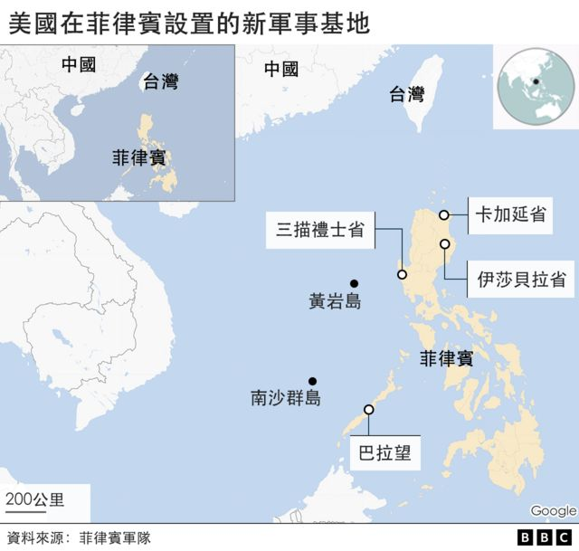
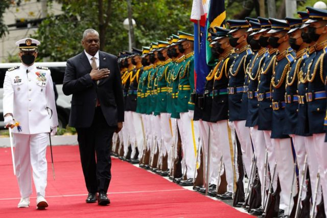
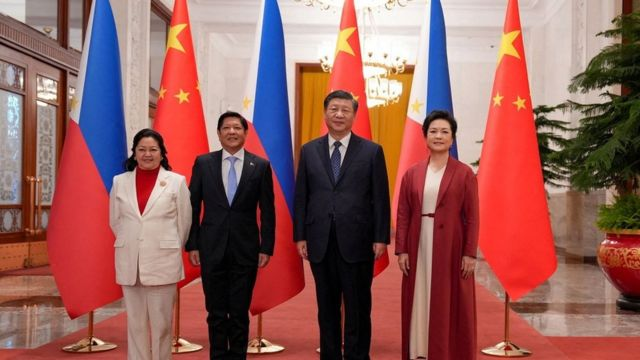

# [World] 菲律宾为美军增设四个基地 大规模驻军可能性不大

#  菲律宾为美军增设四个基地 大规模驻军可能性不大

  * 傅东飞（Rupert Wingfield-Hayes） 
  * BBC记者 发自马尼拉 

> 图像来源，  Reuters
>
> 图像加注文字，这并非回到1980年代，彼时有1万5千名美军和亚洲最大的两个美军基地驻扎在菲律宾，分别位于克拉克场（Clark Field）和附近的苏比克湾。

**美国已经获得了对菲律宾新的四个军事基地的使用权——这些重要地盘将为美军提供一个前沿据点，监视中国在南海和台湾周围的活动。通过这项协议，华盛顿填补了美国从韩国、日本到南边澳大利亚的太平洋岛链上的缺口。**

过去这个岛链上的缺口正是菲律宾，该国毗邻两个最大的潜在冲突爆发点，台湾和南中国海，或者马尼拉坚称的“西菲律宾海”。

根据2014年美菲两国签署的《加强防务合作协议》 （EDCA），美国此前已经可以有限使用位于菲律宾境内的五个基地。华盛顿在声明中称，此次新增的地点和扩大的准入权限，将“允许更快速地支持菲律宾的人道主义和气候造成的相关灾难， 并应对其他共同的挑战”。这很大可能是在暗指在该地区抗衡中国。

该声明是在美国国防部长奥斯汀（Lloyd Austin）今日（2月2日）在马尼拉会见菲律宾总统小马科斯之后发表的。白宮并未透露新军事基地位置，但其中三个基地可能位于菲律宾北部边缘的吕宋岛。如果不考虑中国，这是唯一最靠近台湾的大片陆地。

这一协议在一定程度上扭转了美国30多年前离开其前殖民地的局面，影响不容小视。

“没有菲律宾的准入，在南中国海的应急（行动）就无从谈起，”华盛顿智库战略与国际研究中心（CSIS）东南亚项目主任博林（Gregory B Poling）说，“美国不是在寻求永久性基地，这次是地盘而不是基地。”

也就是说，白宫正在寻求的是能在“需要的时候”进行补给和监视的“轻型和灵活行动”的据点的准入，而非驻扎大量部队的军事基地。

> 图像来源，  Getty Images
>
> 图像加注文字，美国防部长奥斯汀（右）在马尼拉会见了菲律宾总统小马科斯。美国已经获得了对菲律宾新的4个军事基地的使用权。

换言之，这并非回到1980年代，彼时有1万5千名美军和亚洲最大的两个美军基地在菲律宾，分别位于克拉克场（Clark Field）和附近的苏比克湾（Subic Bay）。

1991年，菲律宾政府叫停了这些基地。当时菲律宾人推翻了面目可憎的费迪南德·马科斯（Ferdinand Marcos）的独裁统治，也把旧的殖民主子送回家，进一步巩固菲国的民主和独立。而越南战争早已结束，冷战正在结束，中国还只是一个军事弱国。因此，1992年美国人离开了，或者，至少他们大多数人回到了美国。

往后推30多年，另一个马科斯——即小马科斯，或人们所熟知的“邦邦”——又回到了总统府马拉卡尼昂宫。

但更重要的是，现在中国不再是个军事弱国，它正在靠近菲律宾。

马尼拉惊恐但无力干预，眼睁睁的看着北京开始重绘南海地图。自2014年以来，中国已经建造了10个人工岛基地，包括在位于菲律宾专属经济区深处的美济礁（Mischief Reef）建设军事基地。

据此，菲律宾大学政治学教授卡夫特（Herman Kraft）向BBC解释，在那之前马尼拉和北京的双边关系没有什么大问题：“我们过去与中国在南海是彼此互利共生​​。但在2012年，他们试图夺取斯卡伯勒浅滩（黄岩岛）的控制权。然后在2014年，他们开始建造这些人工岛屿。中国掠夺土地的行为改变了双方关系。”

“我们对付中国威胁的能力非常有限，”菲律宾前驻美大使小库西亚（Jose Cuisia Jr.​​）告诉我说。

他强调，中国人一再违背不会把新南海基地军事化的承诺：“中国人已经将这些地方军事化，这使我们更多的领土受到威胁。只有美国有能力阻止他们。菲律宾无法单独做到这一点。”

> 图像来源，  Getty Images
>
> 图像加注文字，白宫正寻求进入能在“需要的时候”进行补给和监视的"轻型和灵活行动"的据点，而非驻扎大量部队的军事基地。

> 图像来源，  Getty Images
>
> 图像加注文字，2023年1月4日，在北京人民大会堂举行的欢迎仪式上，菲律宾总统小马科斯和第一夫人丽莎·阿拉内塔·马科斯与中国国家主席习近平及其夫人彭丽媛合影。

但是，这一次不会再有成千上万的美国海军陆战队员和空军出没在奥隆加波（Olongapo​​）或安吉利斯市（Angeles city​​）的红灯区了。

##  潜在据点

有关美军在菲律宾施行的暴力和虐待历史仍然是一个敏感话题。

当美国大兵父亲回去美国后，估计有15,000名儿童与他们的母亲留在菲律宾。

“我们的关系长期以来一直不平等，”左翼组织“新爱国联盟”秘书长雷耶斯（Renato Reyes）告诉记者。

“菲律宾被迫承担社会成本。当地留下了强暴、虐待儿童和有毒废弃物的历史。”他补充说。

该国左翼团体强烈反对美国重返菲律宾。

虽然预计回到菲律宾的美国军队不会像过去那样庞大，但白宫现在要求进入几个新据点，一些是面向南海，另一些面向北面的台湾。 非官方报告点出了卡加延省（Cagayan​​）、吕宋岛上的三描礼士省（Zambales）、巴拉望岛（Palawan）以及伊莎贝拉省（Isabela）这几个地方。

卡加延省面对台湾，三描礼士省对着黄岩岛（又称斯卡伯勒浅滩，民主礁，Scarborough Shoal），巴拉望则面对南沙群岛（斯普拉特利群岛，Spratly Islands）。

任何新的美国设施都将设在现有的菲律宾基地内，而美军将分小组轮流进入。

博林告诉BBC，这样做的目的是阻止中国在南海进一步扩张领土，同时也为美国提供一个观察中国在台湾周围军事行动的据点。

博林又解释，“除了这个联盟之外，菲律宾没有办法阻止中国......马尼拉正在从印度购买布拉莫斯（BrahMos）超音速反舰飞弹。美国则想部署战斧巡航导弹（Tomahawk cruise missiles）。它们一起可以控制中国船舰。”

随着对台湾冲突的忧虑日益加剧，菲律宾可以为美国的军事行动提供一个“后方通道”，甚至是一个撤离难民的地方：“别忘了有 150,000 到 200,000 名菲律宾国民在台湾工作。”博林告诉BBC。

但克拉夫特教授警告说，马尼拉不会成为美国联盟的亲密成员来挑战或抵御中国崛起。

“菲律宾没有像澳洲和日本那样做事情，去直接挑战北京在南海或东海的利益。马科斯总统希望与美国保持好关系。但他也希望与中国保持友好以获得经济利益。”

北京则表示，不打算让马尼拉和华盛顿之间的新基地协议破坏中国与邻国的关系。在美国国防部长抵达马尼拉之际，中国官媒《环球时报》刊发社论批评白宫“给菲律宾设下陷阱，试图将菲律宾推到与中国对抗的前线”。

“我们又一次被夹在中间，”左翼联盟的雷耶斯告诉我说，中国和美国一样是一个资本主义帝国。“菲律宾仍然有殖民心态——它把美国视为自己的老大哥。”

