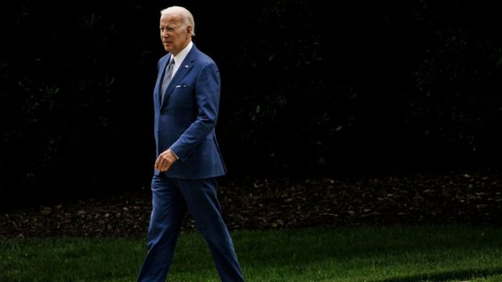
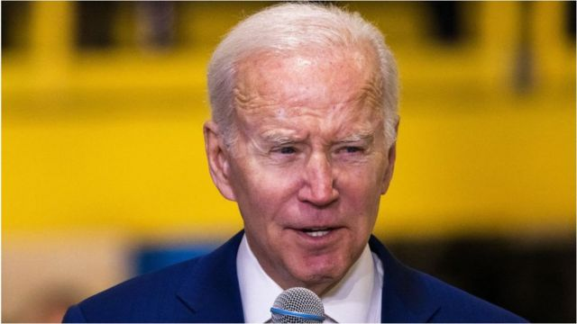

# [World] 美国FBI搜查拜登度假屋：律师称未在特拉华州住所找到机密文件

#  美国FBI搜查拜登度假屋：律师称未在特拉华州住所找到机密文件

> 图像来源，  Getty Images

**美国总统拜登的律师表示，联邦调查局（FBI）在搜查他位于特拉华州霍博斯的家时没有发现机密文件。**

拜登的律师在一份声明中表示，周三的搜查是在总统的“全力支持”下“计划的”。

此次近4个小时的搜查涉及对机密文件处理的更广泛调查。

联邦调查局尚未对此次搜查发表评论。由于这是双方同意的，所以没有搜查令。

拜登的律师鲍勃·鲍尔（Bob Bauer)表示，为了“行动的安全和完整性”，搜查是“在没有事先通知公众的情况下”进行的。

鲍尔表示，搜索从当地时间8点30分到12点，“没有发现带有机密标记的文件”。

鲍尔还说，有一些似乎是拜登2009年至2017年担任副总统期间的“材料和手写笔记”，被带走进行“进一步审查”。

这是去年11月华盛顿特区宾夕法尼亚大学拜登外交与全球参与中心办公室发现机密文件后，在多个地点进行的一系列搜查中的最新一次。这在当时并没有公开。

在去年12月和今年1月进行的搜查中，拜登位于特拉华州威尔明顿的另一处住所被发现了更多文件。

虽然仅在1月份的搜索中就发现了至少12份机密文件，但目前还不清楚被发现的机密文件的确切数量。

拜登表示，他的团队做了“他们应该做的事情”，立即通知了官员，他们正全面配合调查。

在1月的第一次搜查之后，拜登告诉记者，这些文件被锁在一个车库里。

“它们又不是放在街上，”他说。

这次最新搜查的前一天，特别检察官罗伯特·胡尔（Robert Hur）正式开始监督对这些文件的调查。

美国前总统特朗普和前副总统迈克·彭斯也因机密文件而陷入争议。

在彭斯的案件中，根据他的律师发给国家档案和记录管理局的一封信，在他位于印第安纳州卡梅尔市的家中发现了“少量带有机密标记的文件”。1月19日，联邦调查局从该物业的一个保险箱中找到了这些文件。1月23日，又有两箱文件被送到了国家档案馆。

2022年8月，对特朗普佛罗里达州海湖庄园的搜查中国发现了数十个箱子和约1.1万份文件，其中约100份带有机密标记。

在搜查令发布之前，特朗普的代理律师表示，所有政府记录都已归还。特朗普一再否认有任何不当行为，并声称他已经解密了随身带的文件。

##  文件故事继续

> 图像来源，  Getty Images

**BBC驻北美记者安东尼·泽克尔（Anthony Zurcher）**

美国司法部对拜登度假屋的搜查，为这起已持续近一个月的机密文件事件增添了新的变数，目前有一名特别检察官监督调查。

联邦调查局的举动可能会揭示拜登团队在审查储存在他个人住所中的文件是多么及时和彻底。在大多数情况下，拜登的律师一直在对总统的私人住所进行自己的审查，没有政府调查人员的严密监视。尽管他们在总统威尔明顿的家中发现了机密材料，但他们表示，总统的海滨住所没有发现此类文件。

至少，搜查将有助于平息共和党人表达的一些担忧，即政府让拜登受到的审查和怀疑程度低于特朗普。去年8月，联邦调查局搜查了特朗普的海湖庄园。当拜登的律师首次披露，他们在拜登的家和私人办公室发现了机密材料时，前总统、众议院议长凯文·麦卡锡（Kevin McCarthy）和其他保守派人士公开质疑，为什么现任总统没有成为政府调查人员的目标。

但是现在拜登的辩护者指出，拜登的多处房产已经被搜查，但没有迹象表明联邦调查局调查了特朗普在新泽西和纽约的住宅。

