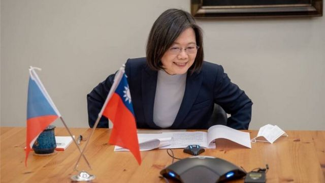
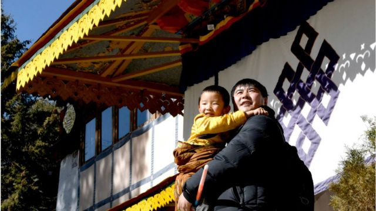

# [World] 中国气球“闯”美国、台湾捷克领导人通话、菲律宾增美军基地等本周重要故事

#  中国气球“闯”美国、台湾捷克领导人通话、菲律宾增美军基地等本周重要故事

> 图像来源，  Getty Images

**美国国务卿布林肯访问北京前夕，美中两国在贸易科技战和台湾等问题上持续对立，中国巨型气球闯入美国领空事件，更成为压垮骆驼的最后一根稻草，让访华行程告吹。**

台湾议题方面，捷克总统当选人与台湾总统蔡英文通话，引起北京强烈不满。美国在菲律宾新增四个军事基地，也被指是为了制衡中国在台海的活动。

中国四川省公布“非婚生育”等宽松措施，是尊重生育权的重要一步，但能否挽救人口危机成疑。

禁书有着悠久而不那么光彩的历史，但它并没有消亡：它仍然是一个生机勃勃的行业。

刚刚过去的一周，BBC中文有以下新闻内容受到读者关注。如果你错过了，带你一一回顾。

##  1\. 中国气球“误入”美国领空 布林肯推迟访华

美国西部蒙大拿州发现疑似中国间谍气球，飞经敏感军事地点上空，中国称气球是用于气象研究的民用设备。

事件造成巨大轰动，拜登政府决定无限期推迟国务卿布林肯的访华行程。

此前，美中关系持续紧张，双方在贸易科技战及台湾等问题上刀光剑影。

##  2\. 捷克总统当选人与蔡英文通话

> 图像来源，  President Office, Taiwan
>
> 图像加注文字，帕维尔与蔡英文通话15分钟。台湾外交部长吴钊燮也参与谈话。

1月30日，捷克总统当选人帕维尔（Petr Pavel）与台湾总统蔡英文举行电话会议。

帕维尔在推特发文说，双方同意加强两国关系，期待未来与蔡总统亲自见面。

中国外交部向捷方提出严正交涉，称帕维尔“罔顾中方多次劝阻和交涉，执意同蔡英文通电话”，是违背一个中国原则。

##  3\. 菲律宾增四个美军基地

美国国防部长奥斯汀（Lloyd Austin）到访菲律宾期间，美菲两国同意扩大2014年签署的《加强防务合作协议》（EDCA），菲方将会多开放四个军事基地供美军进驻，让美国在菲基地总数增至九个。

这四个新基地部分选址据报邻近台湾和南海，分析认为是要应对台海紧急情况。

通过这项协议，华盛顿填补了美国从韩国、日本到南边澳大利亚的太平洋岛链上的缺口。

**4** **. 中国四川放宽“非婚生育”**

> 图像来源，  Getty Images

中国四川省卫健委公布新规定，生育登记取消了是否结婚的限制，今年2月15日起施行，有效期五年。

官方回应指，新规并非鼓励非婚生子，而是为了保证“未婚先孕”人群的权益。

人口专家对BBC表示，新规是是尊重民众生育权的一种进步，但对提高中国低迷的生育率影响甚微。

**5** **. 什么书“危险”到必须禁止的程度？**

> 图像来源，  Getty Images
>
> 图像加注文字，《尤利西斯》曾经名列当局禁书榜单

书籍承载知识，而知识就是力量。也正因此，书籍对当权者 —— 政府和自封的领袖之类人物 —— 构成威胁。他们希望垄断知识并控制公民的思想，而对书籍行使这种权力的最有效方法就是下禁令。

禁书有着悠久而不那么光彩的历史，但它并没有消亡：它仍然是一个生机勃勃的行业。又哪些书“危险”到了必须禁止的程度？

