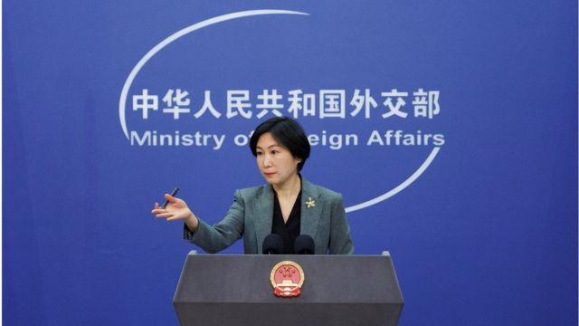

# [World] 中国承认飞行物“误入”美国领空 华府斥侵犯主权推迟布林肯访华

#  中国承认飞行物“误入”美国领空 华府斥侵犯主权推迟布林肯访华

最近更新： 6 小时前

**中国外交部在周五（2月3日）晚上承认飞越美国领空的飞行物体是属于中国的“民用飞艇”后，美国国务院宣布，推迟国务卿布林肯（Antony Blinken）原定下周初访华的计划。**

美国国务院一名高级官员周五晚上向BBC表示，华府留意到中国已表示遗憾，但此事是无可置疑的侵犯主权和违反国际法，当局经内部咨询后认为目前情况下不应出访，否则议程将大幅收窄。

不过，该官员说，当局仍然相信透过外交来处理关系，并致力在任何时间保持开放沟通，包括就今次的事件，布林肯将会在情况许可下尽早访华。

在華府宣佈其決定前不足3小時，中国外交部发出声明，承认该“民用”飞行物体属于中国，用于气象等科研。

外交部表示：“受西风带影响，且自身控制能力有限，该飞艇严重偏离预定航线。中方对飞艇因不可抗力误入美国表示遗憾。中方将继续同美方保持沟通，妥善处理这次因不可抗力导致的意外情况。”

美国国防部官员较早之前称，他们确信“高空侦察气球”属于中国。它最近出现在美国西部蒙大拿州上空。

但美国军方领导人决定不将其击落，因为担心残骸掉落产生危险。

> 图像来源，  Getty Images
>
> 图像加注文字，美国国务院宣布，推迟国务卿布林肯访华的计划。

加拿大周五（2月3日）表示，它正在监测涉及侦察气球的“可能的第二次事件”，但没有说明幕后国家。加拿大在声明中表示，正在与美国紧密合作，以“保护加拿大的敏感信息免受外国情报威胁”。

官员指，气球周三（2月1日）出现在美国蒙大拿州比林斯市之前，飞越了阿拉斯加的阿留申群岛和加拿大。

一位不愿透露姓名的美国高级国防官员表示，政府准备了包括“F-22”战斗机在内的战机，以备白宫下令击落它。

美国国防部长劳埃德·奥斯汀（Lloyd Austin）和美国参谋长联席会议主席马克·米利将军在内的高级军事领导人周三开会评估了这一威胁。奥斯汀当时正在菲律宾旅行。

但他们建议不要对气球采取“动能行动”，因为掉落的碎片可能会对地面上的人员造成危险。

美国蒙大拿州人口稀少，有马姆斯卓空军基地（Malmstrom Air Force Base），也有全美仅有的三个核导弹发射井之一。官员们表示，这显然是侦察气球，正在敏感地点上空收集信息。

但这名国防官员表示，美国情报遭到破坏的“威胁并未显著增强”，因为美国官员“确切知道这个气球的位置以及它经过的确切位置”。

他还说，这对民用航空也没有威胁，因为气球的高度“大大”高于商业航空公司使用的高度。

星期四在五角大楼举行的简报会上，官员们拒绝透露气球目前的位置。他们也拒绝提供其更多细节，包括它的大小。

“有报告称，尽管它在空中很高的地方，但飞行员看到了这个东西，”这位不愿透露姓名的国防官员说，“所以你知道，它是相当大的。”

他们还说，过去几年也曾追踪到这种监视气球，但这次这个气球“似乎停留了更长时间”。

蒙大拿州的社交媒体用户对此感到困惑，一些用户发布了天空中一个白色圆形物体的图片。还有人报告称，在该地区看到了美国军用飞机，飞机显然是在监视该物体。

比灵斯的办公室职员多克（Chase Doak）告诉美联社，他注意到“天空中有一个白色的大圆圈”，于是回家拿了一台更好的相机。

“我想这可能是一个合法的UFO，”他说，“所以我想确保我记录下它，并尽可能多拍了照片。”

事件在中国社交媒体上被广泛讨论，许多人对报道中使用气球进行监视感到有趣。

“我们有这么多卫星，为什么还要用气球。”一名用户在微博上写道。

美国共和党参议员、美国国会参议院情报委员会副主席马尔科·卢比奥（Marco Rubio）抨击了中国所谓的气球。

他在推特上写道：“在过去5年里，中国针对我们国家的间谍活动明显变得更加猛烈和明目张胆。”

蒙大拿州州长、共和党人强佛特（Greg Gianforte）在一份声明中说，他已经听取了有关简报，情况“令人深感不安”。

美国中央情报局局长威廉·伯恩斯（William Burns）周四在华盛顿特区举行的一场无关活动上发表讲话，他没有提到气球，但称中国是美国目前面临的“最大的地缘政治挑战”。

气球是最古老的监视技术之一。与其他空中监视设备相比，它们可以在没有人员的情况下操作，费用低廉，同时能够长时间置于空中。

##  中国回应

> 图像来源，  Reuters
>
> 图像加注文字，中国外交部发言人毛宁回应说，中方正在了解核实情况。

中国外交部发言人毛宁在周五下午回应说，中方正在了解核实情况， 强调中国一直严格遵守国际法，无意侵犯任何主权国家的领土及领空。

她还表示，事实真相澄清之前，猜测及炒作无助于妥善解决问题，中方正在了解核实情况，希望双方能共同冷静及谨慎处理。

不过，在同日晚上9时35分，中国外交部网站发出声明，承认该“民用”飞行物体属于中国。

声明写道：“该飞艇来自中国，属民用性质，用于气象等科研。受西风带影响，且自身控制能力有限，该飞艇严重偏离预定航线。中方对飞艇因不可抗力误入美国表示遗憾。中方将继续同美方保持沟通，妥善处理这次因不可抗力导致的意外情况。”

在外交部发表这篇声明之前，中国官方媒体《环球时报》周五发表报道称，多位相关领域专家认为美方的指控欠缺依据，探空气球从中国本土飞往美国大陆的可能性很小，“在美国上空从事监视活动”更是无稽之谈。

报道引述空间科技信息专家，科技情报公司觅熵科技负责人刘明称，这种探空气球从中国本土飞往美国的概率极小。

刘明认为，这种探空气球一般都在平流层高度飞行，方向难以控制，通常都是借助风力飞行，或者是通过“发气”的方式控制方向，因此气球的生命周期有限，想从中国本土释放，精准飞往美国军事要地上空可能性微乎其微，这些探空气球更有可能来自在美国西海岸航行的各国商船。

《环球时报》还在推特上评论称：“如果其他国家的气球真的能顺利进入美国大陆，甚至进入某些州的上空，那只能证明美国的防空系统完全是摆设，不值得信任。”

