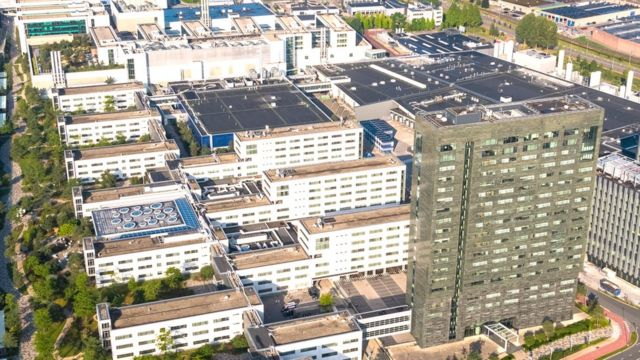
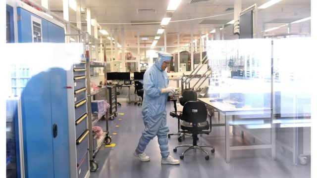
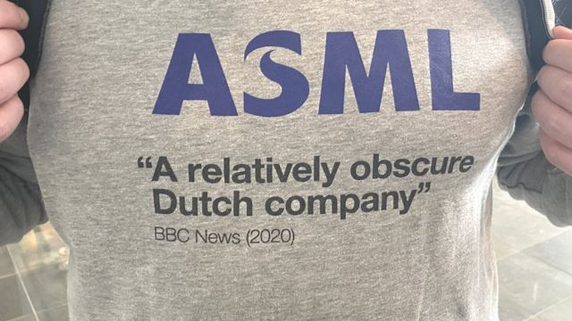
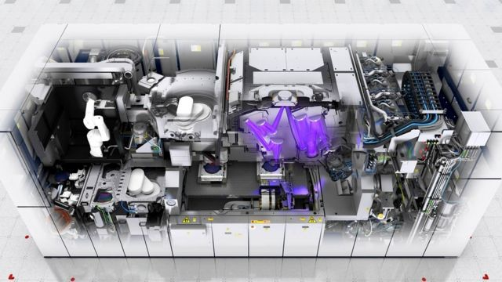

# [World] 中美科技战 BBC记者探究冲突焦点中的荷兰芯片机巨头艾斯摩尔

#  中美科技战 BBC记者探究冲突焦点中的荷兰芯片机巨头艾斯摩尔

  * 卡梅尔·欧格拉迪（Carmel O'Grady）& 马修·肯永（Matthew Kenyon） 
  * BBC记者 

7 小时前

> 图像来源，  ASML
>
> 图像加注文字，艾斯摩尔公司鸟瞰图

**从外面看，它就像一座普通的公司大楼，用了大量的玻璃和钢铁建造，但这座位于荷兰南部的工厂属于艾斯摩尔（ASML），从这里生产制造的机器绝非普通。**

事实上，这里的技术非常先进，在国际市场有很大的需求量，以至于艾斯摩尔成为欧洲最有价值的技术公司。

这家工厂究竟制造的是什么呢？

艾斯摩尔设计和制造的机器用来生产制作计算机芯片，但它们生产的计算机芯片可不是普通的计算机芯片。

艾斯摩尔的机器能生产世界上最先进的计算机芯片，而且它所拥有的芯片生产技术在世界上独一无二。

这种有效的垄断意味着艾斯摩尔公司有世界上最严格的企业安保措施，严守机器如何运作生产的商业机密。

尽管如此，我们还是被安排参观了它的工厂，并了解了它的基本生产过程。

微芯片是通过在硅晶圆上一层一层地建立复杂的晶体管或微型电子开关而制成的。

> 图像来源，  Getty Images
>
> 图像加注文字，这里有世界上最干净的工作环境，任何疏忽留下指纹都会造成昂贵的损失。

它们是用光刻系统打印出来的，在打印过程中光被投射到这些微型开关的设计图案上。

然后使用先进的光学技术对光线进行收缩和聚焦，并将图案蚀刻在光敏硅片上。

正是这个图案形成了硅芯片的电路，最终可能出现在电脑、电话或任何其他你所能想到的电子设备中。艾斯摩尔最先进机器的关键技术在于，它们可以通过产生超细的，仅13.5纳米的极紫外光在微小范围内工作。

艾斯摩尔的桑德·霍夫曼（Sander Hofman）把这种技术与使用不同笔尖的笔相比。“由于波长很小，你就好比是在用很细的线画这些集成电路的线条，而不是用老一代的机器，像是用很粗的马克笔在画。”

用如此精细的电路在硅上蚀刻的能力也就意味着可以在硅上添加更多的元件，这反过来又意味着电子设备可以在保持相同尺寸的情况下拥有更多的处理能力和更多的内存。

机器在真空中运行，因为蚀刻芯片的整个过程可能会受到最微小的杂质，比如皮肤颗粒的破坏。

当我们参观工厂时，技术员布拉姆~麦提森（Bram Matthijssen）正在组装艾斯摩尔的一项最新设计，他所工作的环境堪称地球上最清洁的。

“有些时候，我们必须在手套上戴上手套，以确保我们不会留下任何指纹，确保我们不会把任何额外的灰尘带入机器。”

他说：一个手指印就能对机器造成重大损害。

机器本身是非常庞大和复杂的。一台极紫外光（EUV）机器的组装和交付可能需要一年时间。

去年，公司只交付了50台最高规格的机型，而总共交付的机器也仅400台。

这些销售，加上管理和升级现有机器的收入，使该公司去年赚了227亿美元。

他们正在筹备的订单价值是这个数字的两倍。销售的增长意味着员工人数的增长，在过去的12个月里生产员工也增加了三分之一。

> 图像加注文字，2020年BBC曾经在报道中称艾斯摩尔是“一个名不见经传的荷兰公司”，工作人员将这样的评论印在了衣服上。

技术研究公司CCS Insights的顾问韦恩·林（Wayne Lam）说，艾斯摩尔制造的机器需要几年甚至几十年的时间来开发和完善。

艾斯摩尔从21世纪初就开始研究其最高规格的机器，该领域的其他公司要想赶超需要做相当大的努力。

他说：“我相信竞争已经在进行中......然而，在短期内，还没有任何对手能与艾斯摩尔真正展开竞争。”

对于这家曾被英国广播公司(BBC)描述为“名不见经传”的公司来说，这应该不是坏消息。霍夫曼先生把BBC的这句评论印在了衣服上。

作为全球电子行业的一个重要组成部分，艾斯摩尔公司可谓树大招风。

目前这家公司发现自己陷入了美国和中国之间的竞争。

中国长期以来一直想制造最先进的计算机芯片，为此它需要艾斯摩尔的机器。

> 图像来源，  ASML
>
> 图像加注文字，这幅插图显示了艾斯摩尔极紫外光微影（EUV）机器的复杂内部结构，紫色部分就是极紫外光。

但自2019年以来，美国实际上一直在阻挠艾斯摩尔向中国出口这些机器。

海牙战略研究中心的战略分析师乔里斯·提尔（Joris Teer）说，美国很希望阻止中国在芯片技术方面的追赶。

他说：“美国已经改变了目标，从与对手保持好几代技术的优势，到必须保持尽可能大的领先优势。这也可能意味着必须尽可能地让对手处于落后的劣势。”

有报道称，荷兰和美国当局已经就艾斯摩尔的出口达成了协议，但细节尚未公布。

这一消息公布后艾斯摩尔在回应的声明中表示，在立法得以实施之前，任何限制出口的行动都需要相当长的时间。

从长远来看，艾斯摩尔首席执行官彼得·温宁克（Peter Wennink）认为公司业务不会受到出口限制的严重影响。

他说：“如果半导体不能在中国制造，它们将在韩国、美国、欧洲或台湾制造。因此，我们的这些机器最终都是要外销出去的，因为世界需要这种能力。”

