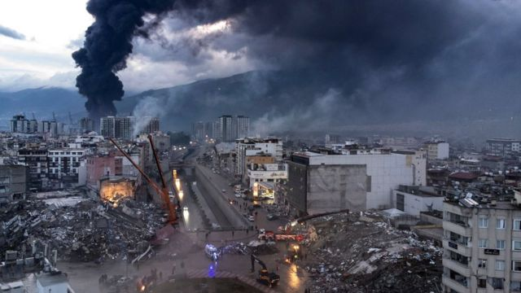
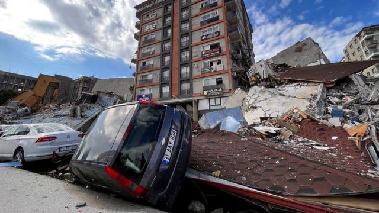
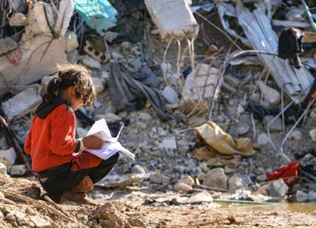
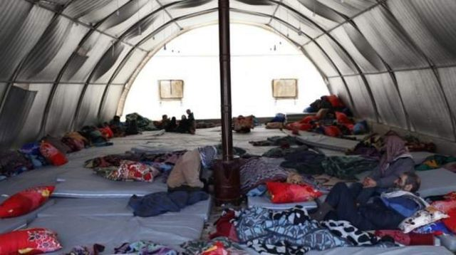
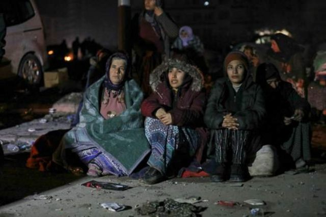
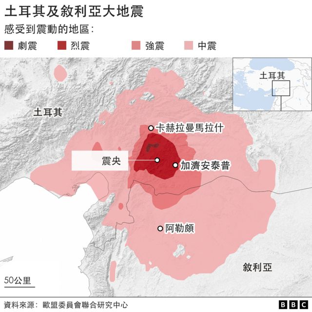
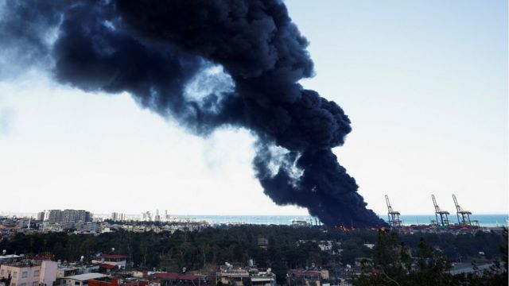

# [World] 土耳其叙利亚大地震：寒冷、愤怒、无家可归的灾民，港口大火与战乱中的灾区

#  土耳其叙利亚大地震：寒冷、愤怒、无家可归的灾民，港口大火与战乱中的灾区

> 图像来源，  EPA
>
> 图像加注文字，土耳其伊斯肯德伦

**周一发生在土耳其和叙利亚的大地震死伤惨重，遇难者的遗体遍布在街上，搜救团队继续寻找幸存者。**

截至北京时间2月8日16点，位于土耳其南部和叙利亚北部的灾区已有超过9000人丧生，其中土耳其死亡人数超过6957人，叙利亚死亡人数大约2500人。

联合国警告说，可能有数千名儿童丧命。国际救援也接踵而至。

土耳其紧急机构（AFAD）表示，65个国家和地区已派出2600多名救援人员前往灾区，协助土耳其救灾。土耳其总统埃尔多安此前称，目前已经至少有45个国家和组织表态愿意提供人道援助到灾区，包含处于战争状况下的俄罗斯与乌克兰，还有日本及韩国都派出搜救队前往救灾协助。

台湾外交部表示，这两天已经派出超过100人组成的搜救队前往土耳其灾区支援，并表示台湾政府捐赠土耳其的金额提高至200万美元。台湾民间捐助给土耳其救灾者众，因为1999年台湾发生921大地震时，土耳其当时在第一时间派遣救难队来台协助，台湾民间此刻力求回报。

中国政府已向土耳其派出救援队。中国国家国际发展合作署副署长邓波清也在周二(2月7日)表示将向土耳其提供首批4千万元人民币紧急援助。中国红十字会已分别向土耳其和叙利亚各提供20万美元援助。澳大利亚总理阿尔巴尼斯也表示将向土耳其提供首批约1000万澳元的人道主义援助。

以下为BBC记者从土耳其城市安塔基亚等地发回的报道。

> 图像加注文字，星期一的 7.8 级地震，在当地时间凌晨4点17分，在加济安泰普市周遭发生。接着还发生一次几乎震级相同的余震。

> 图像来源，  Getty Images

> 图像来源，  EPA
>
> 图像加注文字，叙利亚境内的灾民

> 图像来源，  Getty Images
>
> 图像加注文字，土耳其哈塔伊省的灾民面临严寒的威胁。

##  愤怒的灾民

星期一的 7.8 级地震，在当地时间半夜4点17分，在加济安泰普市周遭发生。 接着而来的余震几乎一样大，震央位于卡赫拉曼马拉什省（Kahramanmaras）的埃尔比斯坦地区。

土耳其总统埃尔多安宣布受地震影响最严重的 10 个省份进入为期3个月的紧急状态。他表示，这些措施将允许救援人员和财政援助进入受灾地区，但没有提供更多细节。

大约 70 个国家正提供援助，但在一些地方，人们对援助的速度不够快感到越来越愤怒。在安塔基亚市，一些死者躺在人行道上数小时。救援人员和救护车很努力的应对这场大灾难。

失踪者的家人在废墟中寻找亲人。 一群人使用大锤和其他工具发现了困在瓦砾中一男一女的尸体，亲属呼吁官方救援人员使用电动工具提供帮助，但救援者说他们必须专注于寻找生者。加入救援的人们继续挖掘，直到尸体被抬了出来。

但是，民众对没有足够的救援越来越愤怒。

一位当地的女士告诉 BBC，救援人员曾来到她男友家的大楼拍照，他们认为那里有 11 人被困其中，但救援人员没有回来。她说他们在几个小时内都能从倒塌的大楼残骸中听到说话声传出，但随后声音就没了。

> 图像加注文字，许多受害者在饱受战争蹂躏的叙利亚北部，那里有数百万难民生活在与土耳其交界处两边的营地。

在赫拉曼马拉什省北部，靠近第二次大地震的震央，山区道路被逃难者堵住了，救援人员因此迟迟无法到达。

一排排建筑物倒塌成堆，救援人员正在努力工作，而刺骨的寒风将废墟中的烟雾和灰尘吹进了他们的眼睛。现在，流落在街头的幸存者不得不寻找食物，并焚烧他们找到的家具取暖。 预计本周晚些时候，气温将降至零度以下。

##  港口大火

土耳其的港口城市伊斯肯德伦（Iskenderun）的情况与此类似，现在无家可归的人正在远离建筑物的空地上避难。

BBC采访到一位正在和孩子和孙辈一起避难的女士，其中包括一名患有癫痫症的 6 岁儿童。 救援人员给他们带来了羽绒被和一些面包，但到目前为止她们还没有其他支援。

“我很伤心，”当地一家医院的医生告诉路透社说， “我在里面看到尸体，到处都是。虽然由于我的专业知识，我已经习惯看到尸体，但对我来说这还是很难受。”

由于一场大火，伊斯肯德伦的港口已经关闭，直至另行通知，这意味着运载前往地震灾区的货物的船只正在改道。这场大火被认为是地震导致一个装满石油的集装箱翻倒起火，火势蔓延到周围货物。

> 图像来源，  Reuters
>
> 图像加注文字，由于一场大火，土耳其伊斯肯德伦的港口已经关闭，直至另行通知，这意味着运载前往地震灾区的货物的船只正在改道。

由于地震造成的破坏和其他容器现在堵塞了港口，紧急灭火队难以进入现场。 试图使用消防船扑灭大火的尝试失败了。

##  情况危急

还有报道称，当地现在很难向叙利亚北部提供援助，尤其是在反对派控制的地区。 那里的控制权在政府和其他反对派团体之间分配。 由于持续的内战，各团体间仍在冲突中。

甚至在地震发生之前，该地区大部分地区的情况就很艰困。现在，天气寒冷，基础设施摇摇欲坠，霍乱爆发给许多住在那里的人带来重重苦难。

事实上，超过400万人，主要是妇女和儿童，地震前就已经在依赖国际援助。尤其是叙利亚西北部已成为最难到达的地方之一，土耳其边境上只有一个小的过境点可以将资源运送到反对派控制的地区。

联合国（UN）周二（2月7日）表示，由于路线受损，暂时停止向叙利亚提供援助，但不清楚何时会重新开启。叙利亚的联合国特使称，任何支持都必须来自国内，而不是跨越与土耳其的边界，因为他们担心反对派控制地区可能出于政治原因而被拒绝援助。

毁灭性的灾难场景中点缀着短暂的希望时刻。一名在阿夫林市（Afrin）附近的灾难废墟下出生的婴儿，被救难人员发现仍依附在分娩后死亡的母亲身上，婴儿活了下来。

##  你们为什么没有早点来？

**BBC记者** **欧兹特克（Fundanur Ozturk）** 发自土耳其伊斯肯德伦

> 图像来源，  EPA
>
> 图像加注文字，土耳其伊斯肯德伦

“你来晚了，一切都来不及了！”亚如（Arzu Dedeoglu） 对着刚刚抵达土耳其南部伊斯肯德伦港（Iskenderun）的救援人员大喊大叫。

这个受地震影响的小镇是土耳其南部受灾最严重的地区之一。

亚如的两个侄女仍被困在废墟下， 她的哭嚎声打破了 Numune 地区现在令人毛骨悚然的寂静。

救援人员行动停止了一下，但女孩的家人恳求他们不要停下来。“请不要离开——也许我的孩子还活着。”他们的母亲说。

在这个地区还存有一种强烈的愤怒感。

亚如抱怨土耳其灾难和应急管理局 (AFAD) 反应迟缓。 她说，居民已经用自己的资源安排了一台挖掘机来清除房屋残骸，但官员们却不允许居民使用。

“我们一直等到深夜，但没人来。我们用自己的方式带来了一台挖掘机，但他们不想让我们使用它——他们阻止了我们。我们有两个孩子困在废墟下：我姐姐的女儿 Ayşegül 和 İlayda。她们现在不在了，她们不在了。”

“我希望他们能在中午之前到来。我们自己也提供了一台发电机。我们努力了，但自从发生余震以来，我们不得不撤离公寓。在那一刻之前，孩子们还有希望。如果你已经找到了那些救援物资跟工具，你怎么不早点来？”

“为什么不是昨天？”

再往前走一段路，还有一群人在已经变成废墟的圭勒兹公寓 （Güleryüz Apartmet）楼旁边等着。他们说，即使过了 24 小时，AFAD 也没有人来帮助他们。

还有另一支救援队在协助那里的人群。 我听到一名妇女对救援人员大喊：“你们昨天怎么没来，我们昨天还在废墟中听到人声！”

受害者告诉我，地震发生那天他们在等待救援。 但24 小时后，随着天黑，瓦砾中传出来的呼叫声逐渐消失。

另一个女人流着泪喊道：“如果你昨天来的话，我们本可以救他们的。”

“那些让我们独自一人的人不应该来要求我们的选票。”

建筑物上方冒出浓烟。 幸存者正在等待亲人获救。

“昨天以来，没有一队消防员来到这里。如果他们在地震中幸存下来，他们现在可能已经死于浓烟，”他们说。

看到摄影机后，阿里（Ali Önder ）走向镜头，让人们听到他的话：“我们那栋楼里还有八条人命。没有人来！ AFAD 仍然不在这里。那些抛弃我们的人，不应该来要选票。 绝不！”

土耳其将于5月14日举行议会和总统选举，外界普遍认为这是对土耳其现任总统埃尔多安（Recep Tayyip Erdoğan）的考验。他已经执政20年了。

