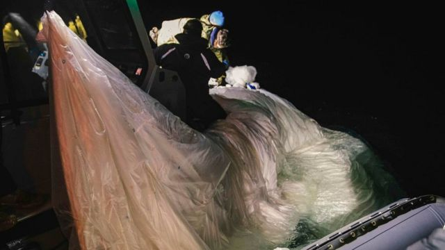

# [World] 中国气球：美国情报部门坚称是用于军事用途“收集战略情报”

#  中国气球：美国情报部门坚称是用于军事用途“收集战略情报”

8 小时前

> 图像来源，  US Fleet Forces Command

**美国情报人士坚称，上周六被美国击落的气球是中国军方用来进行间谍活动的。**

不愿透露姓名的美国情报部门官员告诉《华盛顿邮报》，他们认为这种气球是用来收集与领土相关的战略情报。

这些领土包括日本、印度、台湾和菲律宾。

中国官员已经否认使用这种气球进行监视。

这位美国官员告诉《华盛顿邮报》，美国情报界认为一些气球是从海南飞来的。这个位于中国南部的岛屿上有一个海军军事基地。

哥伦比亚广播公司（CBS）新闻部也援引一位不愿透露姓名的拜登政府高级官员的话证实：美国情报界认为气球是所谓“中国人民解放军在海南实施的空中监视计划”的一部分。

拜登政府的一位高级官员向哥伦比亚广播公司新闻部证实，美国周一向40个盟国介绍了所指称的中国间谍活动。

据报，在那次向盟国的通报过程中，美国副国务卿温迪·谢尔曼（Wendy Sherman）还透露，2019年时也曾有一个中国气球环绕地球飞行，曾经飞越夏威夷和佛罗里达上空。

据拜登政府官员称，负责监督国家情报事务的美国国会领导小组，即八人小组，将在周三听取关于这一事态进展的通报，国会将在周四听取最新情况。

上周，五角大楼说在哥斯达黎加和委内瑞拉上空发现了第二个中国间谍气球。

美国发现所谓的间谍气球导致美中之间一场外交争论。

美国国务卿安东尼·布林肯原定对北京的访问也被取消，他对北京的访问恰好定在首次发现气球的几天后。这次访问原本应该是美中两国之间多年来的第一次高层访问。

布林肯说：“中国的这一行动不可接受，也不负责任。发生在早就计划好的访问前夕，更是不负责任。”

##  中国：美方武力袭击中国“民用无人飞艇”

而中国外交部发言人毛宁在周三(2月8日）再次表态：“美国动用武力袭击中国的民用无人飞艇是不可接受的、不负责任的行为，中方已经提出了严正的抗议。”

毛宁还表示：“夸大和渲染中国威胁无益于中美的互信和关系改善，也不能使美国更安全。”

另外中国驻美国使馆临时代办徐学渊周二奉命就美方武力袭击中国“民用无人飞艇”向美国国务院和白宫国安会高官提出严正交涉。

徐学渊还“敦促美方不要採取进一步可能导致事态升级和复杂化的行动。中方保留作出进一步必要反应的权利。”

美国国防官员此前曾表示，在特朗普担任总统期间，至少有三个疑似中国间谍气球飞过美国上空。

而根据美国官员的说法，被击落的气球出现在美国蒙大拿州之前曾飞过阿拉斯加和加拿大，而阿拉斯加州有许多敏感的核导弹基地。

周一，美国海军公布了气球被击落后的残骸照片。

据信气球有近60米高，官员们说碎片散落在11公里的大西洋海域。

