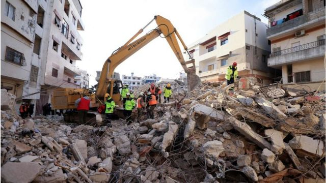
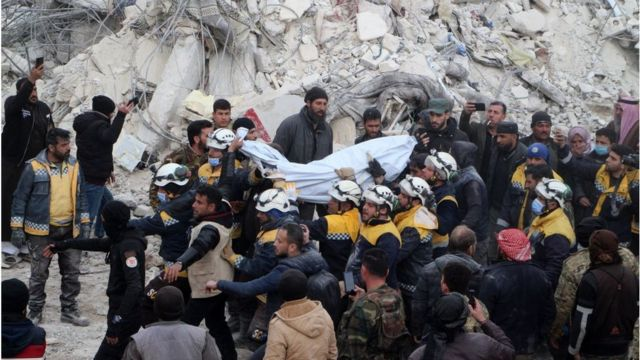
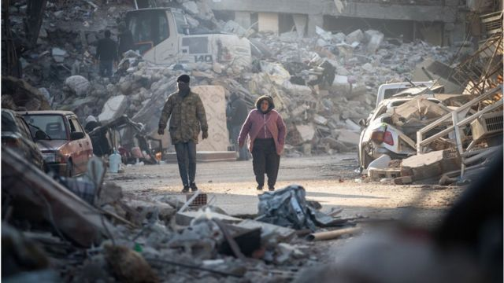

# [World] 土耳其和叙利亚地震：为何如此致命?

#  土耳其和叙利亚地震：为何如此致命?

  * 帕拉卜·戈希 （ Pallab Ghosh ） 
  * 科技事务记者 

> 图像来源，  Getty Images

**周一（2月6日）凌晨，靠近叙利亚边境的土耳其东南部发生强烈地震，造成2万多人死亡，多人受伤。**

地震发生在加济安泰普镇（Gaziantep）附近，随后发生了多次余震，其中一次的强度几乎与第一次地震一样大。

##  为何如此致命？

第一次地震强度很大，它被记录为7.8级，在官方震级中被列为“重大”。地震沿着断层线断裂了大约100公里，对断层附近的建筑物造成了严重破坏。

伦敦大学学院风险与减灾研究所所长、教授沃克（Joanna Faure Walker）说：“在任何一年最致命的地震中，过去10年只有两次震级相当，再之前的10年有4次。”

但造成破坏的不仅仅是地震的威力。

这起事件发生在凌晨，当时人们都在室内睡觉。

建筑物的坚固性也是一个因素。

英国朴次茅斯大学火山学和风险沟通准教授索拉纳博士（Carmen Solana）说：“不幸的是，在土耳其南部，尤其是叙利亚，抵御的基础设施并不完善，所以现在拯救生命主要依赖于震后响应措施。震后的24小时对寻找幸存者至关重要。48小时后，幸存者的数量会大大减少。”

这是一个200多年来没有发生过大地震或任何警告信号的地区，因此准备水平低于一个更习惯于应对地震的地区。

##  是什么引起了地震？

地壳是由独立的板块组成的，这些板块靠在一起。

这些板块经常试图移动，但由于与相邻板块的摩擦而无法移动。但有时压力会不断增加，直到一个板块突然移动，导致地表移动。

具体到这次地震，是阿拉伯板块向北移动，与安纳托利亚板块相撞造成的。

过往， 板块间的摩擦导致了破坏性极强的地震。

> 图像来源，  Getty Images

1822年8月13日，这种摩擦引发了这里一场7.4级的地震，低于周一记录的7.8级。

即便如此，19世纪的地震对该地区的城镇造成了巨大破坏，仅阿勒颇市（Aleppo）就有7000人死亡。破坏性的余震持续了近一年。

这次地震之后已经发生了几次余震，科学家们预计这次地震会遵循该地区上次大地震的趋势。

##  如何测量地震？

它们是用一种叫做矩震级（Mw）的标度来测量的。它取代了更广为人知的里氏震级，里氏震级现在被认为过时且不太准确。

地震的数字是断层线移动的距离和移动它的力量的结合。

> 图像来源，  Getty Images

2.5级或更小的震动通常感觉不到，但可以通过仪器检测到。震级达5级的地震都能感觉到，并造成轻微破坏。像土耳其这次发生的7.8级地震被列为大地震，通常会造成严重破坏。

任何高于8的震动都会造成灾难性的破坏，并可能完全摧毁震中的社区。

##  这次地震与其他大地震相比强度如何？

2004年12月26日，有记录以来最大的地震之一袭击了印度尼西亚海岸，引发的海啸席卷了印度洋周围的整个社区。这场9.1级地震造成约228,000人死亡。

2011年日本沿海发生的另一次地震为9级，在陆地上造成了大面积破坏，并引发海啸。这导致沿海的福岛核电站发生重大事故。

1960年，智利发生了有史以来最大的9.5级地震。

