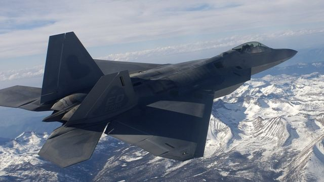
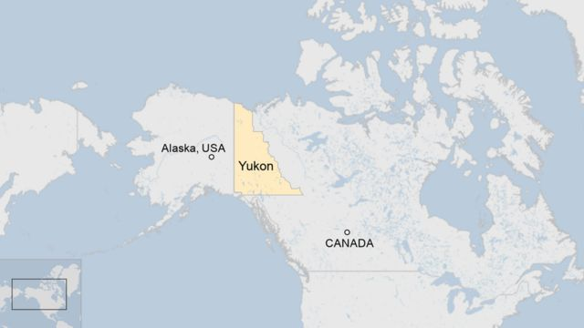
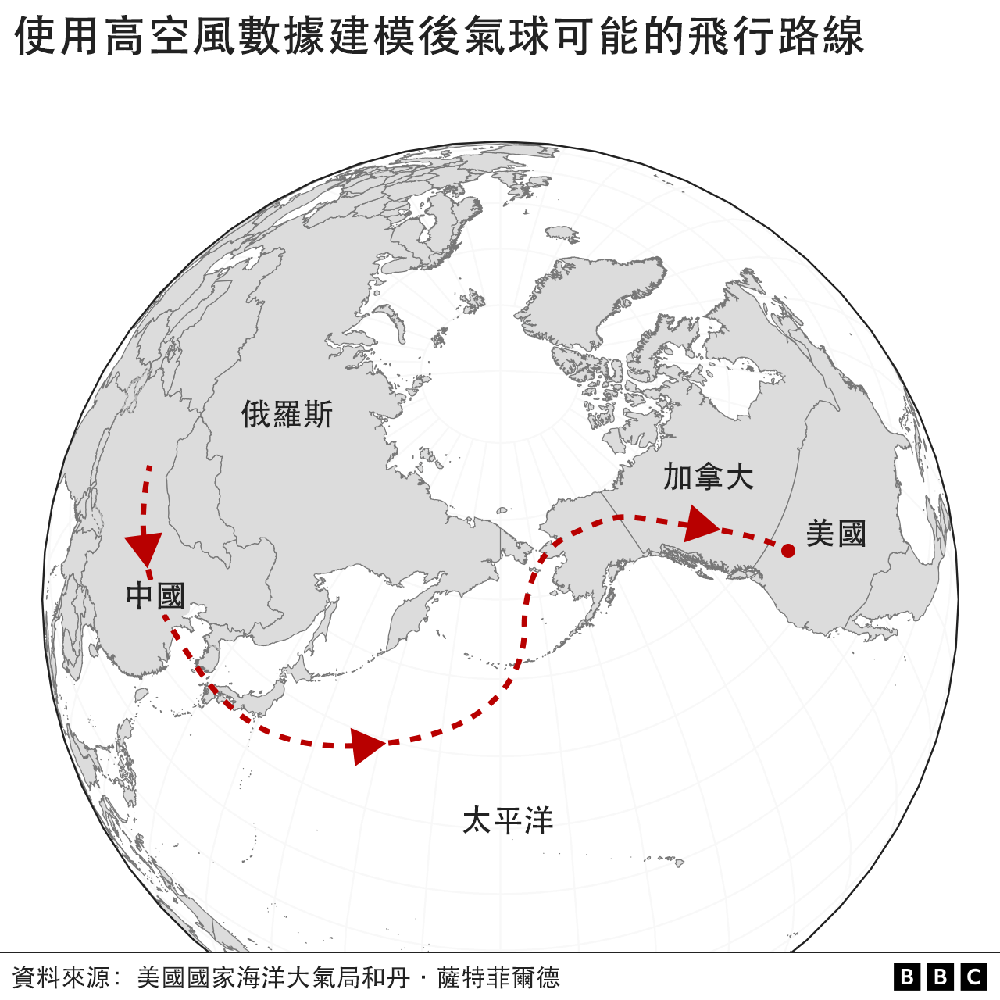

# [World] 美国加拿大军方在北美上空再击落一不明物体 白宫宣布制裁六家中国航太实体

#  美国加拿大军方在北美上空再击落一不明物体 白宫宣布制裁六家中国航太实体

> 图像来源，  Getty Images

**美国在本国领空中击落了两个飞行物之后，当地时间周六（2月11日），加拿大总理特鲁多（Justin Trudeau）证实，又有一个不明飞行物在加国领空被击落。**

他表示最新的飞行物体 “侵犯了加拿大领空”，在加国西北的育空（Yukon）地区被击落。该地区毗邻美国阿拉斯加。特鲁多说，加拿大和美国的飞机都共同出动追踪该物体，最后由美国的F22战斗机击落。

这是一周以来，在北美上空被击落的第3个物体。

北美的天空越来越不平静，第一个遭美国击落的气球被证实来自中国，造成美中外交争端，中国称该气球为民用，否认有任何监视行为并批评白宫政治炒作。

当地时间2月10日，隶属美国商务部的工业和安全局（BIS）公告称，以国家安全为由，限制对六家中国实体出口美国先进科技，五间企业及一间研究机构被美国列入贸易黑名单。美商务部指控这些实体支援中国人民解放军的航天计划， 包括提供气球及相关部件。

根据公开资料，被制裁的六家中国公司及研究机构分别是：北京南江空天科技股份有限公司；中国电子科技集团公司第四十八研究所；东莞凌空遥感科技有限公司；铱格斯曼航空科技集团股份有限公司；广州天海翔航空科技有限公司；山西铱格斯曼航空科技有限公司 。

##  加拿大上空的不明飞行物

美军2月4日在东海岸南卡罗来纳州附近领空击落了一个中国气球。周五（2月10日）在美西北阿拉斯加州上空击落了一个小汽车大小的不明物体。加国总理特鲁多则在周六（2月11）证实他下达命令，并与美国总统拜登（Joe Biden）进行了交谈。

他在 推特上  写道：“加拿大军队现在将回收并分析该物体的残骸。”

加国国防部长阿南德（Anita Anand）告诉记者，最新的不明物体在育空地区中部上空飞行，高度约为4万英尺（12000米），于当地时间周六15:41分左右被拦截击落。她描述该物体为“小型”和“圆柱形”，军方仍在进行回收工作并搜索更多细节。

> 图像来源，  Reuters
>
> 图像加注文字，加国防部长阿南德称，最新的不明物体在育空地区中部上空飞行，高度约为4万英尺，该物体为“小型”和“圆柱形”。

阿南德解释，物体是在离美国边境“大约100英里”处寻获，并补充说该物体对“民用航空构成合理威胁”。

她说：“（该不明物体）似乎比上周六在南卡罗来纳州海岸被击落的那个东西小。”这是指的是那个约60米长来自中国的巨型“疑似间谍气球”。

此外，特鲁多早些时候在推特上发帖感谢为加美两国执行防空任务，并领导这项工作的北美航空航太防御司令部（NORAD）。

白宫则说，在过去24小时内，美国跟踪并持续监测物体。声明说：“出于谨慎考虑，并在其军方的建议下，拜登总统和特鲁多总理授权将其击落。”

“两位领导人讨论了收回该物体的重要性，以确定其目的或来源的更多细节”。美国国防部提供了关于击落该物体的任务的更多细节，证实两架美国F-22军机从阿拉斯加安克雷奇军事基地起飞，该物体被AIM 9X导弹击落。

五角大楼新闻秘书莱德（Pat Ryder）准将补充说，联邦调查局（FBI）将与加拿大警方“密切合作”。

##  尚不清楚来源和功能

另外在周六（11日），美国军方也在蒙大拿州上空加派了战斗机，一些空域被关闭，但结果是 “雷达异常”，未发现任何异常。

在这个最新的物体出现在北美上空一周前，一个疑似间谍气球被美国击落海中。周六（11日），在拜登的命令下，另一个不明物体在阿拉斯加上空被追踪并击落。

在一份简短的声明中，美国军方表示，阿拉斯加国民警卫队和美国军队仍在冰上对当地时间周五击落的物体进行搜索和回收。

> 图像加注文字，最新的飞行物体在加拿大领空,育空（Yukon）地区被击落。

美军称目前没有有关该物体的功能、目的或来源的细节能公布，但确认美国联邦调查局正在阿拉斯加戴德豪斯区（Deadhorse）附近协助回收。

美国军方补充说：“北极的天气条件，包括风暴、大雪和有限的日光，是这次行动搜索的考虑因素，工作人员将调整回收行动，确保行动安全。”行动将在天气允许时继续进行。

上周末，美国防官员告诉媒体，中国气球的碎片降落在南卡罗来纳州外海 14米深的海水中——比他们预期的要浅。中国则否认这个气球——它于 1 月 28 日首次进入美国领空——被用于间谍目的，称它是一个误入歧途的气象装置。

> 图像加注文字，上周六被击落的中国气球可能的飞行线路分析

然而，白宫表示，该气球是飞越五大洲的侦察气球舰队的一部分。

气球事件导致美中关系紧张，国务卿布林肯取消了原定的北京之行。中国官员则指责美国“政治操纵和炒作”。在上周的一次采访中，拜登为白宫处理中国气球的方式辩护，称该气球并非“重大安全漏洞”。

