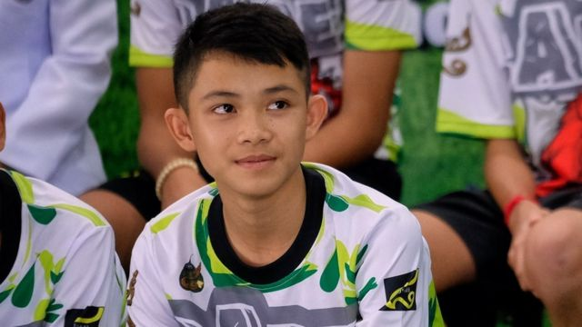
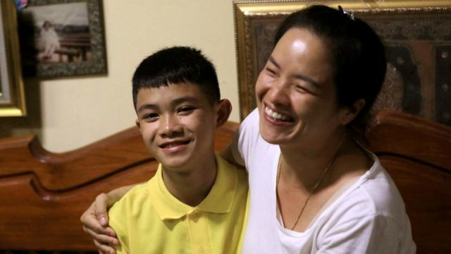

# [World] 泰国岩洞生还者魂断英伦 端沛小队长没能见证奇迹营救五周年

#  泰国岩洞生还者魂断英伦 端沛小队长没能见证奇迹营救五周年

> 图像来源，  Getty Images
>
> 图像加注文字，端沛当年与队友们熬过了伸手不见五指的黑暗。

**BBC获悉，2018年在泰国北部睡美人洞（Tham Luang）被困事件中脱险的野猪足球队队长端沛·蓬贴（Duangpetch Promthep）在英国一家足球学校留学期间意外去世，终年17岁。**

端沛自去年起就读英格兰中部莱斯特郡（Leicestershire）的这家寄宿学校。BBC获悉，端沛上星期天（2月12日）在宿舍被发现不省人事，送往医院救治，星期二（14日）不治身亡。

2018年6月，端沛与其他队员和助教共13人在清莱府睡美人洞探险期间遇上洪水，被困在漆黑溶洞内，18天后才获救，救援过程受到国际关注。

当时曾在现场采访救援过程的BBC东南亚事务记者黑德（Jonathan Head）说，潜水员发现他们，额前电筒照亮端沛的一刻，他的咧嘴笑容是整场营救行动中让人尤其印象深刻的其中一幕。

端沛的具体死因仍待有关方面公布，但莱斯特郡警察厅表示，端沛的死亡情况并无可疑；泰国媒体称端沛头部受伤。

东米德兰救护队（East Midlands Ambulance Service）一名发言人表示，端沛在星期天下午由救护车送往医院，救护队也曾派遣救护直升机到现场。

> 图像来源，  Royal Thai Navy
>
> 图像加注文字，端沛（右）被发现时已在漆黑中度过了九天，他仍对潜水员们报以笑容。

2022年8月，乳名小东（Dom）的端沛在Instagram上宣布考获奖学金，将到莱斯特郡马基特哈伯勒市（Market Harborough）的布鲁克豪斯学院足球学校（Brooke House College Football Academy）升学。野猪足球队上下为之振奋。

端沛当时写道：“今天我梦想成真了。”

时隔六个月，队员们得哀悼英年早逝的队长。

端沛的Instagram账户上满是关于足球的帖子，通常都带有“#足球是我的生活”（#footballismylife）标签。

他在1月发布的最后一篇帖子中，展示了他的“梦之队足球装备”草图——蓝色和粉色条纹的球衣、短裤、袜子和鞋。

##  端沛之死让大团圆结局黯然失色

**BBC东南亚事务记者黑德（Jonathan Head）**

> 图像来源，  Reuters
>
> 图像加注文字，2018年7月19日，获救的端沛（左）出院返家，与母亲塔娜彭（右）一同接受媒体采访。

“小东”端沛在英国的足球学院骤然离世，原因仍然不明。去年他赢得奖学金的时候，可是无比自豪。

这是一个一直满载正能量，激励人心的故事，如今首次蒙上了悲伤的阴影。

2018年7月这群泰国男孩从山洞中被救出的精彩传奇是那种新闻行业难得一见的事情：一个几乎天衣无缝的大团圆结局。

当他去年获奖学金负笈英伦，小东感谢设立这奖学金的前泰国国家队队长济科，并许诺努力学习。

他写道：“我会尽力而为。”看着他与队友们一路走来，备受世人瞩目，却如此不卑不亢，大家深信他能兑现承诺。

端沛的死讯在母亲塔娜彭（Thanaporn Phromthep）向清莱巨蝎寺（Wat Phra That Doi Wao）通报后传开，野猪队队员们随后相继发布吊唁信息。

BBC泰语网报道称，给端沛颁发奖学金的济科基金会（Zico Foundation）创办人，泰国国家足球队前队长“济科”卡迪苏克·塞纳芒（Kiatisuk Senamuang）表示，他在星期天接获端沛在英国宿舍晕倒的通知。据其所知，宿舍舍监马上报警将端沛送院抢救。

医院继而通知泰国驻英国大使馆，济科基金会则通知端沛母亲塔娜彭。塔娜彭表示希望能将儿子遗体运返家乡安葬，卡迪苏克表示将协调此事。

卡迪苏克认为端沛身体强壮，且据他所知，端沛并无旧患。

济科基金会也在其社交媒体上给端沛发帖致哀。

布鲁克豪斯学院校长伊恩·史密斯（Ian Smith）称，校方对端沛骤逝“深感悲痛和震惊”。他说：“我们与小东的家人、朋友、前队友和曾经参与过其生命的人一道悲痛，还有在泰国与本学院的国际大家庭里面受其逝去所影响到的每一人。”

济科基金会星期四（16日）在社交媒体上转发史密斯校长致全体师生与家长的信函，当中赞扬端沛泽心仁厚，希望他安息。

##  睡美人洞事件始末

2018年6月23日，野猪足球队队员在练习后一起骑自行车前往睡美人洞，那是他们经常游玩耍乐的地方。

然而，突发暴雨淹没山洞内极其狭窄的通道，将端沛等12名球员和一名助教困在山洞内。

事发首九天，青年们在山洞内面对一片漆黑，没有任何口粮。山洞外，1万名各方人员设法营救，最终被来自英国的潜水专家寻获，并陆续救出所有人。

端沛在山洞内度过13岁生日，其余队员当时年龄在11到16岁之间，助教艾卡丰·甘他翁（Ekkaphon Kanthawong）当时25岁。

男孩们利用石块挖掘试图逃生，助教则教导他们冥想，以保持平静，和减少氧气消耗。

在策划营救方案期间，潜水员给他们送上粮食，和来自家人的打气书信。为了将他们安全带出山洞，救援人员决定让他们服用镇静药物氯胺酮（ketamine），最后五名被困人员在7月10日重见天日。

这场营救成为国际新闻头条，后来更成为电影与著书题材。串流影视平台Netflix去年便出品了一部六集的迷你纪录片系列。

