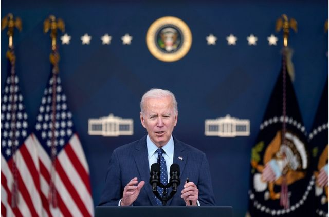
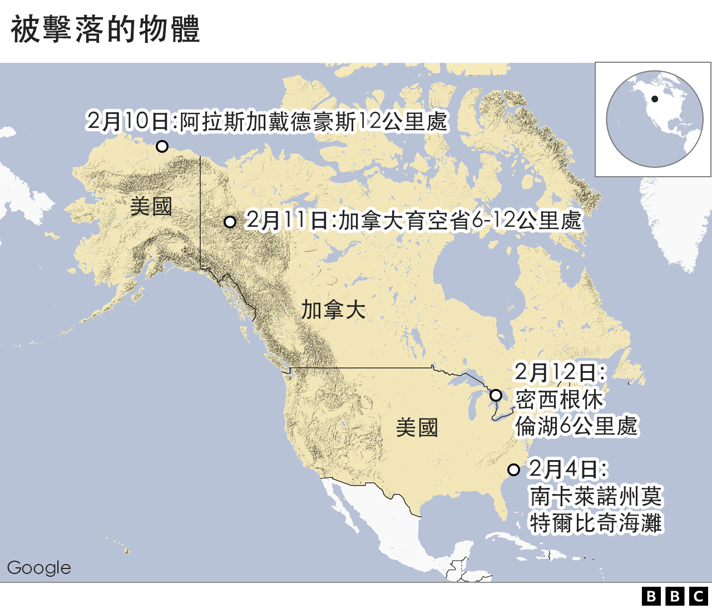
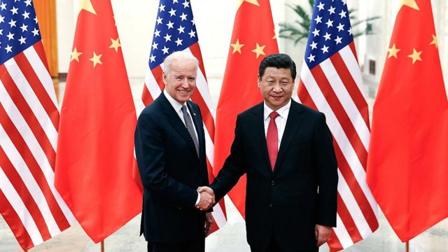
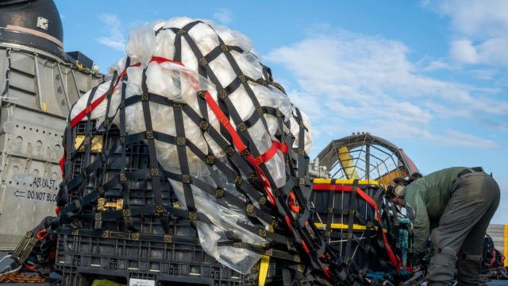
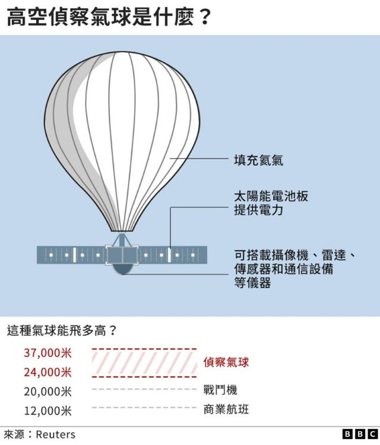

# [World] 拜登称不会为击落中国气球道歉但期待与习近平对话 北京宣布制裁美两大军火商

#  拜登称不会为击落中国气球道歉但期待与习近平对话 北京宣布制裁美两大军火商

> 图像来源，  EPA

**美国总统拜登（Joe Biden）表示，他不会为在美国海岸上空击落一个所谓的“中国间谍气球”道歉。**

他表示，被击落的中国气球是用来监视，但在北美上空击落的另外三个物体不太可能是外国间谍飞艇。

拜登又说，美国将改进针对类似空中飞行物的侦测。

美国总统拜登还称，他将要求北京就中国”间谍“气球入侵美国领空事件作出回应，并计划直接从中国领导人习近平那里得到回应。

他在周四（2月16）表示：”我期待与习主席交谈，我希望我们能查清这件事的真相。“但拜登强调，他不会为美国战机击落中国气球而道歉。

不过，中国否认该气球用于监视，并称该气球是在搜集天气数据时偏离了航线。

但是拜登重申了白宫官员的观点，即该气球在大西洋上空被美国战斗机击落之前，在约四万英尺的高度穿越美国，实际上是用于间谍活动。

在此之前，美国国会参院在周三（2月15日）晚审议通过两项决议案，谴责中国高空侦察气球侵犯美国主权。中国外交部回应称有关决议案“纯属政治操弄和恶意炒作”。

美国总统拜登周四说，华盛顿正在继续与北京就中国气球事件展开对话。拜登称“我们并非寻求一场新的冷战。”

至于谈到后来在阿拉斯加、加拿大西北部和美加边境休伦湖上空击落的另外三个飞行物时，拜登指出，情报部门认为它们 “很可能是与私营公司、娱乐或研究机构有关的气球”。

拜登说，为应对中国气球而引入的增强型雷达，可解释当局如何发现了这三个物体。

他表示：“这就是为什么我指示我的团队就如何处理这些不明物体向我提出更严格的规则，区分哪些可能构成安全或安保风险，需要采取行动，而哪些不需要采取行动。 “

拜登上述发言是在白宫认为有必要消除关于这三个飞行物是境外物体的说法之后发表的。白宫官员表示，这些缓慢移动的不明物体并未“对地面人员构成任何直接威胁”，它们之所以被销毁是为了保护美国的“安全、利益和飞行安全”。

康涅狄格州资深民主党议员吉姆·海姆斯（Jim Himes）此前在听取美国国家安全事务简报时表示，本周早些时候，美国的政策不应该是使用战斗机来对付所有高空物体。他告诉美国媒NPR说，“击落气球的军事任务是一件非常、非常昂贵的事情”，并补充称 “我们需要对此有更多考量”。

正在加拿大协调搜索这些被击落物品的加拿大皇家骑警周四表示，将暂停对休伦湖的搜索，部分原因是找到击落物体的可能性很低。

在回答是否会再次采取类似行动的问题时，拜登回应说：“别误会，如果任何物体对美国人民的安全和保障构成威胁，我就会把它拿下。”

##  拜登期待就气球事件与习近平对话

> 图像来源，  Getty Images
>
> 图像加注文字，拜登还称，他期待与中国国家主席习近平就本月的事件对话（图为拜登与习近平会晤的资料照片）。

不过，在接受美国全国广播公司（NBC）采访时，拜登拒绝透露计划何时与中国国家主席习近平进行对话。拜登称：“我认为习近平最不希望的是从根本上撕裂与美国以及与我的关系。”

美国媒体报道说，针对中国气球事件，拜登还承诺，美国外交官将向中国同行提出这个问题并追究责任。

北京方面重申，2月4日在美国上空被击落的中国气球只是一个被吹离航线的天气监测飞艇，中国否认该气球与间谍情报活动有关。

中国外交部发言人汪文斌周四在记者会敦促美国应该尽量避免“误解和误判”。他表示：“美方不能一边要沟通对话，一边激化矛盾、升级危机，而应同中方相向而行，管控分歧。”

在北美天空紧张局势加剧的情况下，美国军方官员2月17日表示，美国战机本周第二次拦截了在阿拉斯加附近飞行的俄罗斯战机。

由美加共同管理的北美航空航天防御司令部（Norad）在一份声明中说，这是与俄罗斯人的一次“例行”接触。

##  北京宣布制裁两家美国公司

虽然拜登希望平复此事件带来美中外交上的影响，但已经引发北京反弹。就在美国商务部在上周宣布制裁六家与“中国气球”相关的实体（其中一为研究单位）之后，中国随即在本周宣布，制裁两家美国防卫承包商公司。

在中国的制裁消息宣布之前一周，北京表示要对美国实体采取“反制措施”，以回应美国击落中国气球的事件。

> 图像来源，  Getty Images
>
> 图像加注文字，之前在南卡罗来纳州上空被击落的气球被官员描述为有3辆公共汽车加起来那么大。

中国商务部周四（2月17日） 表示  ，将美国洛克希德-马丁公司（Lockheed Martin Corp）和雷神导弹与防务公司（Raytheon Missiles & Defense）列入“不可靠实体清单”，两家公司被禁止向中国出口货物或进行新的投资，也禁止上述企业高级管理人员入境。

中国商务部的公告还宣布对这两家企业分别处以罚款，金额为各企业对台军售合同金额的两倍。北京称原因是它们参与了对台军售。

据《华尔街日报》报道，美国防务公司普遍被禁止向中国出售产品军售商品，因此此次制裁的实际影响微乎其微。此外，雷神亦是向中国航空公司提供商用飞机发动机和飞机零部件等的大厂商之一，也是美国给台湾提供军售的主要卖家。

不过，白宫发言人卡琳·让-皮埃尔（Karine Jean-Pierre）周四在白宫例行记者会上说，中国对两家美国国防承包商的制裁是“象征性”和“不必要的”。

许多分析亦称，中国制裁美国最大的两家防务承包商，这在很大程度上仍是一种象征性姿态，在气球事件后，两国经贸上的紧张关系持续加剧。

##  分析

**BBC驻北美记者安东尼·泽克尔（Anthony Zurcher）**

拜登承受着越来越大的压力。

众人要求他直接与大众说明所谓的中国间谍气球，以及美国战斗机在过去一周先后摧毁的三个不明物体。

星期四下午拜登这样做了——但他的短暂露面，对平息批评者或说服那些要求更多讯息和解释的人几乎没有作用。

因为，拜登没有说明这些物体的性质，也没有提供有关第一个中国气球的更多信息；他没有谈论中国气球首次被发现的时间、预期目的，也没有告诉我们最近的报导称该气球曾飞往美国关岛，但随后改变航线。 他也没有说明，为何在上周发生一系列事件后，现在就没有新的目标了？

作为一次卖力的解释性说明，拜登这次谈话是平淡无味的酱汁。作为公共关系的努力，它可能会失败。因为，它可能暂时让水面平静。但是，下一次当气球又飘入美国天空，或者战斗机争先恐后往天上飞去，导弹飞来飞去，这些问题将以新的紧迫性反扑回来。

