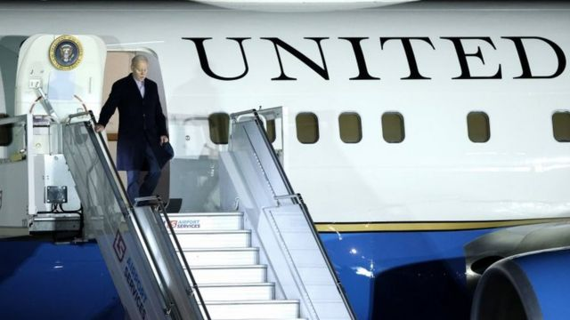
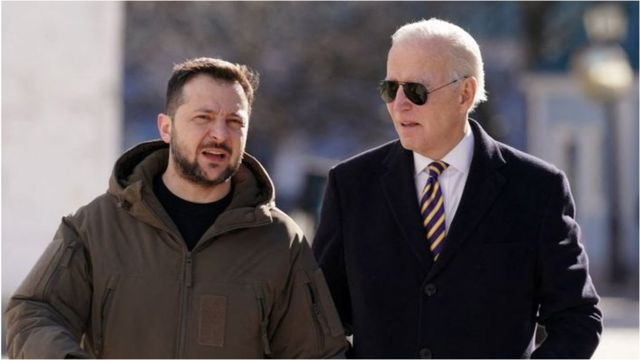
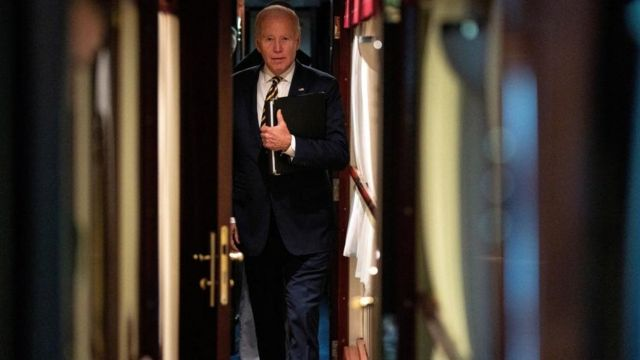

# [World] 乌克兰战争：拜登秘访基辅五小时更多细节披露，记者手机被收，行前已告知俄罗斯

#  乌克兰战争：拜登秘访基辅五小时更多细节披露，记者手机被收，行前已告知俄罗斯

> 图像来源，  EPA

**美国总统拜登在对乌克兰基辅的一次未事先宣布的访问中表示，美国将支持乌克兰对抗俄罗斯，“无论需要多长时间”。**

他说：“我们完全有信心，你们将继续获胜。”

这是拜登就任总统后首次访问乌克兰，而几天后的本周五就是俄罗斯入侵乌克兰一周年。

他说，俄罗斯总统普京认为俄罗斯可以比乌克兰及其西方盟友坚持更久是“大错特错”。

但路透社引用美国国家安全顾问沙利文在记者会上的发言称，美国在拜登出发前几个小时“出于消除冲突的目的”提前通知了俄罗斯。

据法新社报道，拜登这次秘密访问甚至乘坐了一架比通常美国总统外访时的座机小一号的波音757飞机，飞机起飞前也停在不同于往常拜登登机的位置，每个舷窗的盖子都被拉了下来。

> 图像来源，  EPA
>
> 图像加注文字，拜登抵达华沙机场的画面

> 图像来源，  Reuters
>
> 图像加注文字，拜登乘坐火车抵达基辅的画面

##  一揽子援助

拜登与乌克兰总统泽连斯基会面，两人还参观了一座纪念碑，纪念碑是纪念在俄罗斯吞并克里米亚、其代理人部队占领顿巴斯东部部分地区9年来牺牲的士兵。

白宫的一份声明称，拜登此行意在重申美国“对乌克兰民主、主权和领土完整的坚定承诺”。

他从波兰秘密坐了10个小时的火车到达基辅，后来又返回波兰。访问结束后，美国国务卿布林肯宣布向乌克兰提供价值4.5亿美元的一揽子安全援助，包括榴弹炮弹药和海马斯火箭系统，标枪导弹和空中监视雷达。

布林肯表示，美国还将向乌克兰额外提供1000万美元紧急援助，维持乌克兰的能源基础设施。

泽伦斯基表示，乌克兰战胜俄罗斯取决于决心，他在拜登身上看到了这种决心。

他还表示，两位领导人讨论了运送其它武器的可能性。泽伦斯基多次要求购买F16战斗机，但美国和其他盟国目前还未同意。

俄罗斯外交部发言人扎哈罗娃（Maria Zakharova）在评论此次访问时称，失败将降临在那些“把灵魂卖给美国人”的人身上。

虽然其他国家领导人在过去一年里访问过乌克兰，但美国总统是首次于战争期间出现在基辅，这场战争中美国士兵没有参战。

> 图像来源，  Getty Images

美国是乌克兰最大的盟友之一，美国国务院迄今已宣布向乌克兰提供249亿美元的军事援助。

今年1月，拜登宣布，美国将派出31辆主战坦克，远程导弹也在路上。

##  拜登的乌克兰之旅是如何保密的？

**BBC北美事务编辑** **莎拉·史密斯（Sarah Smith）**

> 图像来源，  Reuters

对美国总统来说，这是一次几乎闻所未闻的大胆之旅。

出现在经常受到攻击的战区，白宫官员称拜登对乌克兰首都基辅的意外访问是“现代前所未有的”。

他们表示，此前美国总统对战时伊拉克和阿富汗的访问都有大量美国军队的支持。

尽管媒体普遍猜测拜登可能会在访问波兰期间计划访问乌克兰，但这次访问还是让所有人都大吃一惊。

在基辅市中心的空袭警报声中，他出现在乌克兰领导人泽连斯基身边，传递的信息比他在波兰的演讲中所说的任何话都要响亮。

拜登原定于周一晚间从美国飞往华沙，进行为期两天的访问。提前安排的行程中有两个可疑的长空档，很多人此前都想知道，这是否是他溜进乌克兰的时间。

在白宫每日新闻发布会上，记者们一直在反复询问有关访问的问题。但却被告知，没有安排与泽连斯基会面，“目前”也没有计划在华沙以外的地方停留。

总统的几位高级助手在几个月前就计划好了前往基辅的行程，但周五才做出最终决定。

周日，白宫的官方行程仍然显示总统将于美国东部时间周一晚上19:00（格林威治标准时间周二00:00）起飞前往华沙。事实上，拜登乘坐的飞机在美国东部时间周日早上04:15起飞。

机上安排了一个由他最亲密的助手、医疗团队和安全官员组成的小团队。

只有两名记者被允许与总统同行。他们需要保守秘密，手机也被没收了。在拜登抵达基辅之前，他们不被允许报道此次访问。

随后，拜登坐了10个小时的火车抵达基辅。他本可以去乌克兰其他更容易到达的地方，但他想去基辅进行象征性的访问。

