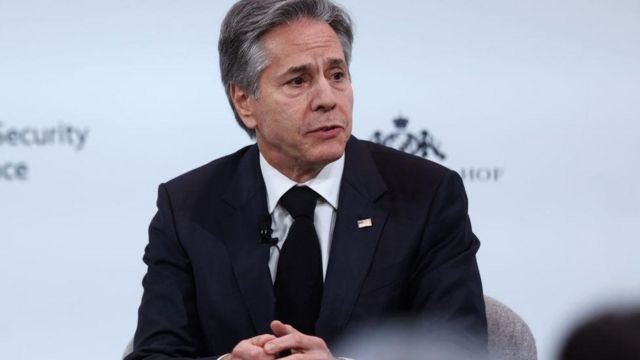
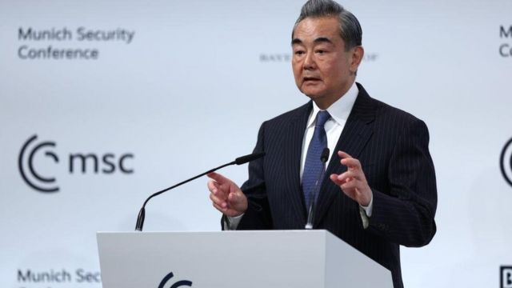
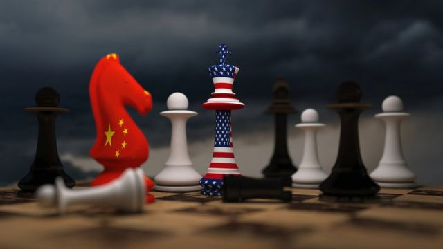
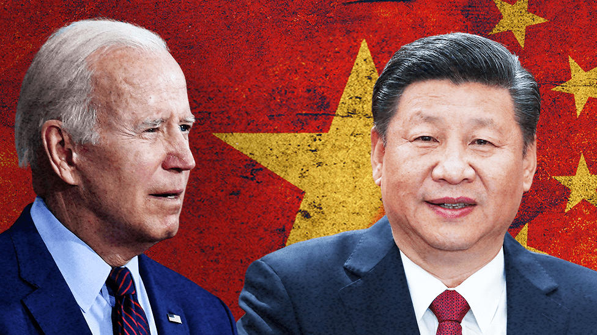

# [World] 气球事件后中美高官首次会晤 布林肯警告中国勿助俄规避制裁

#  气球事件后中美高官首次会晤 布林肯警告中国勿助俄规避制裁

> 图像来源，  Getty Images
>
> 图像加注文字，中国官方称两人这次会晤是“应美方请求”的“非正式接触”。

**本周六，美国国务卿布林肯和中共政治局委员、中央外事工作委员会办公室主任王毅在慕尼黑全球安全会议期间进行了会晤。中国官方强调这次会晤是“应美方请求”的“非正式接触”。**

会谈前后，两国外交交锋继续，从气球问题延伸到此次慕尼黑会议的主要议题——俄乌战争。

两人见面前几个小时，王毅斥责华盛顿击落气球的行为是“匪夷所思”和“歇斯底里”；布林肯则在会面后接受美国媒体的访问称，他警告王毅，如果中国向俄罗斯入侵乌克兰提供物质支持，后果不堪设想。

去年8月时任美国众议院议长佩洛西访问台湾，中美关系进一步趋于紧张。华盛顿此后表达了希望为两国关系设置“护栏”的愿望。去年11月G20峰会期间，习近平和拜登举行会谈，会后美方称布林肯将于今年访华。

2月5日至6日的访华行程原本将是布林肯担任国务卿两年来首次访华，被双方都视为稳定两国紧张关系的契机。

但气球事件使上述访问化为泡影，甚至王毅和布林肯是否会在慕尼黑会谈也成为疑问，直到会谈结束后，美国国务院用一份声明确认了此次会谈。布林肯在会见结束后接受采访称，他没有与王毅讨论重新安排他的中国之行。

##  王毅：击落气球“匪夷所思”、“歇斯底里”

根据 美国国务院的声明  ，布林肯向王毅直接谈到中国的高空气球出现在美国领空，并表示美国不会容忍任何侵犯主权的行为。
 中国外交部一份简短声明  称，王毅在会面时要求美国拿出诚意，改正错误，正视并解决事件给中美关系造成的损害。

> 图像来源，  Getty Images

会谈后，布林肯向美国媒体表示，王毅没有为气球事件道歉，“我很简单地告诉他，那是不可接受的，再也不能发生了。”

王毅在会谈前对事件评价则用词激烈。他在德国出席慕尼黑安全会议发表主旨讲话后 回答提问  ，将其描述为美国制造的一场“政治闹剧”，称“这种行为匪夷所思，近乎歇斯底里，是百分之百的滥用武力，明显违反惯例和有关国际公约”。

“地球上空每天都飘着很多气球，难道美国都要打下来吗？”王毅说，“我们奉劝美国不要再出于国内政治需要，在对外打交道过程中做出这种荒唐的事情。”

> 图像来源，  Getty Images

前美国国防部官员、新加坡国立大学客座高级研究员德鲁·汤普森（Drew Thompson）表示，这表明中国军方认为他们可以为任何技术和任何任务辩护，他们可以做任何事情来增加中国军事投射能力，进行监视。

汤普森注意到全球社会缺乏一致的批评声，这显示了“国际法的脆弱性”，“证明中国有能力阻止其他国家对其进行批评”，并可能导致一个更不安全的世界。

总部设在北京的智库中国与全球化智库副主任高志凯则称击落行为是“过度反应”，美国“表现得越来越歇斯底里”。

> 图像加注文字，在中美数十年的贸易与交往历程之后，如今习近平所设想的世界与西方一直以来所期望的有天壤之别。

##  布林肯：担心中国向俄罗斯提供武器

整个慕尼黑安全会议期间，几乎都在探讨一个问题——如何结束俄乌战争？

王毅和布林肯的会谈同样没有绕开这个话题。美国国务院的声明中称，关于俄罗斯对乌克兰的野蛮战争，国务卿警告说，如果中国向俄罗斯提供物质支持或协助其逃避系统性制裁，将产生影响和后果。

“他们（中国）至少在考虑提供各种致命的援助，包括武器，”布林肯在接受美国NBC访问时称，他向王毅表明“这将在我们的关系中产生严重的后果”。

俄乌战争爆发以来，西方国家一直对中国在其中的角色保持警惕，一方面中国未谴责俄罗斯的入侵行为；另一方面，在战争胶着一年后，中国强大的军事和经济实力对饱受制裁的俄罗斯意义重大。

在慕尼黑安全会议上的一次小组发言中，布林肯说，中国不向俄罗斯提供任何军事援助是美国的首要任务，美方认为这一旦发生将是一个“非常严重的问题”。

在另一个小组，王毅再次呼吁进行对话，并建议欧洲国家“冷静地思考”如何结束战争，他还说，“有些势力似乎不希望谈判成功，也不希望战争很快结束”。

此外，王毅在其题为《建设一个更加安全的世界》的主旨讲话中宣布，中方将发布“关于政治解决乌克兰危机的中国立场”，中国将继续站在和平一边，站在对话一边。

路透社援引一位美国国务院官员称，中国正在试图“左右逢源”（have it both ways），一边在呼吁世界和平与稳定，一边在采取“令人担忧”的举措，支持俄罗斯入侵乌克兰。

值得一提的是，本周日（2月19日），中方公布消息称，中国、俄罗斯、南非三方达成的共识，2月20日至27日，三国海军将在南非德班至理查兹湾以东海空域举行第二次海上联合演习，联演课题为“维护航运及海上经济活动安全联合行动”。

