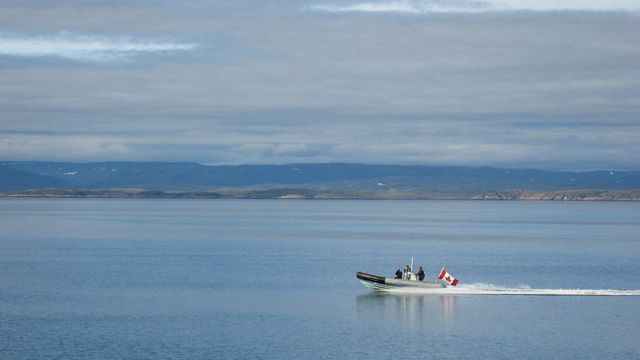
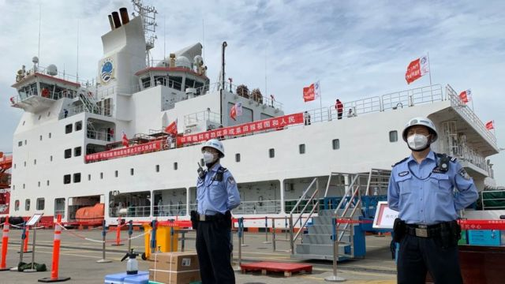

# [World] 加拿大军方称发现中国在北极进行监视活动的证据

#  加拿大军方称发现中国在北极进行监视活动的证据

  * 纳丁·优素福（Nadine Yousif） 
  * BBC记者 发自多伦多 

> 图像来源，  Getty Images
>
> 图像加注文字，加拿大国防部表示，自2022年以来，加拿大军方已经阻止了几次针对加拿大领土的监视企图。

**加拿大军方证实，最近发现中国在北极进行监视活动的证据。**

最先由加拿大《环球邮报》（The Globe and Mail）报道的这一消息引发了对中国在北极地区活动的质疑。

此前，一个疑似中国间谍气球在加拿大和美国领空漂浮，后来被美国军方击落。

中国最近还被指涉嫌干涉加拿大选举。

加拿大军方展开的“透明行动”（Operation Limpid）在去年秋天发现并取回了监测浮标。这是加拿大军方正在进行的一项任务，即通过监测空中、陆地和海域来识别对国家安全的威胁。

加拿大国防部发言人丹尼尔·勒布蒂利耶（Daniel Le Bouthillier）在一份声明中表示，军方“充分了解中国最近在加拿大领空和海上进行监视行动的努力”。

勒布蒂利耶补充说，中国使用的是有双重用途的侦察设备，既可用于研究，亦可用于军事目的。

他说，自 2022 年以来，军方已阻止外界侦察加拿大领土的企图，但没有详细说明其性质。

中国长期以来一直对北极表现出兴趣。在过去的20年里，它向该地区33次派遣了高层人物，并参与了大多数主要的北极机构。

中国还扩大了破冰船队，并派遣海军舰艇前往北方，通常进行科研考察。

随着气候变化导致冰盖融化，中国希望通过该地区开辟一条通往欧洲的较短贸易路线，并获得新兴资源。

> 图像来源，  Getty Images
>
> 图像加注文字，中国长期以来一直对北极表现出兴趣。2021年，中国派出一艘破冰船在该地区进行为期五个月的科研考察。

但专家表示，监视北极军事资产的企图使中国对该地区的研究兴趣也翻了一番。

他们的努力与几个北极国家——即美国、加拿大、芬兰、俄罗斯、挪威和瑞典——释放该地区未开发潜力的更大动力有关。

国际治理创新中心高级研究员、加拿大武装部队前高级官员罗伯托·马佐林说（Roberto Mazzolin）：“这个地方的世界尚未像其他纬度地区那样被绘制和理解。”

马佐林说，加拿大历来将北极视为几乎没有潜在威胁的安全区域。但俄罗斯以及最近的中国对该地区的兴趣改变了这一点。

他说：“（加拿大被迫）审视我们将如何部署我们自己的安全、我们的军事防御或我们的经济发展活动，以确保加拿大和美国的利益。”

加拿大外交部长梅兰妮·乔利（Melanie Joly）星期三对美国有线电视新闻网（CNN）说，她认为中国是一个越来越具有破坏性的力量。

乔利补充说，加拿大正在与美国密切合作，以保护北美领空以及加拿大的北极主权。

在加拿大军方发现中国浮标之前，加拿大情报部门披露中国曾试图干预加拿大2021年的上届联邦选举。

在加拿大《环球邮报》首次报道的文件中，加拿大安全情报部门称中国希望特鲁多（Justin Trudeau）领导的自由党作为少数党连任，确保击败被视为对中国不友好的保守党候选人。

该报道还提到，中方通过向特定候选人捐款、散布虚假信息以及利用领事馆和雇用学生担任义工帮助某些自由党候选人来做到这一点。

加拿大议员正在调查有关中国被指干涉加拿大2019年联邦选举的指控。周二，有关调查扩大了范围，将中国是否试图影响加拿大2021年大选纳入调查范围。

加拿大总理特鲁多周三称中国被怀疑干预选举是“一个非常严重的问题”，并表示他支持对这些报道进行进一步调查。

他补充说，迄今为止的干预努力似乎没有成功，但仍引起人们对外国试图干涉加拿大民主进程的担忧。

特鲁多表示：“外来势力正试图破坏人们对民主本身的信心。”

中国驻加拿大官员否认了这些报道，称中方“从未以任何方式干预加拿大任何选举或内政”。

本月早些时候，在发现中国气球飞越北美后，中国在北美的可疑监视活动占据了当地的头条新闻。

美国和加拿大都表示，该气球正在监视敏感的军事资产。然而，中国否认该气球被用于监视，并说这是一个偏离航线的“民用气象飞艇”。

