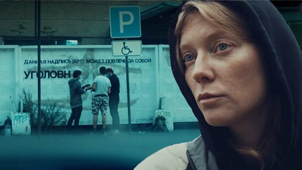

# [World] 冒着巨大风险，俄罗斯电影人记录下战争对国家的影响

#  冒着巨大风险，俄罗斯电影人记录下战争对国家的影响

**冒着巨大风险，俄罗斯电影人记录下战争对国家的影响**

2022年2月，俄罗斯入侵乌克兰。冒着巨大风险，两位俄罗斯电影人耗时一年拍摄下这场战争对自己国家造成的影响。数十万人已经逃离，留下的人则不得不做出选择——是反对、是支持亦或是保持沉默。

一群年轻的涂鸦艺术家开始了一场颠覆性的艺术运动，嘲笑政府的战争宣传。一名演员为自己在马里乌波尔战斗中身亡的弟弟哀悼，她反对战争，但她的父亲很支持。

《俄罗斯的叛徒与英雄》（Storyville Inside Russia: Traitors and Heroes ）由BBC世界服务部调查部门BBC Eye制作。

_导演：Anastasia Popova_

_制片：Misha Kozyrev and Stephanie Stafford_

_剪辑：Anna Saridi & Baya Cat_

_执行制片人：Monica Garnsey_

