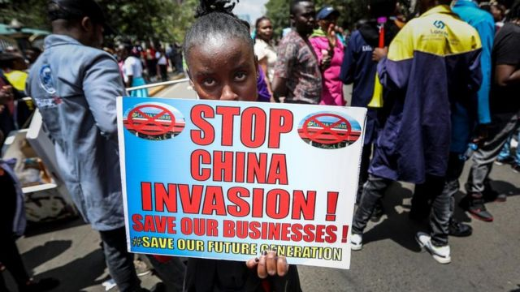
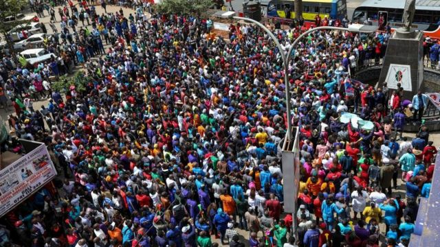

# [World] 中国与非洲：肯尼亚“中国广场”超市平价商品引发抗议的四个看点

#  中国与非洲：肯尼亚“中国广场”超市平价商品引发抗议的四个看点

> 图像来源，  EPA
>
> 图像加注文字，抗议者举着的牌子上写道：结束中国的入侵，拯救我们的生意！

**继民众抗议、超市关门被查又重新营业之后，围绕肯尼亚首都内罗毕“中国广场”超市引发的风波持续。**

肯尼亚贸易内阁秘书摩西·库里亚（Moses Kuria）表示，在首都内罗毕经营的中国大型超市零售业务“是中产阶级的阴谋”，不利于低收入者，而低收入者是经济的主要贡献者。

有关这家在肯尼亚的中国超市所引发的抗议，BBC中文梳理了以下几个看点：

##  抗议的起因

根据肯尼亚媒体的报道，有中资背景的“中国广场”超市于今年1月29日在内罗毕郊区的一家购物中心内开业。

中国媒体报道称，这家一站式零售商以比当地零售商更便宜的价格出售从中国进口的各种商品，开业一个月内超市的日销售量就翻了一番。

此前有媒体报道引述“中国广场”超市的创始人程磊表示，他的业务在前两周就赚了超过157,000美元。

但是这家超市开业不到一个月后就于2月26日宣布关闭。经过肯尼亚反假冒商品局检查近两周后，于3月6日又恢复营业。

超市商品价格低廉，地理位置便利，使其非常有吸引力，成为社交媒体上的一大热门现象。与肯尼亚小商贩的货价相比，它的价格明显有很大优势。

这给其他本地零售商造成很大的压力。肯尼亚小商贩吹着口哨和呜呜组拉大喇叭，数百人游行到内罗毕副总统办公室表示不满，要求结束他们所谓的“中国入侵”。

##  中国超市货价怎样？

在内罗毕进口和销售美容设备的彼得· 西塔蒂（Peter Sitati）是参加示威的人之一。

他说，在他的商店里，一个塑料修脚凳的价格约为43美元，但在“中国广场”的零售价约为21美元，价钱便宜了50%以上。

西塔蒂认为，这样的竞争优势将让“许多肯尼亚企业将倒闭，我们的经济将崩溃。”

当被问及他的货品价格为何高出如此之多时，他说他必须支付经营税和关税，并认为他从中国采购的商品进价可能比“中国广场”要高。

“中国广场”没有回答英国广播公司BBC的查询，也没有解释是如何定价的，但价格如此之低可能有两种原因：一是批发量大可以压低价格；二是从厂家直接进货，免掉中间商的加价，而肯尼亚零售商则没有这样的进货优势和渠道。

“中国广场”创始人程磊坚称自己没有做错任何事。

> 图像来源，  EPA
>
> 图像加注文字，抗议“中国广场”的行动吸引了很多人。

他说：“我的业务是合法的，旨在健康良性竞争。我们已经配合执行了所有肯尼亚政府有关开展业务的行政规定，我们在这里打破垄断。”

“与我们竞争的人感到了威胁，因为肯尼亚人现在知道了我们的存在，而我们不会在定价上盘剥他们。”

##  争议有哪些？

肯尼亚贸易内阁秘书摩西·库里亚在出现针对中国超市的抗议示威后曾警告要废止超市的租约。

他说并无意让来自中国的投资者感到沮丧，但正在防止“肯尼亚成为不合格商品的倾销地”。

肯尼亚中资超市引发的辩论最关键的问题在于中国对肯尼亚的商品出口究竟是帮助了肯尼亚人还是造成了伤害。

对此，肯尼亚也不乏支持中国超市的消费者。

有民众向BBC记者表示：“应该允许中国广场运营。他们以实惠的价格出售优质商品。”

“现在生活开支非常高，这些价格正是我们所需要的。”

还有人担心，围绕中资超市所引发的风波会发出关系到肯尼亚经济和投资政策的错误信号。

肯尼亚外交部的官员科力·辛欧伊（Korir SingOei）一直在努力安抚潜在投资者，他说肯尼亚欢迎来自外部的资金，并且对所有外来资金一视同仁没有歧视。

一直以来肯尼亚努力希望在吸引外国投资和促进自由贸易之间找到平衡，同时保护国内贸易商免受不公平竞争。

肯尼亚经济学家格利桑·伊卡拉（Gerrishon Ikiara）认为，阻止外国人在肯尼亚做合法生意是一种倒退。“我们需要知道如何才能提升肯尼亚人的能力，使肯尼亚能够生产出有竞争力的产品。”

##  肯尼亚有反华情绪吗？

没有数据显示肯尼亚究竟有多少中国商人或人员，不过近年来也出现反华情绪。这部分是由于有人指控肯尼亚的中国人是“种族主义者”，以及担心中国商人从肯尼亚人手中抢走生意和工作。

2019年，肯尼亚当局驱逐了七名在内罗毕两个市场经营的中国公民，指责他们没有工作许可证，并表示他们不允许在为当地人保留的行业里开展业务。

2020年，四名中国男子被指控鞭打一名在中餐馆工作的肯尼亚男子后被驱逐出境。

到目前为止，肯尼亚总统威廉·鲁托（William Ruto）一直回避表态，但在去年当选之前，他曾承诺要遣返那些到肯尼亚来却只能跟肯尼亚人做同样工作的中国公民。

他去年6月曾表示：“我们与不同国家有协议，规定了哪些是本地人从事的行业和工作，哪些是外国人必须有工作许可证才能做的行业和工作。这个应该不是开售货亭、开小摊、卖烤玉米。”

BBC在内罗毕的记者维克多·吉普洛普（Victor Kiprop）报道说，“中国广场”显然不是售货亭，但重新营业让肯尼亚小商小铺感到压力，因此他们的不满和抱怨也就会持续下去。

