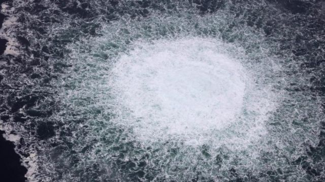

# [World] 美媒指“亲乌团体”策划北溪天然气管道袭击，乌克兰否认与事件有关

#  美媒指“亲乌团体”策划北溪天然气管道袭击，乌克兰否认与事件有关

  * 马鲁·库尔西诺（Malu Cursino） 
  * BBC记者 

> 图像来源，  Reuters

**乌克兰否认与去年9月俄罗斯向欧洲输送天然气的北溪管道袭击事件有关。**

基辅的声明是在回应《纽约时报》的 一篇报道  。该报道引述匿名的美国情报官员指，事件应归咎于一个亲乌克兰团体。

德国媒体的另一宗报道则指，调查人员相信他们已经鉴别出一艘用于安装爆炸品的小船。

爆炸发生前，该管道的天然气输送已经被暂停。

俄罗斯于去年8月关闭了北溪一号管道，声称管道需要维修。北溪二号管道则从未投入服务。

9月26日该天然气管道发生爆炸的确切起因未为人所知，但是外界广泛相信它是遭受了袭击。

莫斯科将爆炸事件归咎于西方，并呼吁联合国安理会进行独立调查。

北约及西方政府领袖并未直接指责俄罗斯，但是欧盟过去曾表示，俄罗斯是利用其天然气管道作为对抗西方的武器。

周二（3月7日），《纽约时报》报道，美国官员审核的新情报显示，一个亲乌团体实施了北溪天然气管道的袭击。

该报道引述匿名美国官员称，没有证据显示乌克兰总统泽连斯基（Volodymyr Zelensky）或他的高级副手曾参与行动。

该美国报纸报道称，有关官员拒绝透露有关情报的具体性质以及如何获取，或“当中包含的证据力度等任何细节”。

报道还提到：“审核相关情报的官员表示，他们相信实施破坏者最有可能是乌克兰或者俄罗斯国籍人士，或者两者的某种结合。”

乌克兰总统泽连斯基的高级顾问波多利亚克（Mykhailo Podolyak）表示，乌克兰政府“绝无参与”该起破坏事件。在一份回应《纽约时报》报道的声明中，波多利亚克指，对于发生了什么，基辅没有相关信息。

俄罗斯驻联合国副代表波利扬斯基（Dmitry Polyanskiy，纪柏梁）在回应相关报道时表示，有关进展“只不过证明了我们提出在联合国秘书长主持下启动国际调查的要求是非常及时的”。

##  北溪管道爆炸谜团

北溪管道的爆炸于去年9月发生在波罗的海海域，靠近丹麦岛屿博恩霍尔姆岛（Bornholm）和瑞典南部海岸处。

事件发生后，德国、丹麦和瑞典均各自展开了调查。

欧洲一些官员一开始曾将事件归咎于俄罗斯，指克里姆林宫意在以此震慑和要挟欧洲各国。

不过之后，一些官员承认，虽然不怀疑爆炸是人为有意为之的事件，但是未有证据直接指向俄罗斯。

在俄罗斯入侵乌克兰之前，美国总统拜登曾警告，假如俄罗斯向乌克兰实施军事进攻，“北溪二号”管道项目将不会继续——这一言论后来引发一些评论人士怀疑美国可能与管道袭击行动有关。

曾获普利策新闻奖（Pulitzer Prize，普立兹新闻奖）的美国记者西莫·赫希（Seymour Hersh）在今年较早前曾撰文称，美国海军以北约海上演习为掩护，在水底放置了北溪管道的炸弹。

这一说法遭到五角大楼的否认，指其是“完全的捏造”。

克里姆林宫发言人则称赫希的分析“非常严重”，应予以重视。

85岁的赫希过去曾被指控散播不实的阴谋论。

至目前为止，德国、丹麦和瑞典的调查均未指向任何一个国家。

同样在周二，德国《时代周报》（Die Zeit）报道，德国当局对于袭击起因的调查已经取得突破。

根据该报以及其他德国媒体机构的联合调查，用于安装爆炸品的小船是一艘从位于波兰的公司租用的游艇，据报是属于两名乌克兰人。至于实施袭击者的国籍则尚不明确。

不过，该报称，德国调查人员尚未找到任何证据证明谁下令实施破坏。报道还指出，这仍然有可能是一次意在嫁祸给乌克兰的行动。

去年9月的爆炸当中，将俄罗斯天然气输送往德国的“北溪一号”有至少50米（164英尺）的海底管道被毁。

丹麦警方相信，有“强力的爆炸”在该管道及其新的姐妹管道“北溪二号”上炸出了四个洞。

德国、丹麦和瑞典当局均在对事件进行调查。

数十年来，俄罗斯一直在向欧洲输送大量天然气。但是在去年2月乌克兰的战争爆发后，多数欧洲国家都已经大幅降低对俄罗斯能源的依赖。

