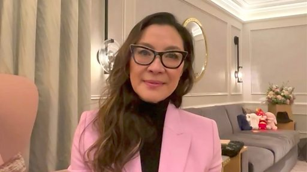

# [World] 2023奥斯卡专访：杨紫琼谈亚洲女性电影人

#  2023奥斯卡专访：杨紫琼谈亚洲女性电影人

**2023奥斯卡专访：杨紫琼谈亚洲女性电影人**

马来西亚影星杨紫琼（Michelle Yeoh）凭在电影《妈的多重宇宙》（Everything Everywhere All at Once，又译：《奇异女侠玩救宇宙》、《瞬息全宇宙》）中的表现横扫影展奖项，今年更入围奥斯卡最佳女主角。如果获奖，她将成为奥斯卡史上首位获得影后头衔的亚洲演员。

《妈的多重宇宙》共获11项提名。除了最佳影片，同片的关家永（Daniel Kwan）、关继威（Ke Huy Quan）与许玮伦（Stephanie Hsu）等也分别入围最佳导演、最佳男主角以及最佳女配角。

第95届奥斯卡颁奖典礼将于3月12日举行，杨紫琼在典礼前夕和BB 聊参与这部电影对她的意义以及作为一名亚洲女演员在好莱坞的历程。

