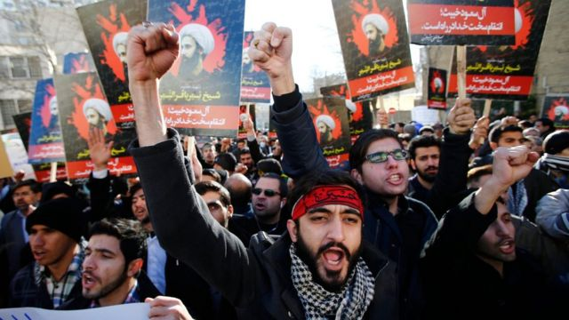
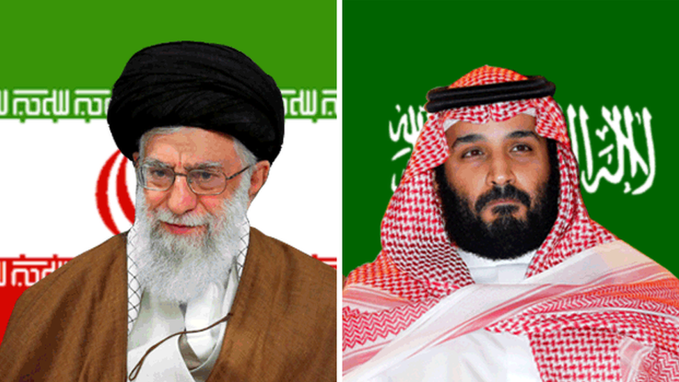
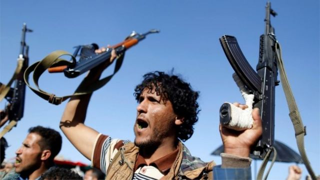

# [World] 中国斡旋下，伊朗与沙特七年后恢复建交

#  中国斡旋下，伊朗与沙特七年后恢复建交

> 图像来源，  EPA
>
> 图像加注文字，沙特阿拉伯驻伊朗大使馆在2016年受到示威者冲击，此后两国断交.。

**被视为中东地区宿敌的伊朗与沙特阿拉伯在断交七年后签署协议，同意恢复两国的外交关系。**

两国官员在中国的斡旋下，于北京进行了四天的谈判，并于周五（3月10日）宣布了这一则令外界意想不到的消息。

沙特阿拉伯于2016年1月与伊朗断交，此前利雅德政府处决了知名什叶派穆斯林教士尼米尔，示威者冲击了沙特驻德黑兰大使馆。

两个分别由逊尼派与什叶派领导的邻国此后关系一直紧张。

它们互将对方视为寻求地区统领地位的威胁势力。在中东，两国的角力蔓延至黎巴嫩、叙利亚、伊拉克等地，在这些国家分别支持敌对的阵营，其中最公开的是在也门。

伊朗支持什叶派胡塞（Houthi）反叛武装在2014年推翻了沙特扶持的政府，而沙特则在之后牵头一场针对胡塞武装的大规模空袭，造成巨大破坏。

沙特也曾指控伊朗帮助胡塞武装攻击沙特。

当中最严重的事件是在2019年无人机和导弹袭击沙特的石油设施，造成破坏和生产中断。沙特及其美国盟友将袭击归咎于伊朗，而伊朗对此予以否认。

##  北京斡旋，美国未参与

此前各方为两国修复关系的尝试均未取得成功，但是在周五（3月10日），沙特与伊朗表示，将会在两个月内重开在彼此国家的大使馆，并将重启贸易和安全事务关系。
 中国外交部同一天发布消息称  ，两国官员在北京完成了对话，并且“就解决各自关切达成共识”。

该消息指，在中共中央政治局委员、外办主任王毅主持下，沙特国务大臣兼国家安全顾问艾班（Musaad bin Mohammed Al- Aiban）和伊朗最高国家安全委员会秘书沙姆哈尼出席了对话闭幕仪式。双方亦于同日达成“北京协议”，中沙伊三方签署了联合声明。

北京称此次对话“翻开了沙伊关系新的一页”。

王毅表示，沙伊恢复外交关系“是对话的胜利、和平的胜利，为当前动荡不安的世界提供了重大利好消息”。

对此，美国则表示审慎欢迎。

白宫国家安全委员会发言人约翰·柯比（John Kirby）表示，美国政府支持“一切令地区紧张关系降级的努力”，但是他补充说：“伊朗是否会履行其义务，确实有待观望。”

路透社引述柯比表示，对于在北京与伊朗进行复交对话，沙特一直有知会美方，但是美国未有直接参与相关谈判。

他指周五达成的共识路线是此前多番对话的结果，包括过去在巴格达和阿曼进行的谈判，以及沙特有效阻止伊朗及其代理人发起的攻击，才最终将伊朗带回谈判桌。

联合国秘书长古特雷斯（Antonio Guterres）对中国斡旋促成协议表示感谢。

古特雷斯的发言人指，秘书长已准备好帮助“确保海湾地区的持续和平与安全”。

此前曾呼吁就核项目向伊朗最大限度施加压力的以色列则未就消息置评。

##  两个中东宿敌的交恶史

> 图像来源，  Reuters/EPA
>
> 图像加注文字，伊朗最高领袖哈梅内伊（左）和沙特王储本·萨勒曼。

沙特、伊朗两个中东大国彼此相邻，长年竞争地区的主导地位。

这种对抗关系更因宗教差异而扩大。两国分别信奉伊斯兰教的两大分支——伊朗大多数是什叶派穆斯林，沙特则代表着逊尼派穆斯林的领导力量，中东地区各国也因应这种教派差异而逐渐形成两个阵营。

1979年伊朗的伊斯兰革命建立了新的神权政府，此后一直以将这一模式扩大到其他地区为己任。

2003年美国入侵并推翻萨达姆领导的伊拉克逊尼派阿拉伯政权后，伊朗的什叶派在该国以至中东地区的影响力得到扩大。这一变化，特别在军事上，动摇了当时中东地区的格局。

2011年阿拉伯世界发生一连串革命和政治动荡后，沙特与伊朗均希望利用这一动荡局面扩大自己的影响力。

> 图像来源，  Reuters
>
> 图像加注文字，沙伊紧张关系在他国蔓延，也门是主战场之一。

伊朗的地区势力呈逐渐上升趋势时，沙特在实际领导人穆罕默德·本·萨勒曼王储（Crown Prince Mohammed bin Salman）推动下采取一系列行动试图遏止伊朗的势力，包括在也门发动针对胡塞反叛武装的战争。

联合国相关报告显示，伊朗一直向也门的胡塞武装提供武器和技术，但伊朗一再否认。

另一方面，沙特也在一定程度得到特朗普政府以及以色列的支持，试图遏制伊朗。

以色列和沙特阿拉伯是2015年限制伊朗核项目国际协议最坚决的反对者，认为该协议远不足以阻止伊朗获得核武器。

在很大程度上，沙特与伊朗之间的敌对被看作类似于中东版的“冷战”——双方处在军事冲突的边缘，但角力主要是通过支持他国的代理势力展开对抗，而不是直接交战。

