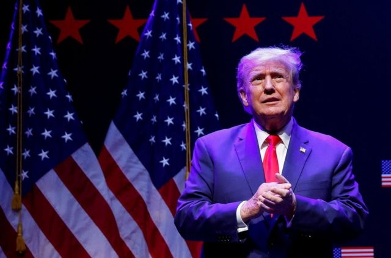
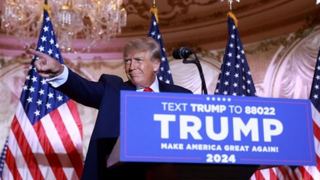
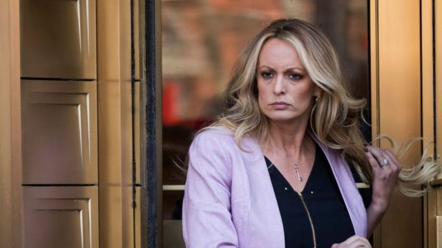
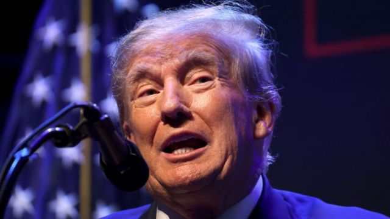

# [World] 美国前总统特朗普发文称他预计将于周二被捕

#  美国前总统特朗普发文称他预计将于周二被捕

  * 莎拉·福勒（Sarah Fowler）和安东尼·泽克尔（Anthony Zurcher） 
  * BBC记者 发自伦敦和华盛顿 

> 图像来源，  Reuters
>
> 图像加注文字，3月13日，美国前总统特朗普在爱荷华州达文波特与支持者举行竞选集会时发表讲话。

**美国前总统唐纳德·特朗普（Donald Trump，川普）表示，他预计将于当地时间下周二被捕，并敦促他的支持者发起大规模抗议活动。**

然而，特朗普的律师说没有来自执法部门的任何沟通，特朗普通过社交媒体平台的发文是基于媒体报道。

纽约曼哈顿地区检察官一直在研究对特朗普提出的可能诉讼。美国媒体报道说特朗普可能在下周遭到起诉。

如果特朗普被起诉，这将是有史以来第一宗针对美国前总统的刑事案件。

该案件的关键在于，在2016年总统大选之前，特朗普通过律师向前成人片影星丹尼尔斯（Stormy Daniels）支付13万美元封口费的指控。

这是76岁的这位美国前总统目前正在接受调查的几起案件之一，尽管特朗普尚未在任何案件中受到指控，并且在每起案件中都否认有不当行为。

特朗普已承诺将继续其竞选活动，成为2024年总统大选的共和党候选人，即使他被起诉。

过去调查他的努力，包括两次弹劾审判、“通俄门”调查和FBI突袭搜查海湖庄园，往往使特朗普在他的支持者中更受欢迎，因此相关起诉可能会产生类似的效果。

目前尚不清楚他本周是否会受到刑事指控，甚至还不清楚这些指控可能是什么。

> 图像来源，  Getty Images
>
> 图像加注文字，特朗普已承诺将继续其竞选活动，成为2024年总统大选的共和党候选人，即使他被起诉。

但随着这位前总统自称他本人将在下周二被捕并呼吁支持者举行大规模抗议，这将是一段进入未知领域的旅程。

特朗普拥有忠实的追随者基础，2021年1月6日，他的支持者在他多次呼吁抗议后冲击美国国会大厦，这证明令人担忧的局势可能会迅速升级为暴力。

特朗普周六（3月17日）在其自创的社交媒体平台“Truth Social”上写道，来自曼哈顿地区检察官办公室的“非法泄密”“表明”，他将于下周二被捕。

曼哈顿地区检察官办公室尚未对此发表评论。特朗普的律师苏珊·内切莱斯 (SusanNecheles) 表示，她的团队没有从执法部门官员那里听到任何消息。

她说：“由于这是一起政治起诉，地区检察官办公室采取的做法是将一切都泄露给媒体，而不是像正常情况下那样与特朗普总统的律师沟通。”

美国众议院共和党议长凯文·麦卡锡 (KevinMcCarthy) 对该调查提出了猛烈抨击，称此举为“激进的地区检察官无耻地滥用权力”。

麦卡锡还在发布的推文中承诺调查联邦资金是否被用于干预选举，即是否“出于政治动机的起诉”。

任何起诉都会给特朗普在共和党内的竞争对手带来复杂的考量，因为他们得决定是在前总统可能分心的时候加大对他的攻击力度，还是保持低调并希望出现最好的结果。

如果说历史有任何指导意义的话，那将会是后者。

> 图像来源，  Getty Images
>
> 图像加注文字，2018年4月16日，成人片影星丹尼尔斯离开美国纽约南区地方法院资料照片。

##  接下来会发生什么？

  **大陪审团完成调查**

特朗普的前私人律师迈克尔·科恩（Michael Cohen）以及前助手凯莉安妮·康威（Kellyanne Conway）和霍普·希克斯（Hope Hicks）据了解目前已经提供了证据。据专家称，特朗普团队曾表示，这位前总统拒绝了出庭邀请，这是此案即将结束的迹象。报道称，最后一名证人可能会在周一出现在大陪审团面前提供证据。

  **检察官决定是否起诉**

调查一旦完成，大陪审团将投票决定是否建议提出刑事指控。然而，他们的判决没有约束力。如果有的话，最终将由曼哈顿地区检察官阿尔文·布拉格 (AlvinBragg) 决定提出何种指控，但没有最后期限。这是一个法律决定，即他相信什么，他能否证明他能排除合理怀疑来赢得定罪——但也是一个深刻的政治决定。

  **特朗普可能在纽约出庭**

美国前总统以前从未被起诉过，但特朗普的律师表示他将遵循正常程序。通常情况下，被告要么被捕，要么向当局自首。如果他们面临更严重的重罪指控，他们将被戴上手铐。然后，他们会被拍照片和取指纹。在初次听证会（称为传讯）之后，像这样的白领犯罪案件中的被告通常会被释放，直到下一次开庭。

> 图像来源，  Getty Images
>
> 图像加注文字，2023年3月13日，特朗普在爱荷华州达文波特举行的活动中发表讲话。

该案件的关键在于特朗普通过前律师迈克尔·科恩向前成人影星丹尼尔斯支付13万美元封口费后，特朗普是如何偿还科恩的。科恩的付款记录显示，这笔付款是为进行法律工作的付款。检察官可能会说这相当于特朗普伪造商业记录，这在纽约属于轻罪。

美国媒体报道称，纽约的执法机构正在为特朗普最早于下周被起诉并出现在曼哈顿法庭的可能性做准备。

据美联社报道，纽约当地和联邦执法官员预计将在下周初召开会议并讨论与特朗普预计被起诉有关的安全问题和相关安排。

除了纽约的封口费调查外，特朗普还因试图扭转他在2020年总统大选中在佐治亚州的微弱失利而面临单独的刑事调查，但是尚不清楚这位前总统是否直接受到了调查。

美国司法部也在调查特朗普卸任后政府机密文件是否被错误处理，以及破坏三年前总统选举结果的更广泛努力，包括2021年1月6日国会山骚乱事件。

