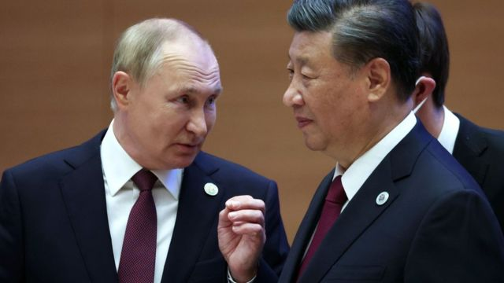

# [World] 习近平与普京会晤：这场中俄元首会谈预料将带来什么？

#  习近平与普京会晤：这场中俄元首会谈预料将带来什么？

  * 史蒂夫·罗森伯格（Steve Rosenberg）、麦笛文（Stephen McDonell） 
  * BBC駐俄罗斯記者、BBC驻中国记者 

> 图像来源，  SERGEI BOBYLEV/SPUTNIK/KREMLIN POOL/EPA-EFE
>
> 图像加注文字，普京和习近平（摄于去年）本周将在莫斯科举行会谈。

**中国国家主席习近平即将开始对俄罗斯进行国事访问。这是自去年俄罗斯入侵乌克兰以来他首次访问莫斯科，他将与俄罗斯总统普京（Vladimir Putin）会谈。**

我们的俄罗斯事务编辑史蒂夫·罗森伯格（Steve Rosenberg）和驻华记者麦笛文（Stephen McDonell）一直在思考双方都试图从会谈中获得什么，以及我们目前对两国关系的走向了解什么？

##  向朋友寻求帮助的普京

**BBC俄罗斯事务编辑 史蒂夫·罗森伯格（Steve Rosenberg）**

想象一下，你是弗拉基米尔·普京。

你发动了一场没有按计划进行的战争、你被全方位制裁。现在，国际刑事法院以战争罪发出了逮捕令，而上面有你的名字。

在这样的时刻，你需要一个朋友。

习近平出现了。

习主席曾称普京总统是他的“最好的朋友”。 两人有很多共同点：他们都是威权主义领导人，都拥护没有美国主导的“多极世界”理念。

在莫斯科，他们预计将签署一项关于深化两国全面战略协作伙伴关系的协议。

在克里姆林宫面临巨大国际压力之际，来自中国国家主席的国事访问是对俄罗斯和普京的明确支持信号。

而这背后的基石是俄罗斯与中国的关系。

“普京正在建立他自己的集团。他不再信任西方，而且永远不会再信任。”诺贝尔和平奖获得者、记者德米特里·穆拉托夫（Dmitry Muratov）认为。

“因此，普京正在寻找盟友，并试图使俄罗斯成为与中国、印度以及拉丁美洲和非洲部分地区的共同堡垒的一部分。普京正在建立他的反西方世界。”

在这个“反西方世界”中，莫斯科严重依赖北京。在乌克兰战火继续的情况下，这种依赖比以往任何时候都要强烈。

“战争已经成为俄罗斯国内政治、外交政策和经济政策的组织原则。有一种对于摧毁乌克兰的执念。”卡内基国际和平基金会（Carnegie Endowment for International Peace）高级研究员亚历山大·加布耶夫（Alexander Gabuev）总结道。

“为此，你需要武器、金钱和经济生命线。中国已至少向俄罗斯提供了武器部件和可用于军事目的的民用技术，而且它肯定提供了资金。”

为了反击西方制裁并提振俄罗斯经济，俄罗斯一直在促进与中国的贸易，主要是在能源领域。预计石油、天然气和能源管道将被列入“习普会”的议程之中。

但是，你再次想象一下如果你是普京：一年前，你和习近平宣称你们的伙伴关系“没有上限”，如果情况确实如此，你是否希望中国现在通过向俄罗斯援助致命武器并帮助莫斯科取得军事胜利以解决乌克兰问题？ 美国声称中国正在考虑这样做，但北京予以否认。

正如俄罗斯人常说的，“表达愿望不是坏事”——但这并不意味着它就一定会发生。如果去年有一件事能证明这一点，那就是中俄“无上限的伙伴关系”确实也有限制。到目前为止，北京显然不愿向莫斯科提供直接军事援助，因为担心会引发西方对中国企业的二次制裁。就北京而言：对不起俄罗斯……中国的利益优先。

最近在俄罗斯官方电视台的一档脱口秀节目中，有人非常直白地指出了这一点。

“在习主席访问莫斯科之前，这里的一些专家已经过度兴奋，甚至欣喜若狂。”军事专家米哈伊尔·霍达列诺克（Mikhail Khodarenok）指出。

“但中国只能有一个盟友：中国自己。中国只能有一套利益：亲中国的利益。中国的外交政策完全不包括利他主义。”

##  习近平向普京发出的信号只会有三种

**BBC驻中国记者 麦笛文（Stephen McDonell）**

习近平对俄罗斯的访问，官方的说法是为了促进两个邻国之间的双边关系。两国政府表示它们正变得越来越紧密。

因此，他们会签署协议、共晋晚餐、在聚光灯前拍照。

这种访问司空见惯，那么为什么大家格外关注此次访问呢？

首先，这是世界其中一个超级大国的领导人在2023年拜访盟友，而后者恰恰是对欧洲另一个国家发动血腥入侵的人。

许多分析人士都在思考，如果俄罗斯在战场上面临明显而屈辱性的失败，中国可能会如何做。

中国政府称其是中立的。它会退后一步作壁上观，还是开始输送武器使俄军获得更大的优势？

习近平抵达莫斯科后，他和普京也可能会谈点别的事，但所有的关注都将集中在乌克兰危机上。

他向普京发出的信号只会有三种：

  * 是时候考虑做出一些挽回面子的妥协了 
  * 支持战争继续下去，甚至更努力地推进 
  * 中国领导人不提出任何意见 

中国刚刚促成了伊朗和沙特阿拉伯恢复外交关系的协议。它正踌躇满志地准备投身更多超越其国界的事务。这似乎使选项三不太可能。

对于第一个选项，如果在伊朗和沙特达成协议后，北京能够再次宣称自己是全球和平缔造者，那么这将是最值得习近平骄傲的成就。

该选项的主要问题是它能在多大程度上使中国受益。

最悲观的选择是第二种，但有一种解读认为俄乌战争对北京的地缘政治战略起到作用。克里姆林宫正在与西方对抗，吞噬着北约的资源，而且战争持续时间越长，就越考验西方公众对更多冲突的胃口，例如中国人民解放军武力攻台。

北京方面的考虑可能是战争持续的时间越长，想要卷入另一场战争的人就越少。

中国政府声称的中立性也与该国官方媒体的新闻报道不符。晚间电视新闻报道照搬了克里姆林宫的说法，用很大比例的报道来指责“西方”造成的“冲突”。它没有提及这是“战争”，更不用指望用“入侵”这样的字眼。

在公开场合，中国表示所有国家的主权（意指乌克兰）都应该得到尊重，但其他国家（意指俄罗斯）的“合理安全关切”也应该得到尊重。然而，习近平正在访问的不是基辅，而是莫斯科。

因此，当习近平几天后离开莫斯科时，普京要么担心中国的支持会动摇，要么被来自地球上最有权势的两名领导人之一的支持所鼓舞。

行家们似乎倾向后者。

