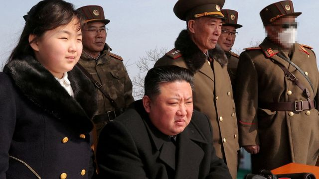
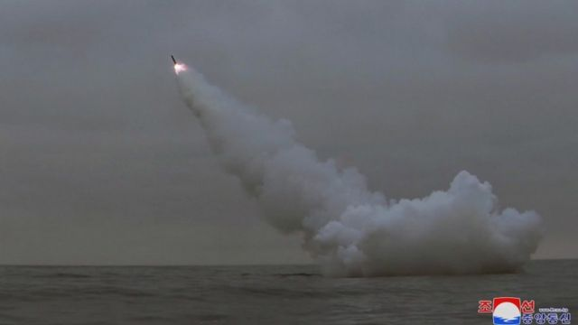

# [World] 朝鲜核问题：金正恩连番武器试验背后有何盘算

#  朝鲜核问题：金正恩连番武器试验背后有何盘算

  * 吉恩·麦肯锡（Jean Mackenzie） 
  * BBC驻首尔记者 

> 图像来源，  KCNA
>
> 图像加注文字，朝鲜官媒上周公布的照片中，金正恩与女儿金朱爱一同观看导弹试射。

**必须承认，近日来要逐一跟进朝鲜的导弹试射会有点困难。**

尤其是他们像我们过去两周所看到的那样，几乎隔天就发射一次武器。

若是将这些试射本身个别看待的话，它们已经不再像往日那样会成为头条，但是如果我们将最近的试射全部综合起来看，我们就可以了解到很多东西。

朝鲜说，它是在惩罚美韩举行近年来最大规模的军演。美韩的同盟军正在演练， 一旦朝鲜发起攻击，他们要如何打败它。这并不是金正恩乐于见到的场景。

只不过，朝鲜这一次的抗议方式不同以往：过去，它回应的方式就是发射短程、中程和远程导弹，或者一些炮弹。

这一次，在两个星期里，平壤发射了它最有威力的洲际弹道导弹，理论上可以到达美国本土的任何地方。

它从潜艇发射导弹，从疑似地下发射室的地方发射导弹。它的军队还模拟了一场对韩国机场发动的核武攻击。

金正恩也向外公布了一种新的水下无人机，他声称可以用它在海底发射核武器，引发一场“超大规模的放射性海啸”，摧毁敌人的战舰。

这一连串动作可谓花样百出。

##  朝鲜武器“时装秀”

位于美国的战略与国际研究中心（Centre for Strategic and International Studies）分析家金艾伦（Ellen Kim）向我形容，这相当于是“朝鲜的时装秀”——就像金正恩女儿被看到在其中一场发射仪式上身穿的那件迪奥（Dior）风格外套一样。

包括金艾伦在内的分析人士都对这个季度所展示的系列多样性感到担忧。平壤推出了更新、更完备的武器，能够从海陆两处瞄准美国、韩国和日本。

“过去，我们不知道他们能够从潜艇发射巡航导弹，或者从地底下发射。它的武器正在变得更难以追踪和拦截，”金艾伦说。

> 图像来源，  KCNA
>
> 图像加注文字，朝鲜的水底试射引发外界关注。

这增强了朝鲜所带来的核威胁。

就以潜艇发射的巡航导弹为例。首尔的峨山研究院（Asan Institute）武器专家杨旭（Yang Uk，音）认为这种导弹最令人担忧。他解释说，从水底下发射导弹使得发射前的探测更加困难。在发射后，巡航导弹飞得较低，并且可以在飞行中途作出调整，从而躲过导弹防御力量。

金正恩过去一直害怕美国会对他的国家先发起攻击，在他有机会出手之前就将其武器一举消灭。现在，他似乎是在通过这一连串测试传达出一个讯息，朝鲜有能力反击甚至率先出击。要毁灭藏在地下或水下的武器是很困难的。

换而言之，他是在说“别想攻击我们”。

##  虚张声势？

不过，我们应该保持警惕。金正恩是倾向于夸大其军事实力的。

围绕在这当中的关键问题是核武器。朝鲜吹嘘说最近试射的所有导弹都有搭载核弹头的能力，但是大多数都只能搭载非常小型和轻量级的核弹头。平壤尚未证明自己能够制造这种武器。

直到它进行试验之前，我们都只能瞎猜。这就是为什么情报界长期以来一直屏息以待，等待朝鲜核试验的原因。

到朝鲜能够大规模制造小型核弹头的那一刻，这种设想中的威胁就会成为现实。

##  还能谈判吗？

有一些人主张，美国与国际社会应该做出更多努力将朝鲜带回谈判桌上，以阻止这种核试验。双方的谈判已经停滞了超过四年，但是平壤没有显示出愿意谈判的迹象。它倾向于选择一个它认为自己能最大限度获益的时机。

> 图像来源，  KCNA
>
> 图像加注文字，金正恩常常被指夸大朝鲜的军事实力。

由于中国与俄罗斯拒绝在联合国安理会上惩罚朝鲜，于是平壤可以继续在不承担后果之下发展武器。现在为什么要停止？它的武器越好，手中的牌就越大，而且它还有更多的事情需要证明。

除了小型化的弹头，朝鲜也还没有展现过它的常规弹头能够完成全程洲际飞行。目前，朝鲜测试远程导弹的方式是射向太空。它还希望发展更尖端的洲际弹道导弹，不需要在发射前加入燃料，从而令它发射时引起的警惕更小一些。

杨旭相信，金正恩同样也是受到国内的危急情势所迫。随着经济动荡，民众捱饿，他的尖端核武器项目是“他剩下唯一可打的牌，”杨旭说。

所以，朝鲜似乎肯定是要锐意向前，发展比过去更加多样和致命的武器阵列。

对于金艾伦来说，只有一件事是肯定的：“更多的测试将会到来。”

