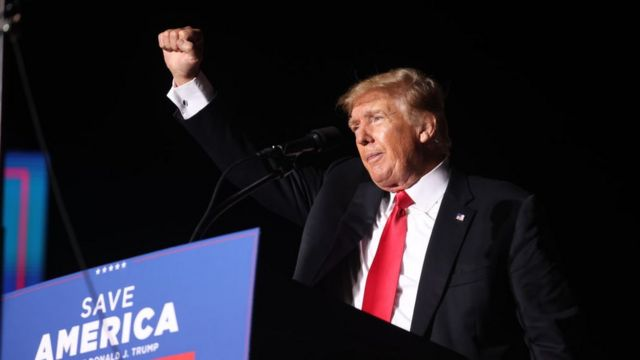
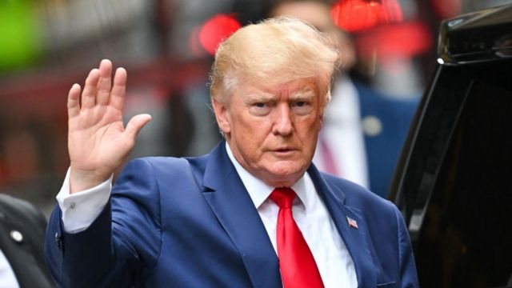
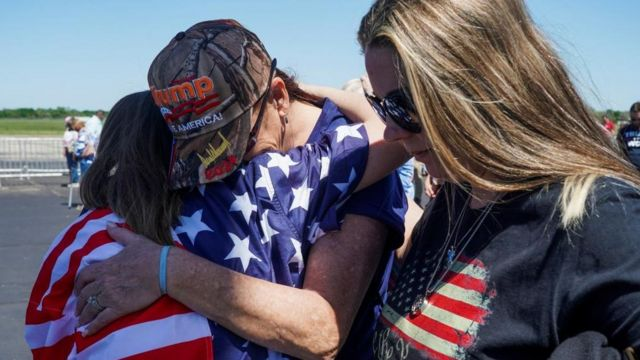
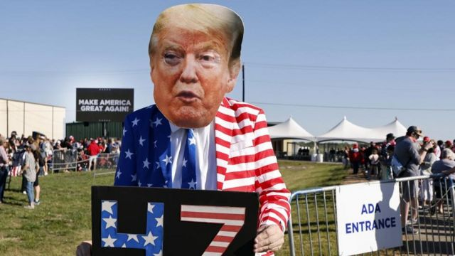

# [World] 特朗普因“封口费”事件遭刑事起诉成美国政坛首例，这将如何影响2024总统大选？

#  特朗普因“封口费”事件遭刑事起诉成美国政坛首例，这将如何影响2024总统大选？

> 图像来源，  Getty Images

**美国前总统特朗普（Donald Trump 川普）因为在2016年美国总统选举前，向一位成人片影星明星支付封口费遭起诉。**

不过，针对这起案件的起诉细节尚未公布。

陪审团在调查了有关特朗普曾向色情片演员“暴风女丹尼尔斯”（Stormy Daniels）支付13万美元封口费，要后者隐瞒两人婚外情事件之后，投票通过起诉特朗普。

76岁的特朗普则否认有不法行为。

但他是第一位遭刑事指控的首位的美国前总统。

持续调查此事的曼哈顿地区检察官布瑞格(AlvinBragg)的办公室证实，已经联系特朗普律师，以 “协调他的认罪自首”，前者尚未说明起诉细节。

但是，两位熟悉此事的消息人士则向美国CBS新闻网说，居住在佛罗里达州的特朗普预计将于下周飞往纽约，并于下周二（4月4日）出庭。

起诉书中的相关指控内容，将在听证会上向他宣读，预计约10到15分钟。

美国特勤局，亦即负责保护现任和前任美国总统的单位，将负责特朗普出庭的安保工作。

##  发生了什么事？

2016年，色情片演员丹尼尔斯与媒体连络，表示愿意出售自称在2006年曾与特朗普(DonaldTrump)发生婚外情的细节。

丹尼尔斯说，两人外遇行为发生在特朗普与现任妻子梅拉尼娅结婚后的第2年。之后，特朗普的团队获得消息，其律师科恩向丹尼尔斯支付了13万美元，要后者对外遇之事封口。

这事其实并不违法。

然而，当特朗普付款给他的律师时，付款记录却说这是用于法律费用。检察官说，这相当于特朗普伪造了商业记录，这在纽约是一种轻微的刑事犯罪。

不过检察官还可能指控特朗普违反了美国选举法。因为，特朗普试图隐瞒这笔给丹尼尔斯的款项，目的是不想让选民知道两人发生婚外情。

而通过伪造商业记录来掩盖罪行将是一项重罪，也是一个较严重的指控。但即使主张起诉的人也承认，无论如何，这绝不是一个泾渭分明的案件。

因为这样的起诉几乎没有先例，过去， 针对将资金是用于选举还是个人支出之间的越界行为，控诉政治家的尝试都以失败告终。

就像美国所有刑事被告一样，特朗普将要面临着被按指纹，和拍摄起诉照片的未来。

> 图像来源，  Getty Images
>
> 图像加注文字，这起刑事案件可能影响 2024 年的美国总统大选。 特朗普目前是共和党人中，已经宣布和潜在党内竞争者的领跑者。

在一份声明中，特朗普攻击布瑞格，称这位检察官恬不知耻， “为拜登做肮脏的工作”。

他又抨击民主党在试图“捉到特朗普”的过程中一直在撒谎及欺骗，“但现在他们做了一件不可想象的事情，在公然干涉选举的行为中还起诉一个完全无辜的人。”

特朗普多次批评在他的家乡纽约市进行的调查，是由他的对手主导的政治 “猎巫”。

起诉特朗普的检察官布瑞格，是一名注册的民主党党员，但他否认对特朗普进行政治报复：“我们根据事实、法律和证据评估我们管辖范围内的案件，”他本月早些时候的推文这样说。

不过，特朗普的律师奈齐丽斯（ Susan Necheles）发出一份声明表示“特朗普没有犯下任何罪行。我们将在法庭上全力反击这一起政治起诉。”

特朗普遭起诉消息传开后，涉案的丹尼尔女士斯则感谢她的支持者。 她在推特上发帖说：“我收到了太多信息，我无法回复……也不想洒了我的香槟。”

> 图像来源，  Reuters
>
> 图像加注文字，若特朗普被逮补，应该会加深和激化美国政治体系中已经存在的尖锐分歧。

##  如何影响美国大选？

此外，这起刑事案件可能影响 2024 年的美国总统大选。 特朗普目前领跑共和党人中其他已经宣布和潜在竞争者。

但美国也没有法律能阻止被判有罪的候选人去竞选总统，或担任总统这职务——即便是在监狱服刑中。

然而，特朗普若被捕，肯定会使他的总统竞选活动更加复杂。

因为，虽然这可能会使一些共和党选民支持陷入困境的参选人，但对于正在竞选的候选人来说，这可能会大大分散他的注意力，因为他还要为选票摇旗呐喊并参加辩论。

此外，若特朗普被捕，应该会加深和激化美国政治体系中已经存在的尖锐分歧。

保守派认为，这位前总统面对的是另一套法治； 而自由派则认为， 这是对违法者的追责，即便他是身居高位。

特朗普的竞选团队在本周发出了筹款电邮，并引用了起诉书。

共和党高层也正在聚集支持特朗普。

共和党籍，美国众议院议长麦卡锡说：“布瑞格试图干预我们的总统选举，对我们的国家造成了无法弥补之损害。”

他说：“布瑞格总是释放暴力犯去恐吓公众，现在又将我们神圣的司法武器化，用以对抗特朗普前总统。”

但是，民主党人则对起诉表示欢迎认为，这表明没有人可以凌驾于法律之上。

民主党国会议员希夫说：“对前总统的起诉和逮捕在整个美国历史上都是史无前例......特朗普被指控的非法行为也是如此。”

特朗普还在其他几起案件中接受调查。其中，包括对他在 2021 年 1 月美国国会大厦骚乱中的角色、他为了扭转 2020 年大选中在乔治亚州失利所做的事情，以及他离任后对机密文件的处理都还在进行调查。

特朗普先从 2017到2021年担任总统四年内， 曾两次被美国众议院弹劾，两次在参议院躲过弹劾。

> 图像来源，  EPA
>
> 图像加注文字，若特朗普愿意，起诉甚至刑事定罪都不会阻止特朗普继续总统竞选活动——更别提他早已释放出信息，表明无论发生什么事，都会继续参选到底。

