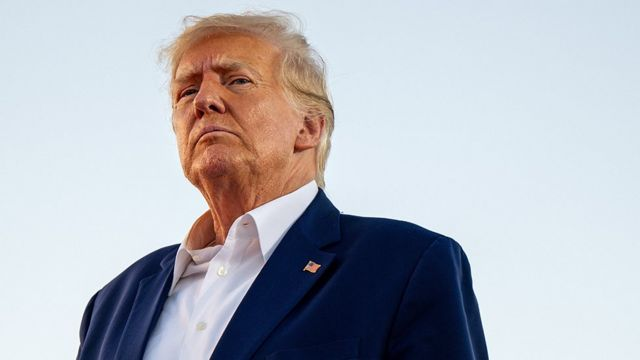
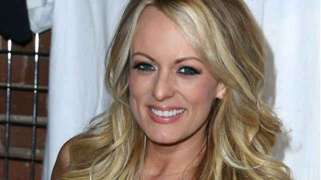

# [World] 特朗普受审日全流程预测：投案，被捕出庭，现场保释，返回海湖庄园发表演讲

#  特朗普受审日全流程预测：投案，被捕出庭，现场保释，返回海湖庄园发表演讲

> 图像来源，  Getty Images

**美国前总统唐纳德·特朗普（Donald Trump）因为涉嫌向一名色情片女星付“封口费”，即将面临历史性的刑事起诉。**

他于当地时间周一（4月3日）抵达纽约市，预计将会在周二接受法庭传讯。

届时，这名曾领导白宫四年的前总统将会面对法官。传讯的程序包括留下指模和拍摄面部免冠照片。

76岁的特朗普是历史第一个被刑事起诉的美国前总统。

他正在谋划再度竞逐总统职位，参加2024年美国大选。

这一案件到底是怎么回事？它有多大的重要性？本文带你迅速看懂。

##  最新的进展是什么？

周一，特朗普从佛罗里达州的家前往纽约，随后会被正式拘捕并出庭。

当局在周一已经加强了保安，因为预计周二在曼哈顿法院外将会有示威。美国媒体亦在纷纷对这一案件作全方位的追踪报道。

在听证会期间特朗普面临的起诉会被全部公开。特朗普预计会先到曼哈顿地区检察官布瑞格(AlvinBragg)的办公室投案，随后被法庭正式传讯，这意味着对他的指控会当庭宣读，随后他将进行申辩。

特朗普离开佛罗里达前往纽约之前，在自己成立的社交平台“Truth Social”上称这是“政治迫害”。

在正式传讯之前，特朗普的法律团队将加入一名新的律师托德· 布兰奇（Todd Blanche）。

预计这名前总统将会获法庭准许保释离开，并于周二晚上回到海湖庄园（Mar-a-Lago），并在当地时间20时15分向支持者发表讲话。

上周，纽约陪审团投票决定对特朗普提出控告，意味着他们相信，有足够证据对前总统进行刑事起诉。

我们目前尚不知道具体的起诉内容和罪名是什么——起诉书将会在传讯时全面公开。

不过，特朗普的律师已经表示，这名前总统将会否认控罪。

但是多个星期以来，陪审团都在听取关于特朗普向成人电影女星斯托米·丹尼尔斯（Stormy Daniels）付钱要求其保持沉默的证据。

事件发生于特朗普成为美国总统之前，后来他在2016年美国大选中击败希拉里·克林顿（Hillary Clinton）。

##  特朗普面临什么指控？

斯托米·丹尼尔斯表示，她在2006年与特朗普有过一段韵事，后者一直对此否认。

2016年，丹尼尔斯试图将她的故事卖给媒体。特朗普的律师迈克尔·科恩（Michael Cohen）向丹尼尔斯支付13万美元（10.5万英镑），要求其保持沉默。

> 图像来源，  Getty Images
>
> 图像加注文字，斯托米·丹尼尔斯

这一类付款被称为封口令。封口令本身并不犯法，但是曼哈顿检察官调查的是，与这笔款项有关的商业纪录是否存在造假。

这才是令特朗普陷入麻烦的因素——科恩报销这笔费用时在账户记录上称这笔款项为法律费用，被指造假。

由于事情发生在美国民众即将投票之际，它可能亦违反支付费用帮助竞选的相关法律。

案件将会进行审讯，特朗普将会提供他的说法，但我们不知道这会在什么时候进行。

他否认有任何不当行为，并称起诉是出于政治动机。

在特朗普抵达纽约之前，曼哈顿的特朗普大厦周围的每一个角落都已经有媒体记者驻守，至少有五架直升机在该区域上空盘旋。

在到达后，特朗普向媒体和人群挥手致意，并在严密保安包围下走进大厦。

##  若罪成，特朗普会入狱吗？

此案法律程序最终可能性最大的是罚款，但是也有可能是入狱。

假如当中有任何起诉的罪名属于严重罪行，那么特朗普将会面临最多四年监禁。

据美国媒体报道，特朗普至少面对一项严重罪行起诉；另有媒体报道他面临的大小罪名约有30项。

不过，法律专家向BBC表示，监禁的可能性很小。

##  特朗普还能参选吗？

可以。即使特朗普现在被起诉，美国宪法当中并无任何条例足以阻止特朗普继续他的选战。

即使他入狱，理论上他仍然可以竞选甚至当选美国总统。

不过，当中有现实的考量。

长期的官司和诉讼对于总统竞选而言是巨大的干扰——时间、精力和竞选集会的时间安排等等方面都是。

据特朗普的团队称，自上周对他作出起诉的消息传出后，特朗普2024年竞选阵营已经筹到超过800万美元。

乔治亚州议员玛乔丽·泰勒·格林（Marjorie Taylor Greene）计划在周二的法庭附近举行支持特朗普的集会。

纽约官员表示，与2021年国会骚乱事件前夕不一样，这一次他们并未看到有示威者大量涌入。

美国总统拜登（Joe Biden）周一表示，对纽约可能出现的骚动有担忧，但是“我对纽约警察部有信心”。

##  特朗普以往受到的调查

他在任总统期间曾面对过两次国会调查，即所谓的弹劾，但是两次都被参议院宣布无罪。

现在，他已经离任，不能再被弹劾，但是却可以被起诉 ，然后面对一系列刑事调查。

这些调查仍在继续。在未来的多个月，我们还会迎来更多消息。

