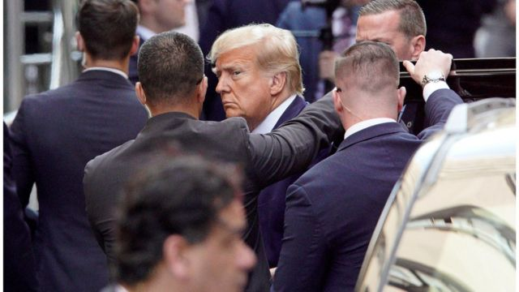
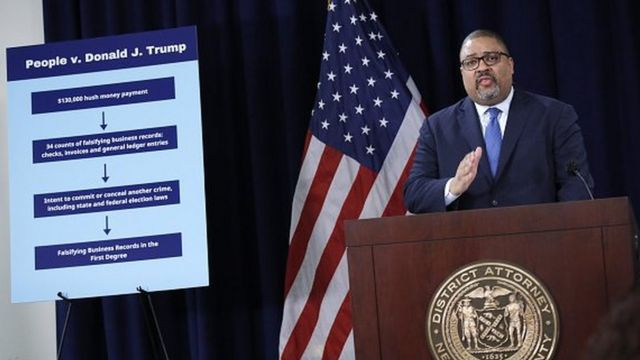
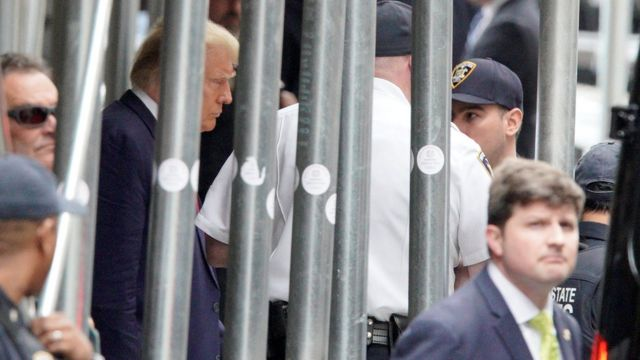

# [World] 特朗普受审：起诉美国前总统的34宗重罪揭露了什么？

#  特朗普受审：起诉美国前总统的34宗重罪揭露了什么？

  * 安东尼·泽克尔（Anthony Zurcher） 
  * BBC驻北美记者 

**美国前总统特朗普当地时间周二（4月4日）出席纽约法庭听证，否认全部34项刑事指控。之后，他返回佛罗里达并向支持者发表讲话，再次声称，起诉有政治动机，案件是“对我们国家侮辱”。同日，他的34宗重罪罪名曝光。**

虽然伪造商业纪录通常是被列作轻罪，但是，特朗普被指控干犯重型罪。这代表涉及的罪行更加严重，若最高量刑可能包括监禁。

“从根本上，今天这个案件中的指控和我们很多的白领案件差不多，”纽约市检察官阿尔文·布雷格（Alvin Bragg）这样形容他的团队向前总统作出的指控，“指控的是一个人一次又一次说谎来保护他们的利益，逃避我们所有人都必须遵守的法律。”

> 图像来源，  Reuters
>
> 图像加注文字，特朗普抵达法庭。

特朗普对所有的指控均否认，在离开法院后坚称无须答辩。“没有做过任何不合法的事！”他在他的社交媒体网站上发帖称。

不过，罪成与否将会由陪审团来决定。以下是这宗起诉美国前总统的历史性案件中的一些细节。

##  全部34项指控均涉及封口费

特朗普面对的指控是 34项伪造商业纪录的一级罪名  。

所有指控均涉及一宗13万美元的封口费，在2016年美国大选前由他的律师迈克尔·科恩（Michael Cohen）向色情片女星斯托米·丹尼尔斯（Stormy Daniels）支付，以阻止她谈论她声称的2007年曾与特朗普有染一事。

在法庭文件中，科恩被指代为“律师A”，丹尼尔斯则被指代为“女子2”。

在与起诉书一并提交的 事实陈述文件  中，第一行即清楚阐明起诉的案情： _被告唐纳德·特朗普（_ _DONALD J. TRUMP_ _）反复且具有欺骗意图地伪造纽约商业纪录，以掩饰在2016年总统选举期间对选民公众隐瞒危害信息的犯罪行为。_

> 图像来源，  Pool
>
> 图像加注文字，特朗普和其律师团队在法庭上。

##  法庭里发生了什么

在曼哈顿刑事法院，特朗普被控以34项伪造商业纪录的严重罪行。

在十多名法院人员和特勤人员陪同下，特朗普否认所有控罪。

程序持续接近一小时。栓控官还提到，特朗普在社交媒体上发布了“威胁性的帖文”。

法官默坎（Judge Juan Merchan）给予特朗普的律师在8月8日前提出任何动议的权利——比如可能提出排除诉状。

针对特朗普的指控全为E级重罪——属重型罪行中最低的级别。最高刑罚是四年监禁。

##  包庇行为发生在特朗普任总统期间

控告特朗普的案件围绕着科恩在支付封口之后如何获得补偿所展开。

2017年，在成为总统之后，特朗普与科恩在白宫见面。之后不久——长达10个月的时间里——特朗普开始从一个处理他资产的信托基金和他自己的银行账户里，出具支票给科恩。

这些支票被登记为“法务费用”，但是科恩说，它们实际上是封口费的报销。

检控方陈述指： _由特朗普集团（_ _Trump Organization_ _）保存及保管的有关支付纪录为虚假的纽约商业纪录。真相是，并无律师聘用协议，而律师A接受的并非是2017年提供法律服务的费用。被告导致他的实体伪造商业纪录，以掩饰他及其他人的犯罪行为。_

> 图像来源，  Getty Images
>
> 图像加注文字，检察官布雷格在庭审后的记者会上。

##  起诉将阻碍还是帮助特朗普？

_**——BBC北美事务编辑莎拉·史密斯（Sarah Smith）分析**_

特朗普的下一次出庭要等到12月——这意味着，在决定他能否成为总统参选人的共和党初选之前几个星期，他会以犯罪被告身份出现。

这对他的竞选来说会是个问题吗——还是说他能够将这次检控扭转为他竞选的有利因素？

在他将面临刑事起诉的消息传出之后的几天里，他的民意支持率上升了，而他的竞选团队声称筹得了超过1000万美元。

所以，他声称，自己是一场有政治动机的迫害行为的受害者，这一策略似乎是奏效的——至目前为止是这样。

但是特朗普还面临着更多的法律调查。他仍然可能在乔治亚州被控试图干预2020年总统选举结果。还有在华盛顿，一名特别法律顾问正在调查他在去年1月6日美国国会骚乱事件中的角色，还有在他佛罗里达家中发现的数百份机密文件。

即使对特朗普这样惯于虚张声势的政客来说，要在打一场总统选战的同时应付一宗或多宗刑事案件庭审，也是一点都不简单。

##  轻罪变重罪

布雷格指，特朗普伪造支付款项的真实性质，因为这些款项是用于支持一次犯罪行为。虽然封口费本身并不违法，但是使用金钱帮助竞选总统而不申报，则违反了联邦竞选财务法。

科恩仅因未透露向丹尼尔斯付款一事违规被定罪。布雷格重申，就该次付款向科恩作出补偿的特朗普，是与一项刑事罪行有关联——这使得他伪造商业纪录的行为成为一次更严重的罪行。

特朗普的辩护者称，这是滥用法律，而且是一次有政治动机的检控。

> 图像来源，  Reuters
>
> 图像加注文字，特朗普走出法庭。

##  “一种犯罪行为模式”

布雷格提到另外两个特朗普竞选阵营支付封口费的事例。他说这些支付的费用证实了检控方的说法，特朗普知道他给科恩的费用是试图影响2016年总统选举的不法企图当中的一部分。

_“被告与其他人一起编排了一_ _个_ _计划，通过发现并收买有关他的负面信息来压制信息的公开，从而有益于被告的竞选前景，以此来影响2016年总统选举，”起诉书的事实陈述这样表示，“为了实施这项不法的计划，参与者违反了竞选法规，制造并导致了纽约多家实体商业纪录中的虚假条目。”_

其中一个事例是，一名声称自己知道特朗普有一个婚外私生子的看门人接受了3万美元。另一个事例是，另一名声称自己与特朗普有染的女性接受了15万美元。特朗普否认与该女子有染。

这些款项来自八卦杂志《国家询问报》（National Enquirer）及其时任出版人大卫·佩克（David Pecker）。布雷格指后者与特朗普协作，压制可能具有危害性的信息曝光。起诉书指，作为回报，佩克获得邀请出席特朗普的总统就职典礼。

