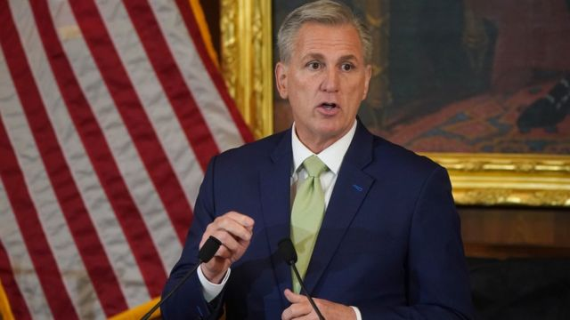
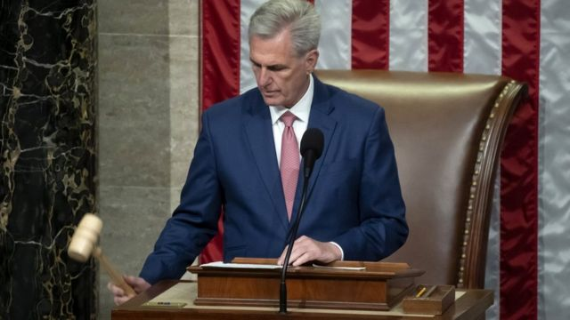

# [World] 麦卡锡：即将与台湾总统蔡英文见面的强硬派美国众议长

#  麦卡锡：即将与台湾总统蔡英文见面的强硬派美国众议长

> 图像来源，  PA Media

**蔡英文将于美国当地时间4月5日，在加州雷根（里根）总统图书馆与美国众议院院长麦卡锡（Kevin McCarthy）会面。**

这是台湾总统首次在美国境内与美国众议长会面，也是1979年中美建交以来，台湾领导人在美国进行的最高级别会晤。

麦卡锡被视为共和党内的务实派，人际手腕高明。他年初在美国164年来耗时最久的众院议长选举中，击败党内极右翼势力当选，取代前任、民主党人佩洛西（Nancy Pelosi，裴洛西）成为美国政坛的第三号人物。

##  家中首个共和党人

> 图像来源，  Reuters
>
> 图像加注文字，作为众议长的麦卡锡（右二）是美国当今政坛的第三号人物。

麦卡锡1965年生于加州中南部贝克斯非市（Bakersfield），母亲是家庭主妇，父亲为助理消防队长，双亲都是民主党支持者，他是家中第一个共和党人。

他在加州州立大学贝克斯菲尔德分校（California State University, Bakersfield）主修营销学，19岁在学校期间中了5000美元彩票，开始投资股票和经营三文治店，但很快就发现利润微薄、税收过高，因而转向支持右派理念。

麦卡锡卖掉小店，1987担任当地共和党众议员汤玛斯（Bill Thomas）的助手和徒弟，正式进入政界，2002年当选加州的州众议员。曾与他同期的共和党人麦金托（Tom McClintock）表示，对麦卡锡当年的表现印象深刻，指他在民主党人主导的加州议会中，很坚持共和党原则。

麦卡锡在加州议会做了两届，2006年其师傅汤玛斯退休，他便接棒参选，成功跻身国会。当时共和党是少数派，但麦卡锡很快在党内开辟自己的位置，以擅于筹款和招募著称。

他其后迅速晋升为首席副党鞭，后来又担任多数党党鞭。2014年，麦卡锡当选为众议院共和党领袖，2015年首次挑战议长宝座失败，同党的保罗·瑞安被选为议长。2019年后麦卡锡开始担任众议院少数党领袖。

##  对华立场强硬

> 图像来源，  EPA
>
> 图像加注文字，麦卡锡被认为对中国持强硬立场，他主导成立了众议院“美国与中国共产党战略竞争特别委员会”。

在外交议题上，他主张对中国强硬，2020年5月在众议院成立共和党“中国工作小组”（China Task Force），以应对中国威胁。

2022年底中期选举共和党重掌众院后，他宣布若当选议长将成立众院“中国问题特别委员会”（Select Committee on China）。2023年1月，众议院以365票赞成、65票反对，压倒性表决通过成立“美国与中国共产党战略竞争特别委员会”（Select Committee on Strategic Competition Between the United States and the Chinese Communist Party）。

麦卡锡指出，美国花了数十年时间，通过欢迎中国加入全球体系的政策，中国却以侵略与反美情绪来回应，他强调捍卫美国不受中国共产党侵略是跨党派的事情。他也说，共和党领导的众院将调查新冠疫情起源，追究中国的责任。

对台湾方面，他在2022年夏天曾力挺时任众议长佩洛西访问台湾，并承诺若共和党执掌众议院，他希望以议长身份再次率团访问台湾，成为第三位访台的众院议长。

今年1月美国网媒《酒杯新闻》（Punchbowl News）报道麦卡锡拟春季访问台湾，消息引起北京强烈反弹。《金融时报》3月初引述台湾官员称，蔡英文说服麦卡锡改为在加州会晤，以免过度刺激北京，威胁台湾安全。

