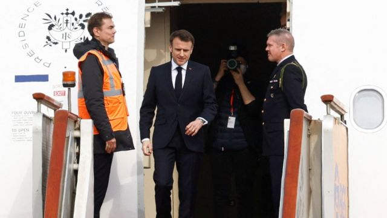
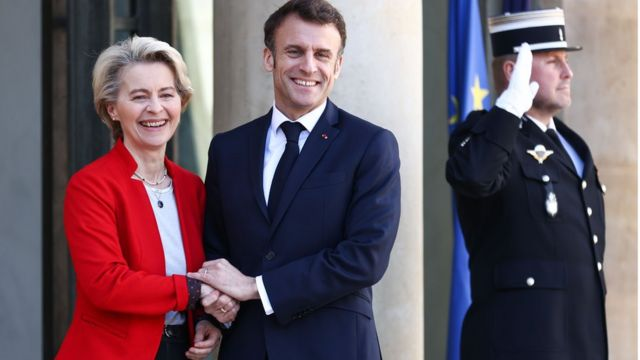
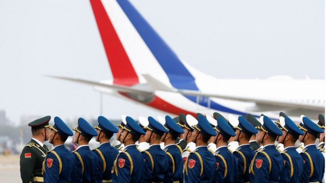
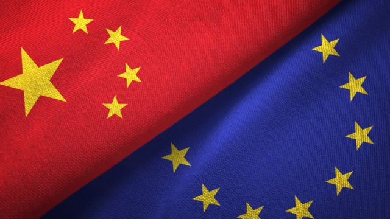

# [World] 马克龙冯德莱恩联袂访华：解决乌克兰危机，法欧领导人如何拉拢中国

#  马克龙冯德莱恩联袂访华：解决乌克兰危机，法欧领导人如何拉拢中国

  * 常思颖 
  * BBC中文 

> 图像来源，  REUTERS/Gonzalo Fuentes/Pool
>
> 图像加注文字，4月5日，法国总统马克龙抵达北京首都国际机场。

**在俄罗斯乌克兰战争持续僵局难解的情况下，法国总统马克龙（Emmanuel Macron）4月5日抵达中国进行为期三天的访问，与习近平、李强等人会晤。和马克龙联袂到访中国的还有欧盟委员会主席冯德莱恩（Ursula von der Leyen）。**

目前正值西方领导人对中俄关系的担忧加剧——习近平上个月前往莫斯科与普京总统会面，双方均表示要进一步强化双边关系。

乌克兰危机被认为是本次会晤的首要话题，不管是法国、欧盟，还是中国，都试图从中获得某些政治利益。

那么，他们各自希望得到什么呢？

##  马克龙的“机会”

对马克龙来说，这次访华的首要目的，是劝阻北京在乌克兰问题上支持俄罗斯；与此同时，他还希望与中国这个重要的贸易和地缘政治伙伴保持良好关系。

与其它欧洲国家不同的一点是，法国有约160万名法国公民居住在包括印太地区在内的海外领土上。法国在印太地区部署了约8000名军人，近年来法国留意到中国逐渐扩张的影响力，加大了军事部署。

但法国目前遭遇通货膨胀、难民危机，以及后疫情时代的经济挑战。乌克兰危机和欧俄之间的相互制裁令法国经济雪上加霜，加剧了国内的社会矛盾。因此法国将目光投向中国，希望北京通过与俄罗斯之间的友好关系来缓和乌克兰危机。

“中国是世界上唯一能够对（俄乌）冲突产生改变性影响的国家，”法国总统府的官员近日对记者表示。

该官员指出，中国如果在军事上支持俄罗斯将是一個灾难性决定，会对俄罗斯产生重大战略影响，而马克龙此次访华“将尝试寻找空间来实施对乌克兰人民有用的倡议，并为结束冲突找到中期路径”。

> 图像来源，  Mohammed Badra/EPA-EFE/REX/Shutterstock
>
> 图像加注文字，4月3日，法国总统马克龙在法国爱丽舍宫欢迎欧盟委员会主席冯德莱恩。

冯德莱恩也将中俄关系放在重要考虑中。他在上周发表的有关中国的演说中说：“中国如何继续与普京的战争互动，将是欧中关系未来发展的决定性因素。”

乌克兰战争爆发以来，北京多次表示希望通过和平谈判来解决冲突，但并没有谴责过俄罗斯的入侵，也没有要求俄罗斯军队撤出乌克兰，这令许多欧洲国家产生质疑。

“马克龙与欧盟委员会主席一起访问中国，表明马克龙重视强大而团结的欧盟，也有助于向北京发出欧洲团结的信息。”欧洲智库安全与发展政策研究所（Institute for Security & Development Policy）的冯儒莎（Zsuzsa Anna Ferenczy）博士对BBC中文说。

她认为，北京不希望进一步破坏与欧洲的关系，因为它把欧洲视为中国的重要合作伙伴和重要市场，不想被华盛顿取代。

“这对马克龙来说是一个机会。”冯儒莎说。

美国巴克内尔大学（Bucknell University）国际关系教授朱志群对BBC中文说，“如果马克龙能够推动中国在俄乌战争中扮演更积极的角色，将有助于提升法国的国际地位。”

也有分析认为，马克龙可能并非真的相信中国能在乌克兰危机中起到建设性作用。

欧洲对外关系委员会（European Council on Foreign Relations）的亚洲项目负责人扬卡·欧特尔（Janka Oertel）在 近日一次访谈中  说，一些欧洲政策制定者认为，假装相信中国的和平倡议可能是出于战术考虑。

她说，乌克兰总统泽连斯基自己也表示希望与习近平会面，并讨论这些建议。“欧洲领导人也可以打破中国领导层的虚张声势，推动北京就和平倡议提案的具体内容进行谈判，以确保中国政府没有空间声称其努力遭到拒绝。”

##  中国想要什么?

> 图像来源，  REUTERS/Gonzalo Fuentes/Pool
>
> 图像加注文字，4月5日，法国总统马克龙抵达北京首都国际机场前，中国军队军官列队站立。

对于中国来说，与美国的关系正日益恶化，于是将焦点转向最大的贸易伙伴欧洲，希望恢复正常交往。

自2022年秋天以来，中欧互动便持续上演。先是11月德国总理肖尔茨率先访华，随后在巴厘岛G20峰会期间，习近平密集会见法国、荷兰、西班牙、意大利等国家领导人。12月，欧洲理事会主席夏尔·米歇尔应邀访华。今年3月底，西班牙首相桑切斯也访问中国。

朱志群指出：“拜登政府对中政策以竞争为主，美国甚至施压一些盟友加入抗中行列。 中国显然希望分化美西方对中国的压力，这是近期以来中国积极发展与美国盟友的关系的主要原因，比如欧盟国家和澳大利亚，新西兰等。”

与此同时，“中方也认为马克龙是比较温和理性的领导人，是可以合作的对手。”

马克龙此前一直批评拜登政府对中国的强硬路线，并认为任何形式的“脱钩”对欧洲都是不利的，因为这关系到巨大的经济利益。他的顾问近日向外界表示，马克龙此次访华意在“重启”与中国的外交和经济联系。

冯儒莎说，“尽管马克龙支持欧盟对中国采取更强硬的立场，但他采取的方式很谨慎。他认为，欧盟应该按照自己的方式行事，使欧盟置身于美中战略对抗之外。”

这与中国的意图不谋而合。

不少中国专家指出，自乌克兰战争爆发以来，欧盟内部倾向美国的力量越来越大。他们认为，只要俄乌战争没有解决，欧盟对美国的依赖就会持续，而欧盟获得战略自主权的前景仍将黯淡。

中国现代国际关系欧洲研究所所长张健在 一篇文章  中写道：“欧洲国家增加的军费，大部分仍可能流向美国，而不是欧洲国家的军工企业……这显然不是（欧洲）战略自主的好迹象。”

“欧盟的多数成员国，仍将采购美国武器作为对美忠诚度的体现，以赢得美国好感，而不是以建设欧盟防务自主为目的。”

在为期三天的访问中，马克龙将在北京与习近平举行会晤，并访问中国的南方城市广州，这无疑代表着一种友好的外交意向。

##  法国与欧盟的“筹码”

> 图像来源，  Getty Images

不过目前尚不清楚，马克龙能否成功推动中国出力缓和俄乌战争。

有分析指出，马克龙没有筹码实现这一目标。因为需要考虑马克龙此次访华的另一个意图——与中国维持良好的经济关系。

最近几年，法国与中国的经济关系一直在下降，贸易逆差不断扩大。根据法国经济部，中法贸易逆差从2019年的330亿欧元增加到2021年的396亿欧元。疫情期间，家乐福、欧尚等多家法国大公司退出中国市场，其它一些公司则缩减了供应链。

推动中国的筹码似乎更多在冯德莱恩手中——这也是马克龙邀请她一同访华的一个重要原因。

“欧盟有警告中国的筹码，预防北京向俄罗斯提供致命性援助。北京依然重视与欧洲先进经济体的经济联系——特别是在高科技领域，欧洲目前比美国开放。”美国智库德国马歇尔基金会（German Marshall Fund）资深研究员司马安洲（Andrew Small）对BBC中文说。

冯德莱恩在访华前的演说中质疑中国的意图，并表示需要更多证据才能认可北京的和平计划。“没有让俄罗斯从乌克兰撤军的计划不是和平计划。”她说。

冯德莱恩或许已经意识到，让中国在缓和战争中发挥建设性作用似乎并不现实。

朱志群分析，跟马克龙比， 冯德莱恩可以说是欧盟内的对华鹰派，对中国一向批评较多。她此次与马克龙同行，“基本上是为了平衡欧盟对华政策，凸显双方在人权和安全等方面的分歧，同时强化中欧之间在经贸和投资等方面的合作。”

冯德莱恩代表着27个欧盟成员国。到目前为止，这些国家并不认可北京在2月底提出的关于解决乌克兰危机的12点立场，以及中国驻欧盟大使傅聪提出的“将乌克兰问题从双边议程中剔除”。

“欧洲许多人认为，试图鼓励中国做一些习近平显然不愿意做的事，是不现实的，甚至会起到反作用。”司马安洲说。

他认为，对于冯德莱恩，“更现实的行动是发出警告，如果北京继续向俄罗斯提供更深层次的支持，尤其是致命性援助，将严重破坏与欧洲的关系，从根本上使中国成为威胁欧洲安全的推动者。”

