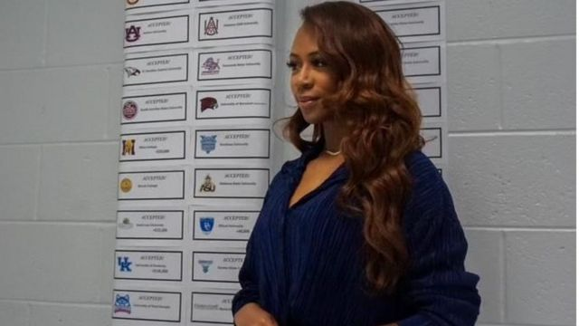
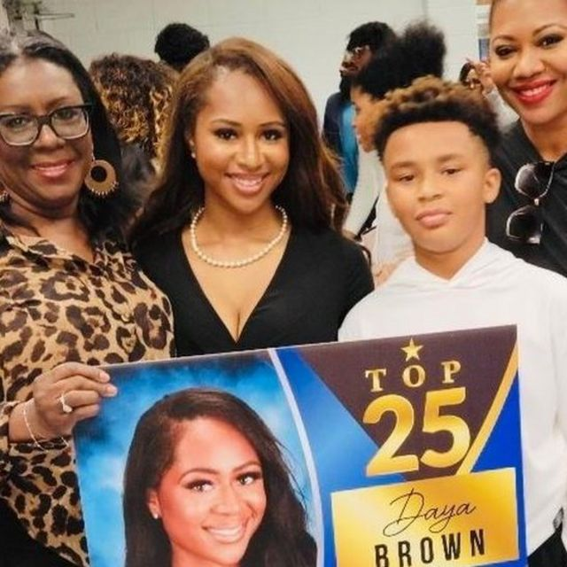
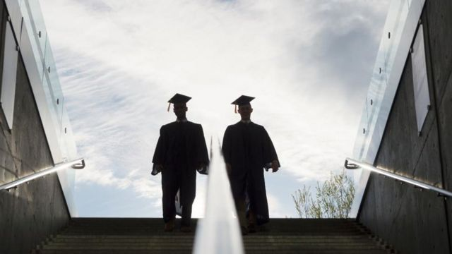

# [World] 美国女生获50多所高校录取和130万美元奖学金，她是这样做到的

#  美国女生获50多所高校录取和130万美元奖学金，她是这样做到的

> 图像来源，  Daya Brown
>
> 图像加注文字，黛雅·布朗（Daya Brown）说，18岁的她从未想过有能力交学费上大学。

**新冠疫情期间，美国佐治亚州（Georgia；又译乔治亚）亚特兰大市西湖高中（West Lake High School, Atlanta）的黛雅·布朗（Daya Brown）与世界各地千千万万的高中生一样，一直被困在家中上网课。**

然后她决定要拟一份清单，列出她希望升读的高校。

布朗对BBC说：“这是我远离烦嚣的办法。我跟自己讲：‘关上Netflix，来计划一下该怎么办吧。’”

她在高中已很享受新闻学、诗词与辩论。她说自己曾经参加的课外活动帮了她一把，让她懂得要及早规划。

“它让我意志坚定。我告诉自己：‘就算世界停顿了，你还能掌握未来。’”

在拟这份心仪学校清单的同时，她还在物色并申请各种各样的奖学金。

布朗说，“我从来没想过交学费上大学。”她说希望让父母不用担心要负担学费。

##  漫长的等待

> 图像来源，  Daya Brown
>
> 图像加注文字，黛雅·布朗在西湖高中的毕业典礼上与外祖母（左）、弟弟（右二）和母亲（右一）合照。

等待了四个月，她开始收到一封又一封的录取通知函。

她兴奋地说：“我获得50多家高校录取，还有不同的奖学金，合起来超过130万美元。”

然而，当她收到了最期待的那所院校来信之后，只能把其它的都拒掉。

“我申请了超过70所学校，到我收到杜克大学（Duke University）的提前录取通知，其它都得推掉。”

> 图像来源，  Getty Images
>
> 图像加注文字，黛雅·布朗说，她希望帮助其他学生申请入读大学。

结果，18岁的她接纳了杜克大学的一年财政援助奖学金。她将在2023年秋季入读视觉与媒体研究一年级。

她还是盖茨奖学金（The Gates Scholarship）的得主。这个奖学金将在夏季颁发予全美300名杰出弱势群体高中生。

她说：“这对于我来说非常重要，因为这是国内数一数二的奖学金，他们给你付全四年学费。”

那么，一次过申请那么多的奖学金，最难的地方在哪里？

让人意外的是，布朗觉得最难的不是要填写海量表格。

她指出：“我认为是那等待的游戏——毫无疑问那是最难的。但说到底，这教会了我保持耐性。”

如今布朗希望能帮助其他学生达成升学梦想。

她说：“我想成为其他女性与弱势群体学生的催化剂，跟他们说：‘你瞧，她也做得到，我也做得到。’”

##  大学录取致胜窍门

黛雅·布朗认为，能如此成功的获取大量高校录取，以下三件事给她带来的帮助很大：

  **寻求帮助** ——“找导师和职涯教练去谈。学生们很多时候对于查询可用资源感到难以启齿，而学校里有许多人在，他们唯一的工作就是给你帮助。” 

  **有条不紊** ——“这个过程可以很排山倒海、令人生畏和混乱。试着营造一个能列出你所有申请的平台，重用同一篇自荐文章也无所谓，按照每一家你要申请的院校加以调整就好。” 

  **利用课外活动来推销自己** ——“在入学申请过程中，课外活动有助塑造你的形象。他们想看到你作为个人的模样，也希望透过这些活动了解你的为人，你希望干些什么。” 

在等待开始大学生活之际，布朗并没有闲着。

她高中时创办了一家制作公司，最近在忙那里的业务。她说这家公司的目标是要推广青少年人的诗词、音乐、艺术与电影创作。

“有时候你会反问自己：‘我做这些干什么？’但你该提醒自己：‘你看，你在试着改变别人的生活，这没有问题，你会为此努力不懈。’”

