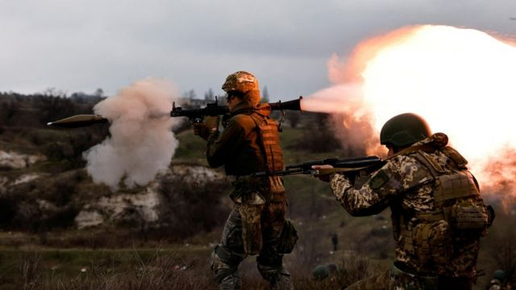
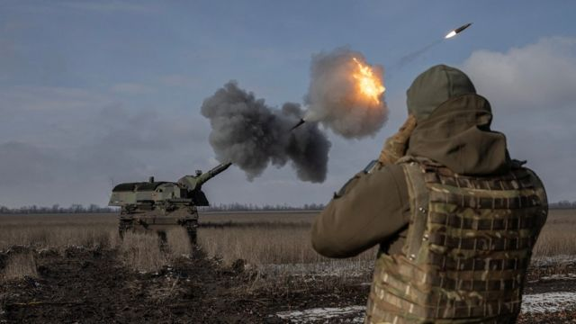

# [World] 乌克兰战争：美国机密文件外泄由谁所为？

#  乌克兰战争：美国机密文件外泄由谁所为？

  * 保罗·亚当斯（Paul Adams） 
  * BBC外交事务记者 

> 图像来源，  Reuters
>
> 图像加注文字，外泄的文件包括外国向乌克兰提供的训练细节

**美国国防部的数十份机密文件——地图、图表和照片——现在正在网络上流传，从中可以得出什么？**

加上各种时间线和数十个无人破译的军事词汇缩写，这些部分标记为“最高机密”的文件，描绘了乌克兰战争的一幅详细图景。

它透露了对战双方所遭受的伤亡，各方的军事弱点，还有关键的是，在乌克兰决定发动万众期待的“春季攻势”时，双方可能的优势是什么。

这些很可能是在某张餐桌上被摊开拍下照片的复印件有多真实？它们告诉我们什么？或者告诉克里姆林宫什么？有哪些是我们此前不知道的？

首先第一点：这是自14个月前俄罗斯全面入侵乌克兰以来，有关这场战争的美国秘密资讯最大规模的一次泄漏。当中有些文件已经是六个星期前的材料，但是可能的影响依然巨大。

有人引述五角大楼官员称，文件是真实的。

至少有一份文件上的信息在稍后的一个版本中似乎被乱改，但是在达100份之多的文件堆里，这似乎是一个相对微小的细节。

BBC看到了当中超过20份。它当中有些部分是描述向乌克兰提供训练和设备的细节，而乌克兰军队正在组织十几个新旅准备可能在数周内发动攻势。

当中说到，这些部队何时会准备好待命，还列出了所有由乌克兰的西方盟友所提供的坦克、装甲车和火炮。

但是它提到，“设备交付时间将影响训练和战备状态”。

> 图像来源，  Reuters
>
> 图像加注文字，乌军战士发射一枚德国制PzH2000自行推进式榴弹炮

一张地图包括一份“地带泥土冻结时间线”，评估乌克兰东部各地在春季进程中的地面状况。

在一个极尽考验乌克兰空中防御的冬天过后，也有一次对基辅防空能力下降的冷静分析，试图以有限的资源在保护平民、关键基础设施和前线部队之间找到平衡。

##  这里面有多少是新的？

这当中的很多细节都很眼熟。只不过这一次信息量要大得多，而且都汇总起来了。

以伤亡数字为例，文件并无令人惊讶地称，美国估计俄军死伤人数在18.95万至22.3万之间。

乌克兰一方的数字——12.45万至13.1万之间——也是与最近几周媒体报道的大概数字范围一致。

在这两个数据上，五角大楼都表示对其准确性“信心较低”，原因是信息落差、行动安全性，以及很可能双方都有意在误导。

有意思的是，就是在这一点上，有人试图改写文件，令它显得乌克兰蒙受最严重的伤亡。

在一个亲俄的Telegram网站上出现的一个版本，将乌克兰“阵亡”的人数（“1.6万-1.75万”）放进俄罗斯的统计里，但是将当中乌克兰一方的数位作了对调，于是数字变成“6.1万-7.15万”。

所有这些都令我们疑问，是谁泄漏了这些文件，以及为什么？

##  “来看一些外泄文件”

关于这些文件是如何从讯息平台Discord流入4Chan和Telegram，公开来源情报调查机构啤令猫（Bellingcat）的阿里克·托勒（Aric Toler）已经 作过报道  。

托勒表示，目前尚未能揭露泄漏文件的最初来源，但是追溯到文件于3月初在游戏玩家常用的一个通讯平台上出现过。

3月4日，电脑游戏《我的世界》（Minecraft）玩家常去的Discord平台服务器上出现一些有关乌克兰战争的争论，之后一名玩家写道“来，看一些外泄的文件”，然后发送了当中的10份文件。

这并不寻常，但也绝非独一无二的文件泄漏方式。

2019年，在英国大选前，有关美英贸易关系的文件出现在Reddit、4Chan等网站上。

当时，Reddit表示，那些未经涂抹的文件是来自俄罗斯境内。

去年的另一个案例中，网络游戏《战争雷霆》（War Thunder）的玩家反复发布敏感的军事文件，似乎是要在他们自己的争论中获胜。

最近的文件泄漏信息更加敏感，而且有可能具有破坏性。

乌克兰一直对自己的“行动安全性”很警惕，对于如此敏感的材料在这样一个关键时刻被外泄，绝不会感到高兴。

乌克兰的春季攻势，对于想要扭转战场形势和为之后和谈定调的泽连斯基政府来说，可能是一个不成功便成仁的时刻。

在基辅，官员已经谈及这可能是俄罗斯发动的一次虚假消息行动。

另一些军事博主则提出相反的看法：这全是西方试图误导俄罗斯指挥官的一次阴谋。

关键的是，目前泄漏的文件当中没有任何信息指出乌克兰反攻的方向和目标。

克里姆林宫对于乌克兰备战的规模肯定已经有比较多的了解（尽管莫斯科在情报上的失败在整场战争中已有明证），但是基辅需要一直让它的敌人猜不透这场行动会如何展开，这样才能让成功机会最大化。

