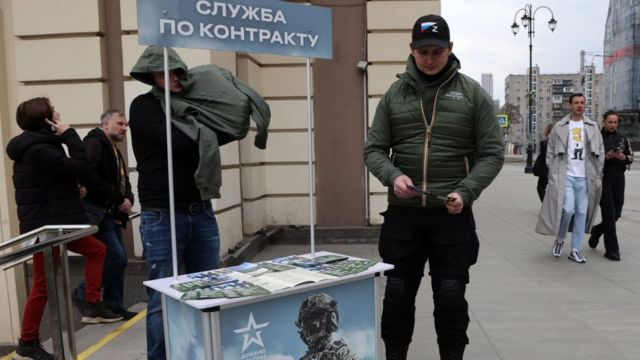
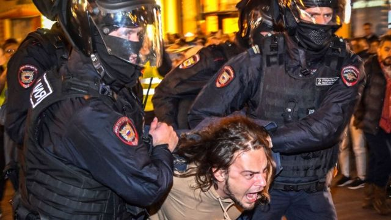

# [World] 乌克兰战争：俄罗斯议会批准网络征召 但否认是为打击逃兵役

#  乌克兰战争：俄罗斯议会批准网络征召 但否认是为打击逃兵役

> 图像来源，  Getty Images

**俄罗斯议会已通过立法，开始网络提供征召文件。**

克里姆林宫否认此举旨在加速进一步动员俄罗斯男性或阻止普遍的逃避兵役现象。

成千上万的俄罗斯人为躲避乌克兰战争而躲避征兵。

批评人士说，这项法律进一步证明了当局正在创建一个“电子古拉格”，这指的是苏联时代的监狱网络。

截至目前，俄罗斯的征兵文件必须亲自或通过雇主提供。

实际上，这意味着许多人通过搬离登记居住地来逃避兵役，或者在军官来访时直接不开门。

根据新立法，征召文件一旦出现在名为“Gosuslugi”的特殊“国家服务”政府网站上，就将被视为送达。

俄罗斯议会国防委员会主席安卡尔塔波洛夫（Andrei Kartapolov）在电视上表示：“传票一经存入应服兵役人员的个人账户，即视为已收到。”

从那一刻起，应征入伍的人士必须到当地的征兵办公室报到。

未能到场的公民将被禁止出国旅行，并可能面临其他限制。他们将不能买卖房产，他们的驾驶执照将作废，他们也不能注册小企业。

395名俄罗斯议员对该法案进行了投票，394人支持，1人弃权。俄罗斯下议院即国家杜马有450名议员。

新法案将在总统普京签署后生效，这可能很快就会完成。

去年9月，克里姆林宫开始了一场混乱的紧急动员运动，以支持俄罗斯在乌克兰的“特别军事行动”。在全面入侵后，俄罗斯遭遇了一系列屈辱的失败。

据信，在一次行动中，超过30万名退役士兵和前义务兵被征召入伍，行动中经常看到年轻人在街上或购物中心被选中。

数千名年龄在18岁至27岁之间的男子逃到国外躲避兵役，俄罗斯许多城市爆发了抗议活动，不过很快就被镇压了。

> 图像来源，  ALEXANDER NEMENOV/AFP
>
> 图像加注文字，俄罗斯有民众抗议动员

根据泄露的美国文件，俄罗斯估计伤亡人数在18.95万至22.3万之间。这些数字包括35500至43000人在战斗中死亡，及15.4万至18万受伤。

BBC俄罗斯组通过从公开信息源收集信息，编制了一份确认死亡的17000名俄罗斯军人名单，名单中有姓名、军衔，很多还包括他们服役的部队。

俄罗斯当局上一次公布伤亡数字是在去年9月，当时他们证实有5937名军人死亡。

“一个让人觉得的心用手的政府网站原来也有不好的一面，”Helpdesk网站创始人克拉西尔希奇克（Ilia Krasilshchik）在推特上写道。该网站为想躲避的俄罗斯男性兵役提供建议和帮助。

“瞬间你就会被标记出来，你就不能出境。就是这样。谁需要新一波的动员活动呢？在一个数字化的国家，颇具吸引力的接口能把人们一个一个找出来。”

俄罗斯人广泛使用国家服务局政府门户网站申请新护照或结婚证，支付账单和罚款，或与普通科医生进行预约。

普京的新闻秘书佩斯科夫（Dmitry Peskov）否认新立法和尝试扩大动员有关：“这只是为了改善军事记录。该系统必须符合现代需求。”

