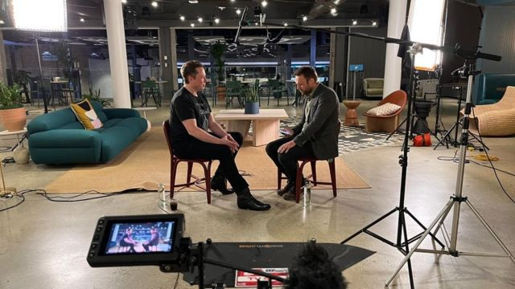
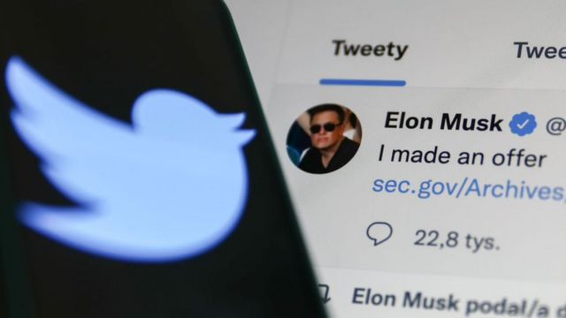
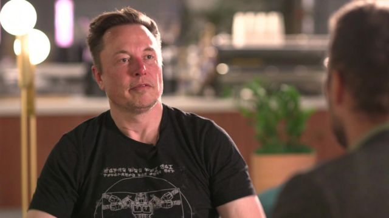

# [World] 马斯克：推特总裁接受BBC专访的六个要点--仇恨言论，封杀TikTok，BBC标签争议等

#  马斯克：推特总裁接受BBC专访的六个要点--仇恨言论，封杀TikTok，BBC标签争议等

**推特（Twitter）所有者兼首席执行官（CEO）伊隆·马斯克（Elon Musk）在短时间内忽然接受BBC直播专访，在一个小时的对话中分享了包括虚假信息、美国总统拜登，以及那场曲折的收购等广泛议题。**

他向BBC表示，运营推特是一个“颇为痛苦”且如同“过山车”的历程。

马斯克是目前世界第二富豪，同时经营着汽车公司特斯拉（Tesla）和航天火箭公司SpaceX。他在去年10月以440亿美元（354亿英镑）收购推特。

在旧金山（三藩市）的推特总部进行的访问中，他向BBC记者詹姆斯·克雷顿（James Clayton）谈到了这家社交媒体公司的大规模裁员、虚假信息以及他个人的工作习惯。

在这场罕见的访问中，他为自己经营推特的方式辩护。

但是他承认，他最终完成对推特的收购是因为当时法官即将要下令他履行收购协议。

他还在访问中确认，将会修改BBC推特帐户上的认证标签——不久前，BBC的官方推特帐户被标记为“政府资助”，现在将改为“公众资助”。

以下是这场访问中我们了解到的六个重点。

##  1\. 马斯克否认推特上的仇恨言论激增

> 图像来源，  Getty Images
>
> 图像加注文字，马斯克收购推特花费了440亿美元。

有说法指在他接手之后，推特上的仇恨言论及内容有增加，马斯克拒绝承认 这一点。

今年较早前，有推特内部人士向BBC表示，在马斯克成为所有者之后经历大量裁员和转变的该公司，已不能再保护用户免受网暴、政府调控的假资讯以及儿童性剥削的侵害。

3月，推特称已经在一个月内删除40万个帐户，以帮助“令推特更安全”。

要全面评估马斯克的说法，你需要有两样我们目前没有的东西——获取马斯克接手前后的推特数据，以及关键的一点是，明确理解他如何定义虚假信息和仇恨言论。

在美国法律下，仇恨言论并没有一言以蔽之的定义。由于美国宪法第一修正案的存在，美国法律对此大体上要比其他国家宽松得多。

##  2\. 他把选票投给了拜登

马斯克说，此前的美国大选，全美有近一半人把票投给了特朗普，但是他说：“我不是其中之一，我投给了拜登。”

在访问的另一个时刻，他为推特解除对特朗普的禁令辩护——后者在2021年被该平台指控煽动暴力而遭封禁。

##  3\. 他声称推特正在对抗假消息之战中获胜

马斯克声称，他致力于删除自动生成的机器账户（bot），在他接手后推特上的虚假信息减少了。

“我的经验是虚假信息减少了，而不是增多了。”他向BBC记者表示。

一些外部的专家对此并不同意。追踪网上虚假信息的初创公司“新闻卫士”（Newsguard）所进行的一项 研究  ——同类的调查研究还颇多——发现，在马斯克接手后，流行的虚假信息传播帐户互动参与度是上升了。

根据该调查，在他收购推特之后的那个星期，那些最受欢迎却最不可信的帐户在点赞、转推等形式的互动参与度方面上升了将近60%。

BBC也独立分析了超过1000个过去曾被禁、但在马斯克接手后又被解禁的帐户，发现恢复后的帐户有超过三分之一散播过侵害或者虚假信息。

这当中包括错误的反疫苗主张、厌女和反LGBT宣传，以及否定2020年美国大选结果等。

##  4\. 他反对封杀TikTok

马斯克表示，他不使用这个美国最多人下载的应用程式，但是他反对任何迫使其关闭的举措。

基于TikTok由中国公司拥有而产生的安全忧虑，美国正在考虑封禁该应用。其他一些国家已经禁止政府雇员在手机上使用它。

“我总体上是反对封杀任何东西，”马斯克说，尽管他表示禁令对推特有利，因为这可能意味着更多人会使用他的平台。

##  5\. 不会以440亿美元出售推特

马斯克在访问中曾表示，如果现在有人出他之前的价格收购推特，他会拒绝。

他说，如果他要卖，更重要的是找到一个珍惜“真相”而不是在乎出价的买家，因为正如他自己说的：“我不在乎钱。”

但是，这是真的吗？不要忘记，他曾经拼命想要退出收购。

##  马斯克BBC访谈中的五句关键引语

  **谈收购推特：** “过程一点都不平淡，就像坐过山车一样……真的是一个非常紧张的情况。” 

  **谈大裁员：** “我不会说那是冷漠……假如整条船都沉了，那就所有人都没工作。” 

  **谈营利：** “我们在这个季度可以营利，或者更准确地说，是可以达到资金流正值，如果一切继续向好的话。我想几乎所有广告商都回来了，或者表示它们会回来。” 

  **谈争议性推文：** “我有没有在推特上多次搬石头砸自己的脚？有。” 

  **谈标记BBC为“政府资助媒体”：** “我们正在将标签调整为……公共资助……如果我们使用和BBC一样的词汇来描述它，想必也是可以的。” 

马斯克表示，他接手时，推特顶多只能再活几个月，而且是被当作一个非营利机构在运营。

推特当时的运营成本是高于它所获得的收益。在马斯克接手之前的最后一次全年报表中，它的总销售额在2021年达到50亿美元，支出则是550亿。事实上，自2012年以来，推特仅有两年获得盈利。

马斯克认为，推特现在是接近收支平衡。这并不令人意外——解雇6500名员工确实会减轻成本。

但是，他也在积极主动地寻找方法加强销售，比如通过改变推特用家的“蓝钩”认证。

所以，没错，推特现在或许正在接近收支平衡，这是因为大幅裁员。但是问题在于，它能不能保持这种盈利趋势，令这家公司配得上440亿美元的价码。

##  6\. 在BBC的认证标签上让步

马斯克确认，在上星期的争论之后，他会将BBC的推特帐户认证标签从“政府资助（government funded）”改为“公众资助（publicly funded）”，而在访问结束几个小时后，标签已被修改。

BBC此前对原本的标签表示反对，强调英国广播公司的独立性。它主要由英国公众通过电视牌照费提供资金。

周三的访问中，马斯克表示：“如果我们使用和BBC一样的词汇来描述它，想必也是可以的。”

牌照费在2022年BBC的53亿英镑总收入当中占71%——其余部来自于拨款、版税和租金收入等商业及其他活动收益。

BBC还从政府获得每年超过9000万英镑，资助主要服务非英国受众的BBC国际部（BBC World Service）。

