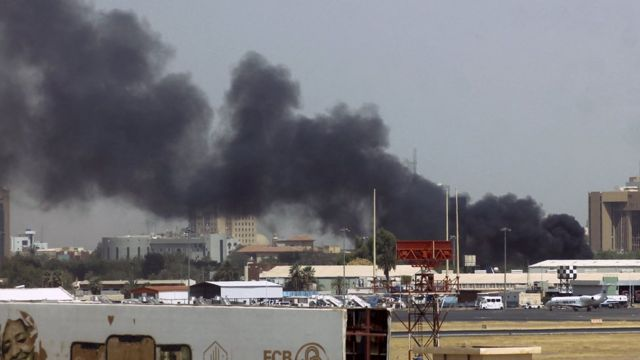
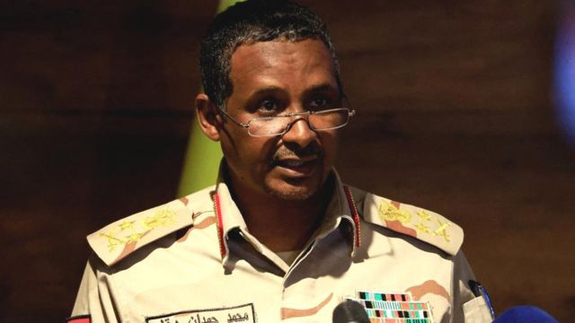

# [World] 苏丹内乱：喀土穆冲突的来龙去脉

#  苏丹内乱：喀土穆冲突的来龙去脉

> 图像来源，  Getty Images
>
> 图像加注文字，喀土穆机场附近的建筑物冒出黑烟

**在苏丹首都喀土穆和该国其他地方爆发的冲突是该国军事领导层恶性权力斗争的直接结果。**

苏丹准军事组织快速支援部队成员和正规军士兵在首都的重要战略地点发生冲突。

以下是你需要知道的信息。

**这场冲突的背景是什么** **？**

自2021年10月政变以来，苏丹一直由一个将军委员会管理，争端的中心有两名军人。

布尔汉（Abdel Fattah al-Burhan）将军是武装部队的首脑，实际上是该国的总统。

还有他的副手兼快速支援部队领导人达加洛将军（Mohamed Hamdan Dagalo），也就是赫梅蒂（Hemedti）。

他们在国家未来的方向和向文官统治的提议上存在分歧。

其中一个主要的分歧点是将10万人的快速支援部队纳入军队的计划，以及谁将领导这支新部队。

**为什么这一切都在周六开始** **？**

在暴力事件发生之前，快速支援部队的成员被重新部署到全国各地，军方认为这是一种威胁，局势紧张数日。

人们曾希望通过谈判解决这一问题，但未实现。

目前还不清楚周六早上是谁打响了第一枪，但人们担心这将使本已不稳定的局势进一步恶化。

外交官们敦促双方停火。

##  快速支援部队是什么?

快速支援部队成立于2013年，源于臭名昭著的金戈威德民兵组织，该组织在达尔富尔残酷地击退了叛乱分子。

从那以后，达加洛建立了一支强大的军队，介入了也门和利比亚的冲突，并控制了苏丹的一些金矿。

它还被指控侵犯人权，包括在2019年6月杀害120多名抗议者。

在军队之外，有如此强大的力量，这一直被视为该国不稳定的根源。

**为什么军方** **执政** **?**

这场冲突是2019年长期任职的总统奥马尔·巴希尔（Omar al-Bashir）被驱逐后紧张局势的最新进展。

苏丹爆发了大规模街头抗议活动，要求结束他近30年的统治，军方发动政变推翻他。

但平民继续要求在走向民主统治的计划中发挥作用。

> 图像来源，  Reuters
>
> 图像加注文字，达加洛

随后苏丹成立了一个军民联合政府，但该政府在2021年10月的另一场政变中被推翻。

从那时起，布尔汉和达加洛之间的竞争更加激烈。

去年12月，苏丹达成了一项将权力交还平民手中的框架协议，但最终敲定细节的谈判失败了。

##  目前情况如何？

这场冲突震动了整个国家，据报道有50多名平民死亡。

在苏丹首都喀土穆，敌对势力争夺总统府、国家电视台和军队总部，居民们在躲避炮火。

一个医生组织称，该市已有25人死亡，其中包括17名平民。

冲突是在提议向文官统治过渡引发紧张局势之后爆发的。

政府军和反对派快速支援部队都声称他们已经控制了机场和喀土穆的其他重要地点，战斗持续了一夜。

周日凌晨，靠近喀土穆的恩图曼和附近的巴赫里都能听到重炮声。目击者还报告说，靠近红海的城市苏丹港有枪声。

军方表示，飞机正袭击快速支援部队基地，该国空军告诉人们周六晚上呆在家里，同时对准军事活动进行了全面的空中调查。

喀土穆居民向BBC讲述了他们的恐慌和恐惧，其中一人称，有人向隔壁的房子发射了子弹。

苏丹一个医生委员会称，全国各地的城市和地区至少有56名平民被杀，还表示，数十名军事人员死亡，其中一些人曾在医院接受治疗。

该委员会称，至少有595人受伤。

##  未来会发生什么？

如果战斗继续下去，可能会进一步分裂国家，加剧政治动荡。

外交官们在敦促缅甸恢复文官统治方面发挥了至关重要的作用，他们将不顾一切地想办法让两位将军进行对话。

同时，普通苏丹人将不得不经历又一个不确定时期。

