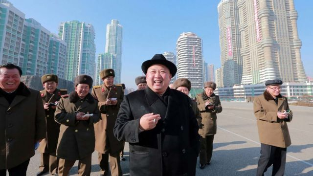

# [World] 英美烟草公司因违反朝鲜制裁规定，需向美国政府支付6.35亿美金

#  英美烟草公司因违反朝鲜制裁规定，需向美国政府支付6.35亿美金

> 图像来源，  Getty Images
>
> 图像加注文字，金正恩

**因其旗下的一家子公司承认向朝鲜出售香烟违反了制裁规定，英美烟草公司（British American Tobacco）将向美国当局支付6.35亿美元（合5.12亿英镑）和利息。**

美国当局表示，这次协议与2007年至2017年英美烟草公司在朝鲜的活动有关。

英美烟草首席执行官杰克•鲍尔斯（Jack Bowles）表示：“我们对这种不当行为深感遗憾。”

美国因朝鲜的核武器和弹道导弹活动对其实施了严厉制裁。

周二，英美烟草公司与美国司法部和财政部外国资产控制办公室达成和解。

英美烟草公司是全球最大的烟草跨国公司之一，也是英国十大公司之一。它拥有包括Lucky Strike、Dunhill和Pall Mall在内的主要香烟品牌。

该公司在一份声明中表示，其已"与美国司法部签订了暂缓起诉协议，并与海外资产控制办公室签订了民事和解协议，英美烟草在新加坡的一家间接子公司已与美国司法部签订了认罪协议"。

美国司法部表示，英美烟草还合谋欺骗金融机构，让它们代表朝鲜实体处理交易。

据称北韩国务委员会委员长金正恩的烟瘾很大。去年，美国试图让联合国安理会禁止向朝鲜出口烟草，但遭到俄罗斯和中国否决。

在周二的新闻发布会上，美国司法部助理司法部长马修·奥尔森（Matthew Olsen）表示，和解是“一项长期调查的结果”，并称这是“司法部史上对朝鲜制裁开出的最大单笔处罚”。

他表示，英美烟草参与了一项“精心策划的计划，旨在绕过美国制裁，通过子公司向朝鲜出售烟草产品”。

“2007年至2017年，这些第三方公司向朝鲜出售烟草产品，并获得了大约4.28亿美元。”

朝鲜银行家Sim Hyon-Sop（39岁）和中国中间人秦国明（音译，60岁）、韩琳琳（音译，41岁）也被控协助向朝鲜出售烟草。

警方悬赏500万美元缉拿任何有助于逮捕或定罪Sim的信息，对另外两名嫌疑人悬赏每人50万美元。

他们被指控为朝鲜国有香烟制造商购买烟叶，并伪造文件，欺骗美国银行处理价值7400万美元的交易。因为这些交易，朝鲜制造商（包括一家军方所有的制造商）赚了约7亿美元。

朝鲜多年来因其弹道导弹发射和核试验而面临多轮严厉制裁。

然而，这并没有阻止金正恩继续发展朝鲜的武器项目。

