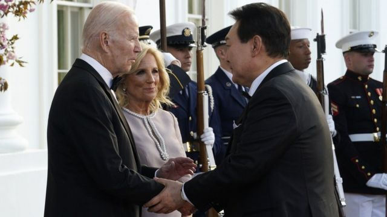
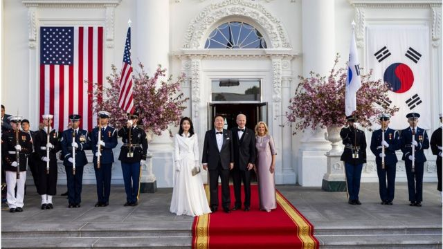
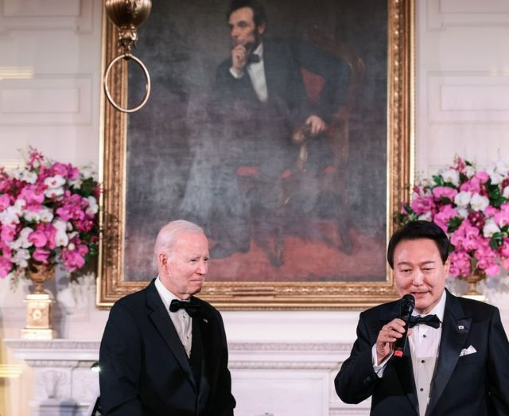

# [World] 尹锡悦访美：美韩达成重要核武协议

#  尹锡悦访美：美韩达成重要核武协议

> 图像来源，  EPA
>
> 图像加注文字，美国总统拜登和韩国总统尹锡悦达成一项新协议

**美国总统拜登和韩国总统尹锡悦达成了一项具有里程碑意义的协议，以应对朝鲜的核威胁。**

美国同意定期向韩国部署美国核潜艇，并让韩国参与其核规划。作为回报，韩国同意不发展核武器计划。

拜登表示，这份名为《华盛顿宣言》（Washington Declaration）的协议将加强美韩合作。

他在周三与尹锡悦一起举行的新闻发布会上发表了上述讲话。尹锡悦本周在访问华盛顿期间将讨论一系列问题，包括乌克兰战争、气候变化、网络合作和核电。

尹锡悦表示，《华盛顿宣言》标志着美国前所未有的承诺，即通过核武器加强防御阻止攻击，保护美国盟友。

宣言发布之际，朝鲜进行了创纪录数量的弹道导弹试验，人们对朝鲜核威胁的担忧日益加剧。

“这与加强威慑有关，来回应朝鲜不断升级的行为，”拜登说。

美国政府高级官员本周对记者表示，这项新协议是数月来谈判的结果。

美国官员本周对记者表示，根据该协议，美国将致力于采取措施，“通过定期部署战略资产，包括美国核弹道导弹潜艇访问韩国，使威慑更加明显，这是自上世纪80年代初以来从未发生过的事情”。

双方还将建立一个核协商小组，讨论核规划问题。

> 图像来源，  EPA
>
> 图像加注文字，韩国总统尹锡悦4月24日开始对美国进行6天的访问。

长期以来，韩国的政界人士一直在敦促美国，让他们更多参与计划如何以及何时对朝鲜使用核武器。

随着朝鲜核武库的规模和复杂程度不断提高，韩国人越来越担心，在什么事情会促使拜登代表他们按下核按钮的问题上，他们被蒙在鼓里。由于担心华盛顿可能会抛弃首尔，人们呼吁韩国发展自己的核武器。

但今年1月，尹锡悦成为数十年来首位将这一想法重新提上日程的韩国总统，令华盛顿的政策制定者感到惊讶。

美国突然明白，安抚人心的言辞和姿态不再起作用，如果它想劝阻韩国放弃制造自己的核弹，就必须拿出一些具体实在的东西。

此外，尹锡悦明确表示，他希望在取得“切实”进展后回国。

智库“新美国安全中心”（Centre for a New American Security）的金杜妍（音译，Duyeon Kim）表示，对韩国来说，参与核规划是一个“重大胜利”。

“到目前为止，在华盛顿决定使用核武器前，桌面演习将结束，”金杜妍表示。

“美国曾认为此类信息过于机密，无法分享，但考虑到朝鲜正在生产的核武器类型，针对这种情况进行练习和训练非常重要。”

这个新的核协商小组符合韩国政府的要求，提供了更多参与。但更大的问题是，它能否平息公众的焦虑。

这并没有使美国完全承诺，如果朝鲜发动攻击，美国将使用核武器保卫韩国。

但拜登周三表示：“朝鲜对美国或其盟友和伙伴发动核攻击是不可接受的，无论哪个政权采取这种行动，都将导致其政权终结。”

作为回报，美国要求韩国保持无核状态，并忠实倡导不扩散核武器。美国认为，劝阻韩国放弃拥核非常重要，担心如果这次失败，其他国家可能会步其后尘。

但美国的这些承诺不太可能完全满足一些有影响力、越来越直言不讳的学者、科学家和韩国执政党成员，他们一直在推动韩国政府武装自己。

韩国拥核的主要支持者郑成昌（音译，Cheong Seong- chang）博士表示，尽管宣言有许多积极的方面，但“韩国公开放弃《不扩散核武器条约》的权利，这极其令人遗憾”。他补充说，这“进一步加强了我们的核束缚”。

拜登表示，美国将继续努力让朝鲜重返谈判桌。华盛顿说，平壤无视了无先决条件会谈的多次要求。

美国希望说服朝鲜放弃核武器，但去年朝鲜领导人金正恩宣布该国的核地位“不可逆转”。

一些专家表示，现在讨论军备控制而不是无核化更有意义。

> 图像来源，  EPA
>
> 图像加注文字，周三在白宫举行的国宴结束时，拜登总统邀请韩国总统尹锡悦唱起了歌曲《美国派》。尹锡悦拿起话筒，用英语唱出了第一段。

韩国总统尹锡悦4月24日开始对美国进行6天的访问。访问中，韩美总统共同参拜韩战纪念碑，在白宫交流会面互赠礼品。两国还签订了网络安全合作框架协议。

中国与韩国之间或许也将有进一步的高层交流。

据韩联社报道，韩国驻华大使馆25日表示，驻华大使郑在浩前一日在北京人民大会堂向中国国家主席习近平递交国书，并转达韩国总统尹锡悦期待习近平年内访韩的信息。

但中国外交部4月26日回应称，对于此事没有可以提供的信息，中韩双方就推动双边关系健康稳定发展，包括妥善处理各自关切和敏感问题等保持着沟通。

