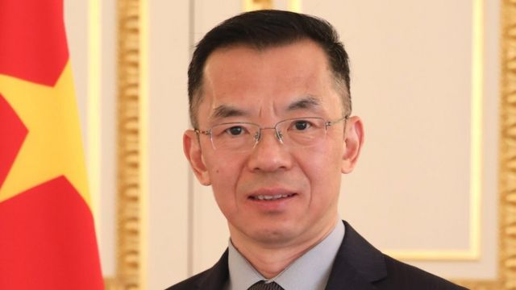
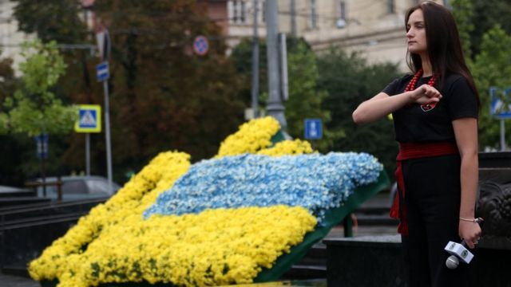
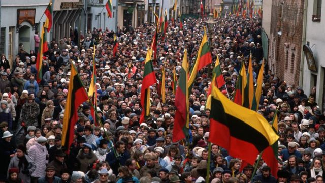
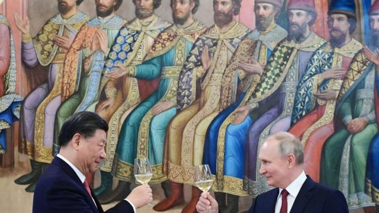
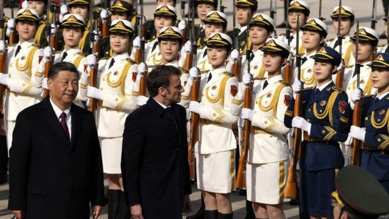
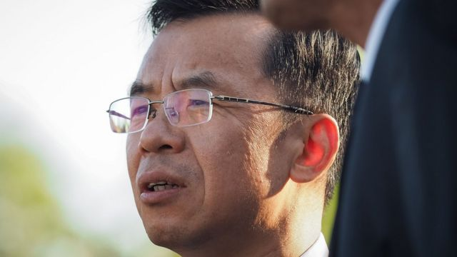
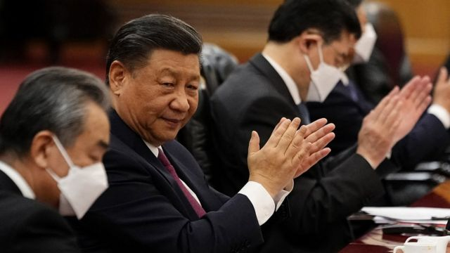

# [World] 卢沙野“质疑主权论”为何引爆中国与欧洲的外交风波

#  卢沙野“质疑主权论”为何引爆中国与欧洲的外交风波

  * 李澄欣 
  * BBC中文记者 

> 图像来源，  Chinese Embassy in Paris
>
> 图像加注文字，中国驻法国大使卢沙野经常发表争议性言论，此前曾说孟晚舟被捕是因为“白人优越感”，辱骂法国著名学者是“小流氓”，说台湾“统一”后要进行“再教育”等。

**就在中国与欧盟关系回暖之际，中国驻法国大使卢沙野公开质疑前苏联国家主权范围，引发欧洲舆论海啸。**

中国驻法国大使馆4月24日发表声明，定调卢沙野言论为“个人观点”，并下架稍早发布的访谈全文。中国外交部发言人毛宁重申尊重各国主权独立及领土完整。

欧盟外交与安全政策高级代表兼欧盟委员会副主席博雷利（Josep Borrell）指北京已经适当澄清，法国总统马克龙（Emmanuel Macron）就批评外交官不应使用这种言辞，法方全力声援受影响国家，强调这些国家边界不可侵犯。

此前，法国以及波罗的海三国爱沙尼亚、拉脱维亚和立陶宛，都召见中国驻当地大使要求解释，乌克兰总统顾问也谴责相关言论。80名欧洲议会议员发表公开信，呼吁法国政府将卢沙野列为“不受欢迎人物”并驱逐出境。

多名国际关系学者向BBC中文分析指，卢沙野言论看似只是小错误，却“致命性伤害”了中国欧盟关系，让欧洲的亲中派“一言惊醒梦中人”，也使此前对北京示好的马克龙陷入尴尬。

##  卢沙野说了什么？

> 图像来源，  Getty Images
>
> 图像加注文字，2021年8月29日有乌克兰民众庆祝独立三十周年。

根据中国驻法国大使馆微信公众号一度刊出的访谈纪录，卢沙野4月21日接受法国电视台LCI访问时，被问到克里米亚是否属于乌克兰，他答道：“这取决于如何看待这个问题。历史上，克里米亚一开始就是俄罗斯的。苏联时期，赫鲁晓夫把克里米亚送给了乌克兰。”

主持人罗契宾（Darius Rochebin）提醒他“从国际法角度，克里米亚就是属于乌克兰”，卢沙野回应指“从国际法的角度，甚至可以说那些前苏联国家没有有效的国际法地位，因为没有国际协议认定他们作为主权国家的地位”。

主持人追问“您意思是说，苏联解体后，边界秩序的问题仍未解决”，卢沙野说：“现在不是纠结这些问题的时候，现在最要紧的是实现停火。”

主持人接着表示，“这并不是纠结细枝末节。如果我们拿掉中国的一部分，然后说：‘抱歉，这只是细枝末节’。不是这样的。在乌克兰看来，这显然是一个非常严重的问题。”卢沙野回应道：“正如我之前所说，要考虑到冲突的来龙去脉，不能简单地一概而论。有问题可以一起讨论。”

##  中国外交部的切割

> 图像来源，  Getty Images
>
> 图像加注文字，苏联瓦解前立陶宛民众游行要求独立的历史图片

访谈全文在4月24日下午已被撤下，中国外交部发言人毛宁当天在例行记者会上被追问下架原因时称，“我不了解你说的情况”。

毛宁回应争议时强调，中国尊重各国的主权独立及领土完整，指苏联解体后中国是首先与相关国家建立外交关系的国家之一，建交以来中方始终坚持相互尊重、平等相待的原则。她又说，一些媒体曲解中国在乌克兰问题上的立场，挑拨中国与有关国家的关系，中方将对此“保持警惕”。

中国驻欧盟大使傅聪同日受访时表示，“中俄合作是无上限的，中欧同样如此”。

但上述表态未能平息欧洲舆论，当天稍晚，中国驻法国大使馆发声明指，卢沙野的评论“只是表达个人观点”，不应被过度解读，其发言并非中国的政策声明，中方尊重苏联解体后诞生的国家作为主权国家的地位。

##  “致命性破坏力”？

> 图像来源，  Getty Images
>
> 图像加注文字，习近平3月访问俄罗斯，与普京会面时互称“亲爱的朋友”。

美国巴克内尔大学（Bucknell University）国际关系系教授朱志群对BBC中文指出，没有一位中国外交部官员为卢沙野背书，显示其言论不代表官方立场，而北京很快意识到卢的错误，因此迅速进行损害控制（damage control），“我认为这事件很快就会结束，除非欧洲的一些势力不愿意让它过去”。

新加坡国立大学政治学副教授、卡耐基中国项目研究员庄嘉颖（Chong Ja Ian）则认为，中国官方跟卢沙野切割“做得太迟也太少”，驻法使馆似乎是看到毛宁的回应无法安抚欧洲人情绪后，才发表声明降温，但拖延只会让公众怀疑北京的真诚，而卢本人也没有明确道歉或收回言论。

目前乌克兰战争未解，北京多次表示希望促成和平谈判，但从未谴责俄罗斯入侵或要求俄方撤军，习近平3月会晤普京时更呼吁中俄共同推动世界“百年变局”，引发欧洲舆论忧虑，庄嘉颖指卢的言论无疑是火上加油。

“普京意图推翻苏联解体后的新欧洲版图，北京近期对于欧洲秩序暧昧的态度、默认俄罗斯的做法，已经让很多欧盟成员国尤其是中东欧国家非常不安，因为会直接影响他们的安全和存亡。卢沙野只是两句话（惹祸），但恰好触碰到欧盟的痛处。”

香港浸会大学政治及国际关系学系副教授陈家洛告诉BBC中文，中国外交部的切割意味着，北京决心不对卢大使以官方身份公开发表的“个人观点”负责，“欧洲人都看到这一点，也不会买帐”。

他认为有关言论已造成伤害，对中国欧盟关系有“致命性破坏力”，尤其冲击与中东欧的关系。“欧盟非常重视平起平坐、互相尊重，我不相信卢沙野不知道这价值观，但他仍然表达出北京很不屑前苏联国家的看法，佐证了中国口讲尊重主权，但实际上站在俄罗斯一方。”

##  欧盟舆论反弹

> 图像来源，  Getty Images
>
> 图像加注文字，法国总统马克龙4月访问中国，与习近平检阅中国三军仪仗队。

1991年苏联解体，15个前加盟共和国成为独立国家。目前已加入欧盟的前苏联国家，包括波罗的海三国立陶宛、爱沙尼亚、拉脱维亚，乌克兰则是准成员国。

近80名欧洲议员4月23日在法国《世界报》（Le Monde）发表公开信，指卢沙野的激进言论严重侮辱相关国家的历史、文化及完整性，明显违反国际法和外交论述的界线，“这是最糟糕的战狼行为，不应置之不理”，他们要求法国外长科隆纳（Catherine Colonna）把卢列为不受欢迎人物。

信中强调，中国或任何其他国家都无权质疑他国主权，“主权不是外交玩具，而是国际关系、国际法和《联合国宪章》的基本要素”。

前欧洲议会政治顾问、台湾国立东华大学助理教授冯儒莎（Zsuzsa Anna Ferenczy）对BBC中文说，欧洲政界和舆论都对事件感到震怒，破坏本来已经脆弱的信任，卢的言论也不合逻辑。

“如果不承认前苏联国家的主权，怎样和他们建交？不过，自相矛盾也是北京一贯的风格，比如一方面强调要和平、尊重主权及领土完整，另一方面却默许俄罗斯侵犯乌克兰主权和领土。对欧洲人来说，这印证了，中国并不是一个负责任的联合国安理会成员国，更不是他们自称的世界强国。”

> 图像来源，  Getty Images
>
> 图像加注文字，欧洲议员要求法国驱逐卢沙野

冯儒莎提出，卢沙野言论或许不是一个错误，而是中国故意模糊焦点，“把讨论的焦点转移到领土主权争议，而不是问题的本质，就是中国默许俄罗斯入侵乌克兰”，她也担心这是中国“假信息工程”的一环，“我们当然觉得这样歪曲事实很荒谬，但中国国内的人可能会相信（质疑主权论）”。

她续指，北京可能藉此试探欧盟的反应，“但这是一个很愚蠢的试探，欧盟不仅没有被分化，还变得更团结”。

事件也让法国总统马克龙尴尬，他早前访问中国时向习近平示好、争取北京协助调停俄乌战争，已经饱受批评，卢沙野言论进一步打击其亲华路线。学者庄嘉颖说：“（法国）做了那么多让步后，你居然讲这些话‘打脸’，实在太不给马克龙面子。以后欧盟政治人物与中国互动时会更谨慎。”

学者陈家洛也说，事件对于欧盟的亲北京政客而言，可谓一言惊醒梦中人。“原来中国跟你琴棋书画喝完茶，转身就这样对你，这让他们认清，不能那么幼稚地去理解中国内部的情况。”

##  “战狼外交”重现？

> 图像来源，  Getty Images
>
> 图像加注文字，外界关注习近平展开第三个任期后的外交政策

卢沙野事件引爆外交风波，却获得中国国内部分人声援。

官媒《环球时报》前总编辑胡锡进4月24日发文维护卢沙野，指乌克兰事务不是卢的职权范围，他受访时只是表达“一般性意见”，面对咄咄逼人的提问回应得非常礼貌，不应被贴上“战狼”标签，又认为法国应当保护卢大使的表达权，“不应事后掉过头来进行政治声讨，那样做将是法国的耻辱”。

这次卢沙野事件再次引起“战狼”路线的争议，今年初前中国外交部发言人赵立坚被调职，曾被视为习近平第三个任期将放弃“战狼外交”的指标。

学者庄嘉颖指出，“战狼”是一种战术，是以实况来决定采取什么行动，而不是意识形态来带动行为，因此战狼外交开始退潮，还是可以看到中国外交部对美国很尖锐的说法，或者英国曼彻斯特总领事馆示威及殴人事件。

“战狼这套做法一直维持在那边，他可以决定什麽时候用或不用，不是说一定存在或一定不存在的。他一直预备好可以这样用，有时候有误判或者讲话太兴奋等等的，一控制不好就会出来了。”

陈家洛也表示，卢沙野事件反映中国“骨子里还是有强烈的战狼基因”，并主导着中国外交政策，这路线得到国内部分鹰派和网民赞赏，但外交上适得其反，倒是壮大了欧盟疑中派的声音。

“实际效果是帮习近平‘倒米’（帮倒忙），是外交上的一个挫败、开倒车。本来北京想拉拢欧洲抗衡美国，欧洲领袖也有这个想法，觉得疫情后一些合作和机制可以复常，但现在可预期欧盟会对中国更多戒心。”

