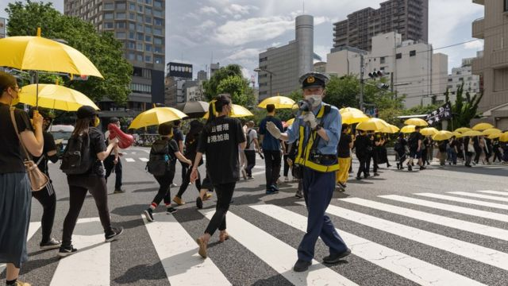
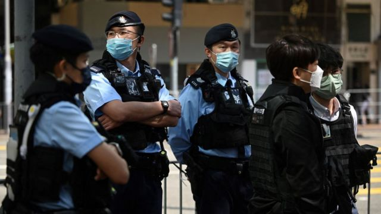
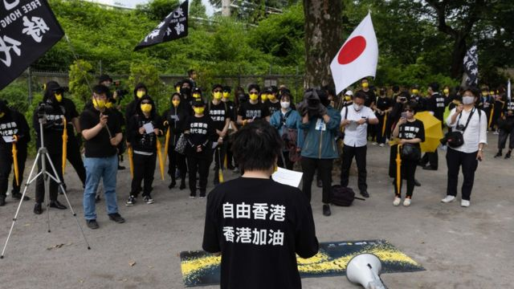
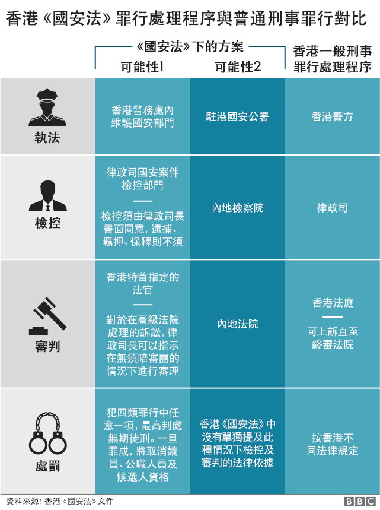
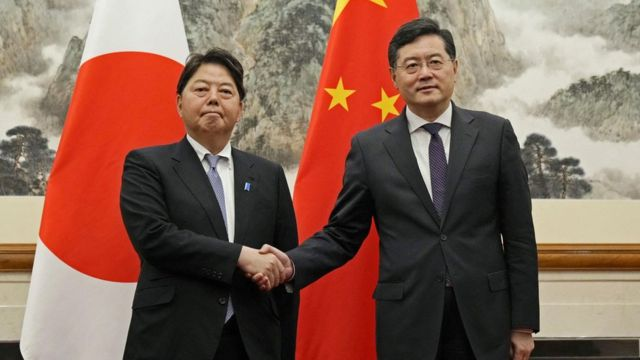

# [World] 香港国安法“域外适用第一案”：留学日本女生返港换证被捕的细节

#  香港国安法“域外适用第一案”：留学日本女生返港换证被捕的细节

> 图像来源，  Getty Images
>
> 图像加注文字，2019年反修例示威以来，日本是其中一个不时出现声援香港游行抗议的地方。

**日本与海外中文媒体近日先后报道一位香港旅日学生遭中国香港国安警察拘捕的消息，并对这起被称为“中国《香港国安法》域外适用第一例”的案件表达关注。**

这起拘捕发生在3月，香港警察称，被捕女子涉嫌《香港国安法》下的“煽动分裂国家”罪。一位日本教授近日发表专栏文章谈论案件，引起媒体注意。

来自日本的消息称，被捕女生被指控触犯《香港国安法》的言论是她在日本期间于网上发表。一些海外评论人士接受BBC中文查询时对此感到忧虑。

自中国全国人大常委会于2020年6月30日颁布《香港国安法》，便有法律学者与外国政府等质疑其具备治外法权。但香港特区政府曾多次反驳称，“《香港国安法》的域外效力符合国际法的‘保护管辖’原则”，批评外国政府“无理指责”。

##  拘捕如何发生？

日本东京大学研究生院综合文化研究科阿古智子教授 4月初在雅虎日本（Yahoo! Japan）发表专栏文章称  ，一位她所认识，在日本留学的香港学生3月初返回香港换领身份证时遭国安警察拘捕。

香港自2018年11月起签发新一代智能身份证，并陆续安排居民换证，直到2023年3月初结束。由于海外中国使领机关并不代办此项手续，海外港人必须返回香港换证。

在香港考取博士学位的阿古智子写道：“她是在日本的时候，在网上写了一些东西，转发了一些信息。 尽管如此，她还是在香港被捕，因为国安法可以域外适用。”

阿古智子对BBC中文表示，在东大就读的被捕女子男友向她求助时，她才知道女生被捕一事，继而发表了该文章。为保护对方安全，阿古教授婉拒透露女生的具体身份。

按照阿古智子的说法，被捕女生交出了护照，说明她被限制出境。

她在专栏文章中说：“无论如何，我希望这名学生所在的大学考虑允许她在线上课，以便她可以继续在日本学习。”

> 图像来源，  AFP
>
> 图像加注文字，女生在3月初被捕，两天后获准保释候查。

##  各方声音

隶属美国政府的美国之音电台与自由亚洲电台其后指出，阿古智子教授所提及的这位女生是在3月8日被捕。 香港警察翌日发新闻稿称  ，在九龙秀茂坪拘捕了一名涉嫌干犯《香港国安法》下“煽动分裂国家”罪的23岁女子，“调查显示，该名女子涉嫌在网上发布煽动香港独立讯息”。

香港警察证实，该名女子已于3月10日获准保释候查，须在5月中旬向警察报到。警察方面并未进一步说明其保释条件。

在3月9日同一份新闻稿中，香港国安警察还证实拘捕了已解散的民主派工会职工盟前总干事邓燕娥，她是职工盟前秘书长李卓人的妻子。不过，新闻稿称这位23岁女子的案件与邓燕娥的案件无关。

香港警察并未公布这位女生具体发表了哪些言论，为何被视为“煽动‘港独’”。但日本《产经新闻》台北支局长矢板明夫 4月20日在Facebook发文称  ：“据了解，这名女大学生从2019年就到日本留学。大约两年前，曾在脸书上分享过一些支持香港学生抗议游行的图片和文字，其中有‘香港独立、唯一出路’等游行口号。警方认为这些内容触犯了国安法。”

> 图像来源，  Getty Images
>
> 图像加注文字，日本媒体称，这名女生在日本期间在网上转发声援香港示威的图片与文字，部分内容被香港国安警察认为是鼓吹“港独”。

前香港立法会民主派议员，目前在美国纽约执业的律师郭荣铿对BBC中文说，就其所知，此案确是首例香港人在外国发表言论后，在香港遭警察以《香港国安法》罪嫌拘捕的案件。

郭荣铿说：“最大的担忧是，所有海外港人，甚至是外国人，都可能担心，会否因为说了些什么，或做了些什么——例如去参加了游行——在香港过关卡的时候会有问题。”

“在这案子之前，大家也听到有港人担心说不敢去游行啊，在英国不敢干这干那，怕回不去香港的，也有。”

另一位具备律师背景的前立法会议员许智峯也有同样看法。他被香港国安警察以《香港国安法》下的“煽动分裂国家”罪和“勾结外国势力”罪通缉，又被廉政公署以煽惑他人在立法会选举中投白票或不投票罪名通缉，目前流亡澳大利亚。

许智峯对BBC中文说，不少在海外继续从事与香港民主自由相关倡议工作的港人，“他们已经觉得得有所牺牲，回去香港的话要承担风险”，而这位女生被捕“更是确立了这风险真实存在，而且比想象中要大”。

“因为你能看见这位学生是寂寂无名的普通人，不是前议员、社运领袖等等，不是很积极的，大家都认识的香港自由民主运动网上倡议者。都不是。只是一位普通学生。这让白色恐怖蔓延到全世界。”

“而似乎这样的趋势将继续蔓延。”

##  《香港国安法》的境外管辖权

根据《香港国安法》第36至38条，无论该人是否香港居民，是否身在香港，《香港国安法》同样适用。

按照目前已知信息，若这位23岁女生被起诉“煽动分裂国家”罪，一旦被判有罪，“情节严重的，处五年以上十年以下有期徒刑；情节较轻的，处五年以下有期徒刑、拘役或者管制”。

郭荣铿对BBC中文说，这是《香港国安法》的“治外法权”首次被应用，国际社会将密切关注其影响，因为不单是有关香港的言论，任何人发表了对中国对批判言论，谈台湾问题，都有可能被香港警察引用《香港国安法》来抓捕。

总部设在美国的人权观察组织亚洲区副主任王松莲对BBC中文评论说，言论自由等公民自由权在香港每况愈下，这位23岁女生的案件是《香港国安法》首次被引用于居民在香港以外言论的案件，“尤其令人震惊”。

王松莲说：“有鉴于因为家庭或商业联系而经过香港的人何其之多，这部法律实际上赋权中国政府审查全球言论。”

国际特赦组织（Amnesty International）香港事务发言人凯文·达林（Kevin Darling）也对BBC中文评论说：“这位学生被捕展示了香港当局试图透过将这定义含糊而危险的法律套用到全世界，让异议人士噤声的行为模式，令人震惊。”

“这严重侵犯人权，而其目的是要在（香港人）侨民群体与任何试图发布其对香港看法的人之间散布恐惧。”

香港特区政府曾多次为《香港国安法》的境外管辖权辩护，最新一次是在2023年1月12日回应英国外交部呈交下议院的《香港半年报告书》时称：“《香港国安法》的域外效力符合国际法的‘保护管辖’原则……符合国际法的原则以及国际惯例。针对《香港国安法》适用域外效力的批评，显然属双重标准。”

##  日本关注

> 图像来源，  Kyodo via REUTERS
>
> 图像加注文字，日本药企员工被中国国安部门拘留成为林芳正（左）与秦刚（右）4月初会晤的主要议题之一。

郭荣铿说：“我觉得日本媒体关注，就是因为近期有日本人在中国大陆遭到抓捕……所以日本人或日本相关人士在中国被抓捕的议题，在日本坊间正被讨论得很厉害。”

4月2日，日本外相林芳正访华，首次会晤新任中国外长秦刚。林芳正在会晤中 提到了香港与新疆人权议题  ，但日本媒体关注的重点是，林方正在会面中，就安斯泰来制药公司（Astellas Pharma）日籍男性高管被拘留一事 提出抗议  。

共同社引述日本外务省消息称，自2015年以来，共计有17名日本人在中国遭执法部门拘留，目前有五人仍未获释。

阿古智子形容，有着这么多日本人在中国遭到收押，东京在处理对华关系方面如履薄冰。

日本驻香港总领事馆回答BBC中文记者查询时表示，不会评论该香港女生的案件。但领事馆续称，日本多次对《香港国安法》在国际社会与香港民众表达强烈忧虑下坚持实施感到遗憾。

##  其他类似案例

虽然这位23岁女生相信是首位因境外言论而被香港警察引用《香港国安法》抓捕的首例，但自该法生效以来，已有香港国安警察引用其他法律起诉香港居民在境外言论的例子。

2022年12月，18岁男子徐凯骏被指控在多个网络平台发表“港独”口号、经篡改歌词的中国国歌与中国国旗，警察控告他四项罪名，分别是《刑事罪行条例》下的“作出一项或多项煽动意图的作为”罪，《国歌条例》下的“意图侮辱国歌而故意发布经篡改的国歌歌词”罪和“意图侮辱国歌而故意发布以任何方式侮辱国歌的情况”罪，以及《国旗及国徽条例》下的“意图侮辱国旗而故意发布侮辱国旗的情况”罪。

案件在西九龙裁判法院审理，被告人认罪，但他与辩方律师争论涉案网帖是在境外发布，质疑法庭有否权力管辖。主审的香港总裁判官苏惠德不接纳有关论点。

2022年3月，英国伦敦民间组织“香港监察”（Hong Kong Watch）创办人兼执行总监 罗杰斯（Benedict Rogers）  收到来自香港特区保安局和香港警察的警告信，指控该组织网站内容“威胁中国国家安全”，并称罗杰斯游说各国制裁北京和香港，“严重干涉了香港事务”。

