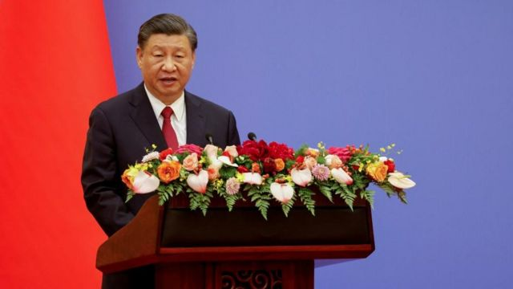
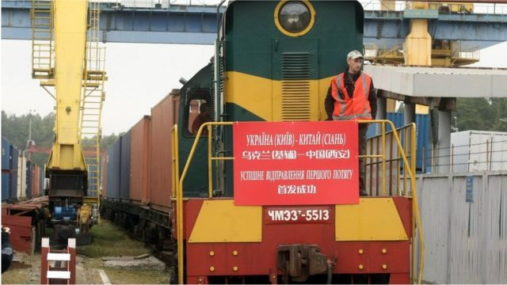
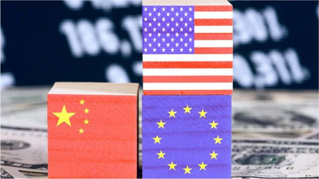
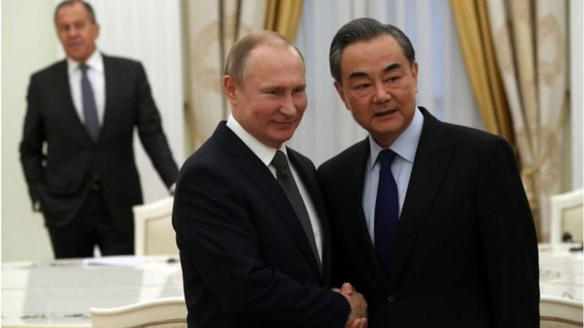

# [World] 习近平与泽连斯基通话后 俄乌停火还有多远

#  习近平与泽连斯基通话后 俄乌停火还有多远

**中国国家主席习近平本周三（4月26日）同乌克兰总统泽连斯基通电话，这是两人自俄乌战争爆发以来首次通话，外界也寄希望于中国利用自身对俄的影响力，促成俄乌战争的结束。**

泽连斯基在他的推特上透露，此次通话时长一个小时。两人就目前的战争交换了意见。最直接的成果是，中国将派遣一位前驻俄大使担任特使前往乌克兰，而乌克兰则将补上已经空缺两年之久的驻华大使的人选。

欧美等国基本都表达对这次通话的欢迎，希望能够实现俄乌停火，但在通话后公布的文件中，中方未提俄罗斯撤军，乌方依然强调了领土回到1991年时状态，为和谈的可能性划下问号。

##  习近平说了什么？

> 图像来源，  Reuters
>
> 图像加注文字，与西方不同，北京试图在俄罗斯的入侵问题上表现出中立态度。但它从未隐藏与莫斯科的密切关系，也从未谴责俄罗斯入侵乌克兰。上个月，习近平对俄罗斯进行了为期两天的国事访问。

习近平通话的主要内容可以概括为三点：中国“不是当事方”，中方“坚持劝和促谈”，“核战争没有赢家”——

  * 具体而言，习近平表示，中国作为联合国安理会常任理事国和负责任大国，“既不会隔岸观火，也不会拱火浇油，更不干趁机牟利的事”。中方所作所为光明正大。 
  * 在“乌克兰危机”问题上，中方始终站在和平一边，核心立场就是劝和促谈。对话谈判是唯一可行的出路。而且，现在各方理性的思考和声音在增加，应该抓住契机，为危机的政治解决积累有利条件。 
  * 核战争没有赢家。对待核问题，有关各方都应该保持冷静克制，真正从自身和全人类的前途命运着眼，共同管控好危机。 

在行动上，中方将坚持劝和促谈，为尽快止战停火、恢复和平作出自己的努力。中国还将派中国政府欧亚事务特别代表赴乌克兰等国访问，就政治解决乌克兰危机同各方进行深入沟通。

值得注意的是新华社的报道中全文并未提到“俄罗斯”、“入侵”等字眼，并称习近平是应约与泽连斯基通电话。

##  泽连斯基说了什么？

根据上述新华社的报道，泽连斯基在电话中说明他对当前“乌克兰危机”的看法，并感谢中方为乌克兰提供的人道主义援助，同时欢迎中方为恢复和平、通过外交手段解决危机发挥重要作用。

泽连斯基4月26日在推特发文表示，他与习近平进行了“时间长且有意义”的电话会谈。他说，此次通话及任命乌克兰驻中国大使，将会为乌中双边关系发展注入强有力动能。

不过，乌克兰方面的通话纪要称，泽连斯基告诉中国领导人，“没有人比乌克兰人民更希望和平”，但和平必须是“公正和可持续的”。

“以领土妥协为代价是不可能实现和平的，”泽连斯基说。“乌克兰的领土完整必须在1991年的边界内恢复。”

泽连斯基也在社交媒体上称，如果要妥协领土就没有和平，乌克兰的领土完整必须恢复到1991年的国界线。

此外，泽连斯基还谈到乌中伙伴关系，“中国曾是乌克兰的头号贸易伙伴。我相信，我们今天的谈话将为这一势头在各个层面的恢复、保持和发展提供强大动力。”

> 图像来源，  Getty Images
>
> 图像加注文字，2021年9月，首趟乌克兰发往中国的货运班列发车。

##  其他国家态度如何？

美国白宫方面对两人通话表示欢迎，同时提到事前并不知晓这次通话。

路透社援引美国国家安全委员会发言人约翰·柯比表示，这是否“会导致某种有意义的和平运动、计划或提议——我认为我们现在还不知道”。

他还补充称，如果要通过谈判达成和平，那么这将在泽连斯基总统准备好的时候进行，他还指出，美国欢迎任何一方为实现公正的和平而付出的努力——只要这种和平是可持续且具有公信力的。

欧盟外交与安全事务高级代表博雷尔（Josep Borrell）也表示，这次通话“很重要”，“我很高兴他们能有这次的谈话”，希望这是中国发挥作用并说服俄罗斯停止侵略的第一步。但也强调，必须是公正的，承认乌克兰人权利的和平。

联合国副秘书长哈克也对此评论称，“我们鼓励包括联合国安理会成员国在内的所有核心国的参与，参与到为解决俄乌危机作出贡献中去。我们希望，中国继续在此方面发挥有效的作用。”

俄罗斯则“捧中踩乌”，其外交部发言人称，俄罗斯注意到中国已准备好开始谈判进程，但是乌克兰将无法充分理解中国发出的和平呼吁，因为乌克兰和背后的西方国家有能力搞砸任何和平倡议。

##  派遣特使

> 图像来源，  Getty Images
>
> 图像加注文字，中国之所以如此谨慎地表达立场，有着与美国和欧洲在外交、经济方面的长期战略考虑。

通话后，最直接的成果是，中国将派欧亚事务特别代表赴乌克兰等国访问。

中国外交部欧亚司副司长于骏向媒体确认，中国解决乌克兰危机特别代表团的团长，将由李辉出任。

今年70岁的李辉的现任职务是中国政府欧亚事务特别代表，但他的外交官生涯长期跟俄罗斯打交道。

苏联解体前就担任中国驻苏联大使馆一秘，解体后改任驻俄罗斯大使馆一秘。1997年担任驻哈萨克大使，两年后到外交部中亚司担任司长。到2009年，他开始担任驻俄罗斯大使，并一直持续到习近平任内，直至2019年卸任。

虽然到了退休年龄，但他回国后继续担任欧亚事务特别代表。

泽连斯基则宣布任命，里亚比金·鲍里斯维奇为乌克兰驻华大使。里亚比金在俄乌战争爆发前3个月开始担任乌克兰战略工业部部长，直至今年3月。

乌克兰驻华大使的位置已经空置两年。2021年2月乌克兰原驻华大使谢尔盖·卡梅舍夫因突发疾病于任上逝世后，一直未有新任命。

> 图像来源，  Getty Images

另外值得注意的是，法国总统马克龙访问中国之后，彭博社报道称，中法正在秘密制定一项计划，旨在最早于今年夏天将俄罗斯和乌克兰带到谈判桌上。报道还援引“熟悉这些计划的人”称，马克龙已责成他的外交政策顾问博纳（Emmanuel Bonne）与中国的王毅合作，制定一个“框架”，作为莫斯科和基辅之间未来谈判的起点。

