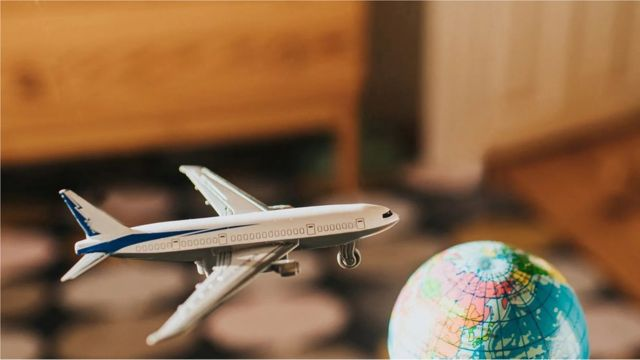
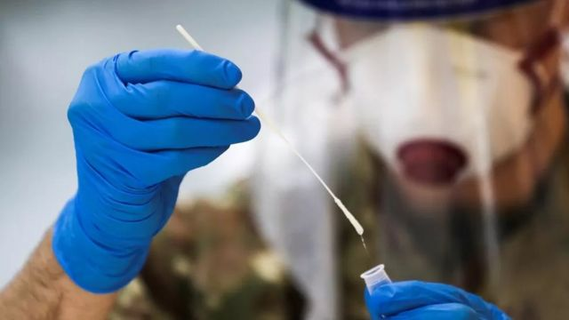
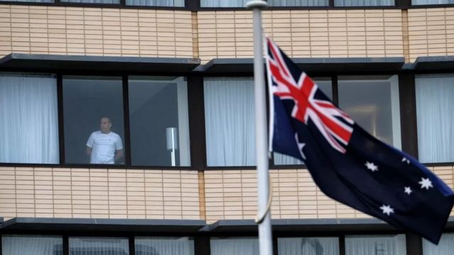
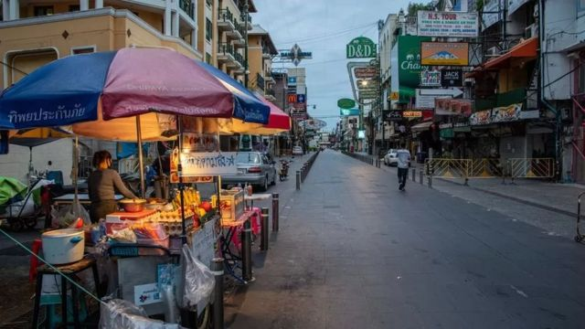
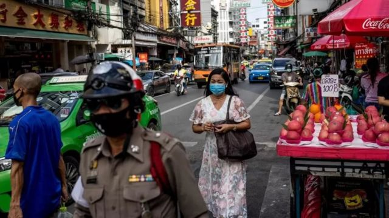

# [World] 边检现在像一扇门，过去是一堵墙——BBC记者谈后疫情时代首次出国旅行

#  边检现在像一扇门，过去是一堵墙——BBC记者谈后疫情时代首次出国旅行

> 图像来源，  Getty Images

**核酸、隔离、疫苗卡、一票难求……三年新冠疫情间，出国旅行真是难比登天。**

4月25日，中国宣布，自当月29日起，所有来华人员不再需要登机前48小时内做核酸，抗原即可。恰逢“五一”小长假前夕，多少人在盼望、计划重启放飞自我模式，再去体验一下诗和远方？

曾常驻美国、南亚、悉尼的前BBC记者尼克·布莱恩特（Nick Bryant）报道过许多重大国际新闻，出国是“常态”。但是疫情爆发后，他发现自己对旅行的兴趣断崖式骤跌。直到最近全家一起从悉尼到泰国去度假。

他在BBC广播4台《记者来鸿》栏目中谈到以下感受：

我一生从未害怕过坐飞机，尽管在911恐怖袭击后的几年间，我确实曾对机场产生恐惧。

当时我在美国，加强安全检查显然是必要的防御措施。但我发现自己对安检外的长龙、新成立的国土安全部那些身着制服的警官产生精神上的抵触。因为这一切都在提醒着我，世界已经改变，生活在这样一个世界令我不舒服。

> 图像来源，  Getty Images
>
> 图像加注文字，美国国土安全部成立于2002年，负责国土安全和反恐。

我第一次搭乘飞机—— 一架大型喷气客机，是独自一人从伦敦的希思罗机场飞往加利福尼亚。从那时起，在我心中，航空一直就是把我和自由、探险、开启新生活联系在一起的纽带，商用飞机被用作大规模杀伤性武器令我憎恶。让我不安的还有，我一直把美国视作热情、好客的地方，但现在，她的疑心、“地堡心态”越来越严重。

> 图像来源，  Reuters
>
> 图像加注文字，核酸，难忘的疫情记忆？

如果说911事件后机场让我忐忑，那么这几年的疫情大流行则带来了更糟糕的后果：对国际旅行的反感。

那些必填的表格、必做的检测令我焦虑，我不仅担心可能会被禁止入境，甚至担心在办理登机手续时不能排在最前面。然后就是，还要考虑回程。因为，好不容易从甲地去了乙地，并不意味着还能从乙地返回甲地！

也许，我患上的是上次和家人出国度假留下的“后遗症”。

> 图像来源，  EPA
>
> 图像加注文字，疫情高峰时期澳大利亚的集中隔离酒店（资料图片）

当时，我们被从悉尼机场径直送入隔离酒店，警车开路，摩托车压阵。两周后才获准离开酒店。

接下来，即使在澳大利亚这个防疫堡垒打开国门以后，宅家，一度也是我们首选的度假形式。不需要出州，更不用说出国了。

因此，我很高兴地告诉大家，最近，我们再次拥抱蓝天——从澳大利亚飞往泰国去度假！

出发前不需再用棉棒捅喉咙，登机只要带好护照和机票。虽然这还不算完全彻底的后疫情旅行，因为大流行毕竟尚未结束，但感觉真的和疫情之前没有太大区别。

抵达另外一个国家再次令人兴奋。边检感觉更像是一扇门，而不是一堵墙。

> 图像加注文字，外国游客曾经是泰国经济的支柱之一，疫情期间一片萧条。

> 图像来源，  Getty Images
>
> 图像加注文字，曼谷街景

从机场开车前往曼谷市中心的车程，也成了享受出国旅行美妙之处的一段经历。

神奇的异域风情，迥异的文化，新景色、新声音和新气味对感官的冲击，全球化的感觉，就连时差带来的困倦，也更像是轻松的慵懒，与病毒和感染毫不沾边。

由于生物钟仍然停留在澳大利亚时间，黎明前我就醒了，静观这个巨大的亚洲城市从沉睡中逐渐苏醒。

很快，我们就开始坐着嘟嘟车、长尾船外出探索，围上遮身的纱笼去参观皇宫，在曼谷品尝绝对正宗的泰国料理，就连与夜摊老板讨价还价也是乐在其中。

在泰国北部给小象洗澡，让我重新感悟为未来积攒记忆的乐趣。

旅行，也带给我一种复联的感觉：与朋友面对面的互动，而不是线上聚会。多年来，我又一次见到了曾在南亚共事的老摄影师，他是老朋友，也是曾经的“驴友”。每一次想到他，我脑海中总会浮现出两个字：探险。

他家墙上挂着一张2005年巴基斯坦地震后我们沿着印度河乘船出行的照片。当时，巴基斯坦有一个地区据信是本拉登的藏身地。我们的小船队出发执行慈善任务，船上装满了救援物资。无法确定前路等待我们的会是朋友还是敌人。

此情此景也提醒着我旅行的不可预测性，但这也正是它的魅力之一。

也许，这次全家去度假只是让我唏嘘怀旧，因为它给了我重温驻外记者生活的机会。

几年前，我决定放弃驻外记者的生活方式。老实说，第一时间狂奔机场，在另一端等待的可能是恐怖，这不是我眷恋旅行的情由。原因更简单：我怀念的是开阔眼界。

被新冠封锁三年之后，我再次感染了“旅行病毒”。

音频加注文字，

【BBC时事一周（粤语）——华人谈天下】澳大利亚重开边境，“报复式旅游”到临，让各行各业求才若渴。

