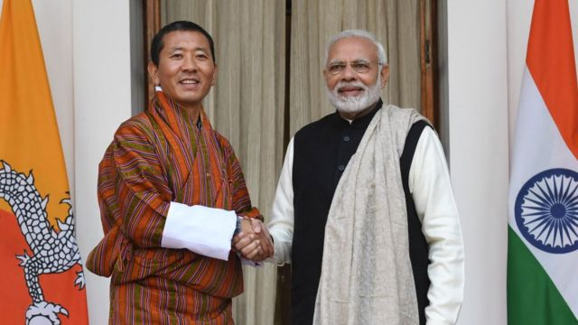
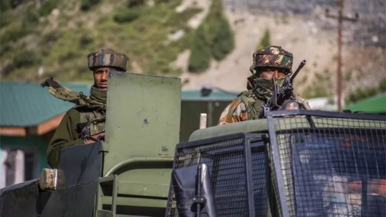
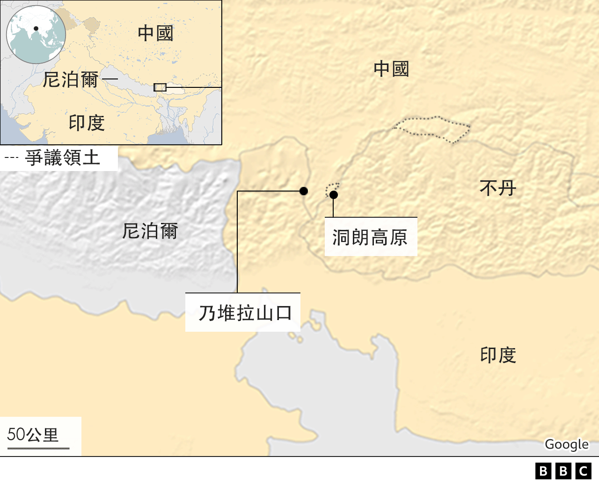

# [World] 不丹：首相暗示想与中国完成划界协议，印度会接受吗？

#  不丹：首相暗示想与中国完成划界协议，印度会接受吗？

  * 安巴拉桑·埃希拉扬（Anbarasan Ethirajan） 
  * BBC记者 

> 图像来源，  Getty Images
>
> 图像加注文字，洛塔·策林（左）与印度总理莫迪于2018年会面——两国历史上一直联系紧密。

**喜马拉雅地区的国家不丹窝在两个亚洲大国中国与印度之间，这个独特的地理位置意味着需要付出代价。**

不丹是与中国仍然有陆地边界争议的两个国家之一。另一个就是印度，它与中国就喜马拉雅地区边境问题有长久的意见不一。

中国在全球的崛起正迫使不丹和北京达成协议，但是任何可能的突破都需要不丹盟友印度的批准。

廷布与德里之间的关系紧密，而印度一直向不丹提供规模达数亿美元的经济和军事援助。

不丹和中国在喜马拉雅地区北部和西部都有领土争议。

在所有的争议地点当中，核心的战略要地是一片叫洞朗（都克栏，Doklam）的高原地区——它靠近印度、不丹和中国之间的三叉交汇区。不丹和中国都声称拥有该地主权，而印度则支持廷布的立场。

印度支持廷布有自己的原因。专家表示，洞朗高原对于印度的安全非常重要，因为中国一旦占领该地区，就可能对西里古里走廊（Siliguri Corridor）构成威胁——这个有“鸡脖子”之称的22公里（14英里）狭长地带，连接着印度本土和它的东北部各邦。

不丹首相洛塔·策林（Lotay Tshering）最近接受比利时报纸《自由报》的访问，只是提醒人们这个国家的局限性。

“问题不是不丹单独就能解决。我们是三方（这里涉及三个国家）。国家没有大小之分，是三个平等的国家，各占三分之一。我们准备好了。只要另外两方也准备好，我们就能够讨论。”该报这样 引述  策林说。

他还表示，希望不丹和中国能够在一两次会议里划定边界。这两个国家自1984年以来一直在进行边界谈判。策林还说，中国没有进入过其领土。

策林的说法引起了印度的警惕，特别是媒体。很多评论者都表示，担心不丹和中国有可能达成涉及那个三叉交汇点的互换协议。有一些人表示，廷布在坚持洞朗主权一事上力度不够。

> 图像来源，  Getty Images
>
> 图像加注文字，印中接壤边境上的印度军队士兵

“印度担心中国是在向不丹施压解决边界问题，以此困扰新德里，” 前印度高级外交官、喜马拉雅事务专家史托布丹（P. Stobdan）说。

“很明显，不丹人试图加快解决分歧的进程，而关于中国在解决纷争当中的角色，不丹的立场最近是有了一些改变，”史托布丹说。

在印度媒体掀起一阵波澜之后，策林在本月较早前对自己的言论进行了澄清。

“我没有说任何新的东西，（不丹的）立场也没有改变。”这位首相向《不丹人》（The Bhutanese）周刊表示。

虽然很多不丹人对于策林的评论在印度媒体引起反响感到惊讶，但是来自中国的观点却是，在没有德里支持的情况下，廷布要达成协议不容易。

“印度在这里是个障碍。如果中国和不丹也解决了边界问题，那就只剩下印度了。我不认为印度会让这件事发生。”上海国际问题研究院研究员刘宗义向BBC表示。

他说，中国与不丹在1996年一度接近达成协议，但是却因为印度的介入而失败了。

不丹与中国的边境问题，还牵涉到印度与中国之间数十年的边界争端。

两国国土接壤的边界并没有完全划定，而且彼此有重叠的主权主张。印度称双方边界有3488公里长，中国则声称有约2000公里。

目前实际上的边界从印度北部的拉达克地区开始，一直延伸到东边的阿鲁纳恰尔邦（中国称藏南）。

中国持续增长的经济和军事体量也被很多不丹人敏锐地注视到，他们感觉与北京尽早达成协议，将对国家更有利。

“中国是一个现实。不丹能否选择不和中国有外交关系？我不认为那是一个可取的安排。”不丹一名不愿具名的专家说。

印度和不丹在1949年签署了特别条约，将德里的安全利益考虑在内。2007年的修订条约给予廷布当局更多的自由，包括外交政策和军事采购。

数以百计的印度士兵驻守在不丹境内，官方指他们是对不丹军队进行培训。其总部设在西部城镇哈阿（Haa），距离洞朗约20公里。

不丹评论人士，比如旺查·桑杰（Wangcha Sangey），就觉得假如不是德里据报一直坚持要不丹保住洞朗，不丹就能够与中国达成边界协议 。

“我们怎么声称拥有洞朗？我们现在有的是洞朗仍然被我们守着的部分。我们没有的那部分，我们无法从中国那边夺走，”他说。

桑杰这一派的分析人士称，不丹目前寄望于印度提供其大部分需求，特别是石油，而廷布应该通过打开与北边邻居中国的另一条路，以使供应多元化。

不丹首相的评论，引起了印度外交部长的谨慎回应。

“在牵涉到我们共同的国家利益，比如安全利益等事务时，印度与不丹仍然联系紧密，合作密切。”印度外交部秘书维奈·莫汉·克瓦特拉（Vinay Mohan Kwatra）4月初这样向媒体表示。

“我会重申我们较早前的声明，在确立（洞朗）三叉交汇点的问题上明确清楚地摆出我们的立场，”克瓦特拉说。

印度不希望在洞朗附近有任何调整，因为它有着巨大的战略重要性。另一方面，像不丹这样的国家，要向北京施压使其放弃主张，可能很困难。

在人们谈论起一个属于亚洲的世纪时，与世界两大崛起的经济体同时接壤的不丹或许处在一个有利位置。但是随着德里与北京的紧张关系持续存在，廷布却发现自己处在一个越来越脆弱的境地。

