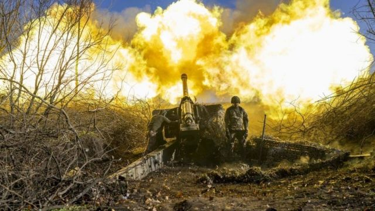
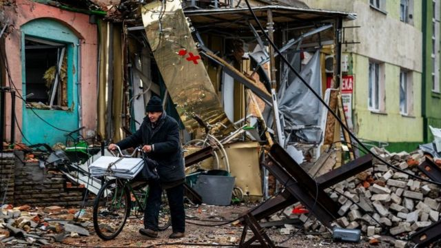

# [World] 乌克兰战争：去年12月以来“超两万名俄军在乌克兰丧生”

#  乌克兰战争：去年12月以来“超两万名俄军在乌克兰丧生”

> 图像来源，  AFP via Getty Images
>
> 图像加注文字，11月，一名乌克兰士兵向巴赫穆特外的俄罗斯阵地开火。

**白宫称，在过去的五个月里，超过两万名俄罗斯士兵在乌克兰巴赫穆特的战斗中丧生。**

美国国家安全委员会发言人约翰·柯比（John Kirby）引述最新解密的情报称，另有8万人受伤。

美国表示，死者中有一半来自瓦格纳私人雇佣兵公司。这支军队一直在乌克兰东部城市巴赫穆特（Bakhmut）作战。

自去年以来，俄罗斯一直试图在一场艰苦的消耗战中夺取巴赫穆特。

俄罗斯目前掌握了这座城市的绝大部分区域，但乌克兰仍然控制着该城市西部的一些地方。对双方来说，这场战斗有巨大的象征意义。

乌克兰表示，他们正在利用这场战斗消耗尽可能多的俄罗斯军队和其储备。

“俄罗斯通过巴赫穆特在顿巴斯发动进攻的企图失败了，”柯比对记者表示，“俄罗斯一直无法夺取任何真正有战略意义的重要领土。”

“我们估计，俄罗斯伤亡人数超过10万人，其中有2万多人在行动中丧生，”他说。

美国的统计来源于去年12月初以来的数据。

“最终，经过数月战斗和巨大损失，俄罗斯试图发动的攻势适得其反，”柯比表示。

他还说，他不会估计乌克兰的伤亡人数，因为“他们是这里的受害者，俄罗斯是侵略者”。

BBC无法独立核实这一数字，莫斯科也没有发表评论。

占领巴赫穆特将使俄罗斯更接近控制整个顿涅茨克地区的目标。去年9月，乌克兰东部和南部的四个地区在公投后被俄罗斯吞并，顿涅茨克地区是其中之一，俄罗斯之外的国家普遍谴责公投是一场骗局。

分析人士说，巴赫穆特没有什么战略价值，但已成为俄罗斯指挥官的一个焦点，他们一直在努力向克里姆林宫传递任何积极的消息。

瓦格纳雇佣兵集团在俄罗斯袭击巴赫穆特的行动中占据了中心位置，该集团因其常常不人道的手段而臭名昭著。

瓦格纳领导人普里格津（Yevgeny Prigozhin）将自己和他的私人军队的声誉押在了夺取这座城市上。

> 图像来源，  AFP via Getty Images
>
> 图像加注文字，1月，巴赫穆特一名当地居民推着自行车走在街上。

但他最近威胁要从巴赫穆特撤军。

在一次罕见的接受俄罗斯著名战争博客的深度采访中，他称，如果俄罗斯国防部不向瓦格纳提供急需的弹药，他将让瓦格纳战士撤出。

他警告说，瓦格纳的战士可能会被重新部署到马里。

在战争期间，他经常与俄罗斯国防部发生冲突，指责官员没有为他的战士提供足够的支持。

普里格津还呼吁俄罗斯媒体和军方领导在乌克兰预期的春季反攻前“停止对俄罗斯民众撒谎”。

“我们需要停止对俄罗斯人民撒谎，停止告诉他们一切都很好。”他说。

他赞扬了乌克兰军队“良好、正确的军事行动”和指挥。

乌克兰一名高级将领周一表示，反击已将俄罗斯军队赶出巴赫穆特的一些阵地，但局势仍然艰难。

乌克兰地面部队指挥官亚历山大·瑟尔斯基将军（General Oleksandr Syrskyi）在Telegram上表示，尽管损失惨重，但包括伞兵和来自瓦格纳的战斗机在内的俄罗斯新部队“不断被投入战斗”。

“但敌人无法控制这座城市，”他说。

