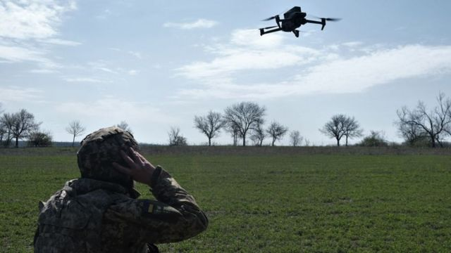
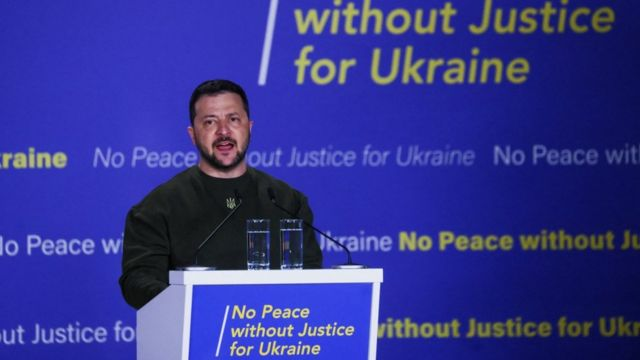
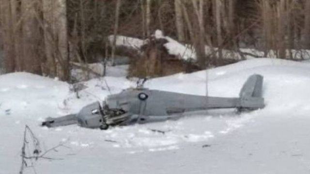
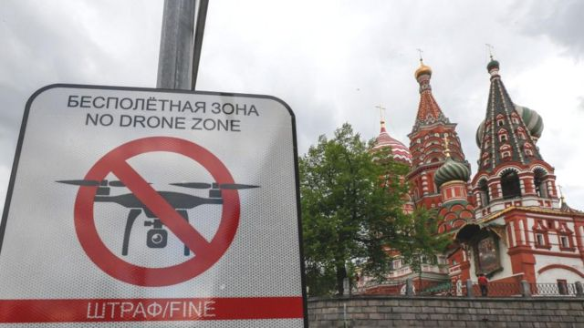

# [World] 克里姆林宫遭无人机袭击事件引发美俄乌三方唇枪舌战

#  克里姆林宫遭无人机袭击事件引发美俄乌三方唇枪舌战

> 图像来源，  Getty Images

**俄罗斯较早前声称克里姆林宫遭遇无人机袭击，并将矛头指向美国及乌克兰。**

俄罗斯总统普京的发言人称，袭击发生在周三（5月3日）凌晨。社交媒体上的视频显示，克里姆林宫区域曾冒出烟，另一段视频则显示其中一座建筑有轻微爆炸。

莫斯科指，事件是乌克兰试图刺杀俄罗斯总统普京的行动，并指乌克兰近日在俄罗斯境内发动了一系列类似的袭击行动。

但是乌克兰方面否认实施袭击，声称事件是由俄罗斯自导自演，并以此作为将战争进一步升级的理由；美国亦表示将非常谨慎地对待俄罗斯的指控。

“我们不攻击普京或莫斯科，我们是在我们的领土上作战。我们是守卫自己的村庄和城市，”周三正在访问芬兰的乌克兰总统泽连斯基（Volodymyr Zelensky）表示。

##  美国回应：“可笑的指控”

在指控乌克兰发动是次袭击一天后，普京的发言人指，行动是在华盛顿的支持下实施的。

美国国家安全委员会发言人约翰·柯比（John Kirby）则形容莫斯科方面的说法是“可笑的指控”。

周四，克里姆林宫发言人佩斯科夫（Dmitry Peskov）指，美国“无疑”是此次袭击的幕后策动者，但没有提供证据。

“这种袭击，作出决定的地方不是基辅，而是在华盛顿，”佩斯科夫说。

约翰·柯比在美国媒体上作出回应：“佩斯科夫不过是在说谎，就这么简单。”

“美国与此事毫无关系。我们甚至不知道那里到底确切发生了什么，但是我可以向你保证，美国在此事当中没有丝毫牵涉。”

柯比还表示，华盛顿不会鼓励也不会帮助乌克兰向其境外发动攻击，也不支持对任何领袖个人发动攻击。

> 图像来源，  Reuters
>
> 图像加注文字，泽连斯基本周在海牙演讲，呼吁国际社会以俄罗斯采取行动。

##  乌克兰：俄罗斯试图嫁祸

乌克兰方面则指，这是莫斯科一次试图嫁祸的行动。

泽连斯基的顾问波多利亚克（Mykhailo Podolyak）向BBC表示，这一事件可能显示俄罗斯正在乌克兰“筹划一场大规模的恐怖主义挑衅”。

他表示，袭击莫斯科对乌克兰来说不合情理，但是却能帮助俄罗斯攻击平民目标制造理由。

周三，俄罗斯在乌克兰南部赫尔松地区的空袭造成21人死亡。泽连斯基指，空袭击中火车站、加油站、超市和民宅等设施。

波多利亚克指，在俄罗斯境内飞行的无人机是属于“当地反叛武装的游击活动”。

##  俄罗斯防空力量堪忧？

据莫斯科官员称，两架无人机已被俄罗斯防空部队击落，而且当时普京并未身在克里姆林宫官邸。

普京是全世界保安最严密的国家领袖之一，但是假如俄罗斯方面的描述属实，将可能令外界质疑莫斯科的安保力量。

外界将可能会因此审视俄罗斯的防空力量——最近数月，莫斯科的一些重要建筑附近均被看见设置起了防空武器系统。

这是因为克里姆林宫担心乌克兰或者乌克兰的支持者会试图对重点目标实施空袭。

> 图像来源，  Anton Gerashchenko
>
> 图像加注文字，乌克兰制造的UJ-22无人机（资料图片）

##  乌克兰战争中的无人机袭击

最近数月，俄罗斯境内以及俄军占领区域出现过一系列怀疑是无人机袭击事件，但没有一起得到乌克兰方面的官方承认。

  * 5月4日，四架无人机在俄罗斯卡斯洛达地区一个炼油厂发动袭击，位置距离克里米亚边境200公里 
  * 上月，一架无人机在乌克兰边境约400公里（249英里 ）外的城市基列耶夫斯克（Kireyevsk）被击落，俄罗斯官媒指，其后的爆炸令至少三人受伤 
  * 2月，一架无人机在莫斯科约100公里外的古巴斯托沃村（Gubastovo）坠毁，当地政府指是一次试图袭击民用设施的行动，而且有无人机残骸照片显示，是一架由乌克兰制造的UJ-22无人机。 
  * 去年12月，俄罗斯军方指，乌克兰边境东北边600公里处一个空军基地被无人机袭击。 

2023年初以来，BBC对俄罗斯传媒的分析得出，在俄罗斯境内及俄罗斯控制的乌克兰地区已经发生超过20起怀疑无人机袭击。

当中大多数发生在俄罗斯东北部边境附近的布良斯克和别尔哥罗德州，以及克里米亚，主要目标是基础设施、机场和能源设施等。

> 图像来源，  EPA
>
> 图像加注文字，克里姆林宫的防卫森严，亦属无人机禁飞区。

乌克兰未有承认发动当中的任何一起袭击，但是基辅军方曾表示，破坏俄罗斯的后勤支援是乌克兰筹备反攻俄军的其中一部分工作。

俄乌双方均有在这场战争中使用无人机，俄罗斯主要用伊朗制造的无人机袭击乌克兰的军事目标。

专家表示，乌克兰所使用的无人机可以深入俄罗斯境内，甚至抵达距离边境450公里的莫斯科。

飞航新闻博客 “Aviationist”  的主编大卫·森西奥蒂（David Cenciotti）表示：“虽然乌克兰未确认其武装力量实施过这些袭击，但我认为我们去年至今看到的那些先发制人的突袭，证明了乌克兰有能力从乌军占领区内发动这一类远程攻击。”

无人机专家史蒂夫·赖特（Steve Wright）也表示 ，从乌克兰境内发动无人机攻击克里姆林宫是有可能做到的。

但他补充指，他猜想此次袭击可能从较近的地方发动，以避开莫斯科防空系统。

乌克兰数位化转型部长米哈伊洛·费多罗夫（Mykhailo Fedorov）近日曾声称，乌克兰的R18无人机“能从基辅飞抵莫斯科并返回”，但他否认是在鼓吹向莫斯科发动无人机袭击。

无论在周三的莫斯科到底发生了什么，现在外界关注的问题是俄罗斯将如何回应。

一些官员已经呼吁采取强硬行动，俄军将领此次亦曾多次表示，对于俄罗斯本土的攻击，将会采取强悍的回应。

但目前尚未清楚，俄罗斯是否有能力采取有效的反击，或者此次事件是否会导致乌克兰战事的升级。

