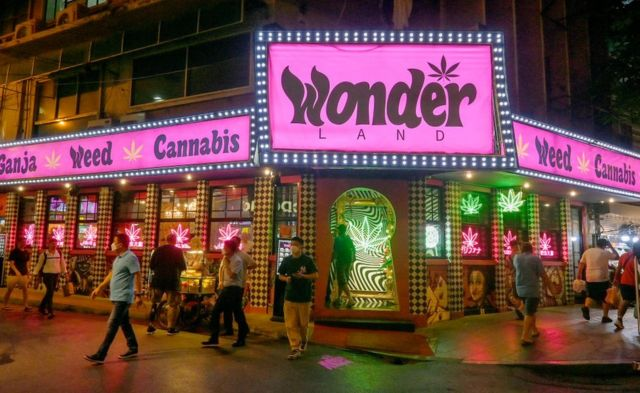
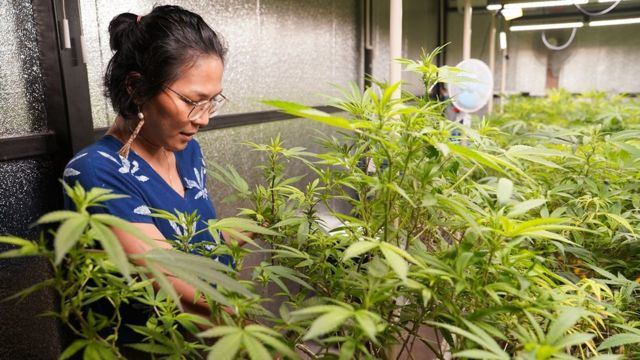
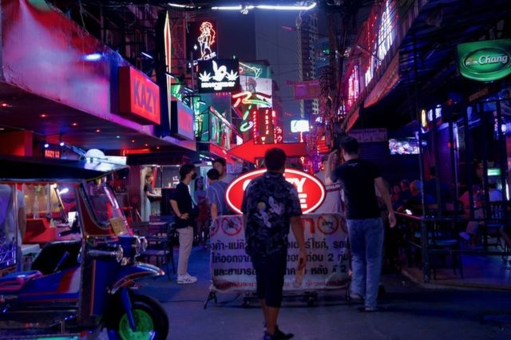
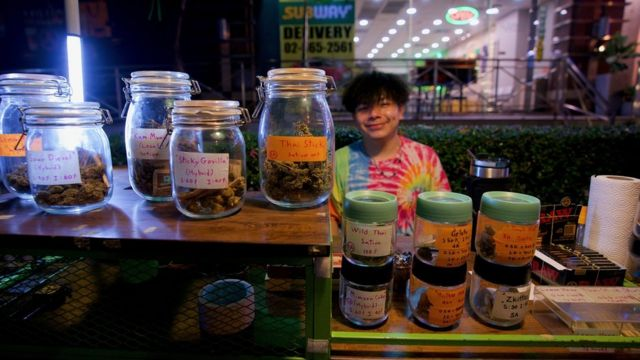
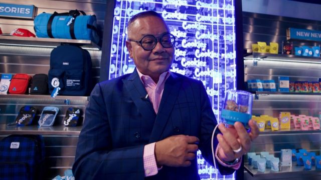
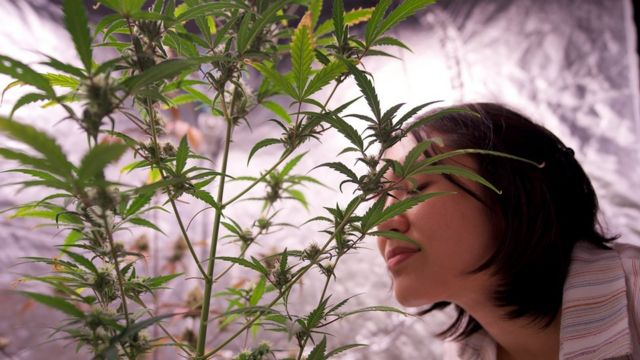

# [World] 泰国是如何成为东南亚“大麻天堂”的？

#  泰国是如何成为东南亚“大麻天堂”的？

  * 乔纳森·赫德（Jonathan Head） 
  * BBC驻东南亚记者 

> 图像来源，  Getty Images
>
> 图像加注文字，在曼谷街头，大麻叶的图案成了一个熟悉的标记。

**在曼谷最国际化的街道素坤逸路，万花筒般的繁杂霓虹灯之中，出现了一种新的标志。**

忽然间无处不在的鲜绿色大麻草五尖叶图案，宣告了泰国自去年6月大麻合法化以后，一项与大麻有关的产业已经华丽兴起。

从BBC曼谷办公室向东走2公里，你会经过超过40个药房，那里出售药力强劲的大麻花蕾，以及吸食它所需要的一切用具 。

朝相反方向走去，走到著名的背包客热门地点考山路，就有一整座以大麻为主题的购物商场“植物天堂”（Plantopia），那些小店都隐约被顾客试吸大麻所产生的烟雾所笼罩。

“泰国大麻”（Weed in Thailand）网站列出全国出售大麻及其周边产品的超过4000家店铺。

而这就是泰国——在去年6月之前，你在这里只是藏有大麻都可能被判监五年，生产则最高判15年；还有另一些毒品方面的违法会被判死刑。这种转变的速度令人咋舌。

“这很混乱，但这里是泰国，没有这突如其来的自由，我不觉得会变成现在这样，”姬蒂·乔帕卡（Kitty Chopaka）说。她创办的乔帕卡公司是一家有关大麻产业的咨询公司，也是推动这项新立法的国会委员会一分子。

不过，这并不是像她这种长期倡议者所梦想的那种自由。

“我们需要规管。明确说清楚你能做什么，不能做什么，”姬蒂说，“现在这带来很多困惑，很多人不知道他们能做什么，他们能把钱投在哪里。”

> 图像来源，  Lulu Luo/BBC
>
> 图像加注文字，姬蒂·乔帕卡说，泰国需要更好的法规来帮助大麻产业。

在这种看似自由放任的状况里，还是有一些规定，但是它们只是偶尔执行，或者干脆不执行。并不是所有的药房都有规定要求的执照，而且它们本应记录所有大麻的出处，以及每一个顾客的个人信息。

除了未经加工的大麻植物之外，任何产品的四氢大麻酚（THC）成分都不应该超过0.2%——那是大麻中作用于精神的化学物质，产品也不能在网上销售。但是，你能够在网上找到有供应商提供含有高含量THC的大麻蛋糕和软糖，不到一个小时就能送到你家门口。大麻不能卖给20岁以下人士，但是当产品有摩托车手直接送货的时候，谁又能知道呢？

有些餐厅提供含有大麻的菜品，你可以点大麻茶和大麻雪糕。便利店甚至会卖带大麻味的饮用水。警方承认，他们不确定什么事情合法或不不合法，以至于他们在大麻的事情上很少去执行规定。

这项大麻法案有点像是一个政治意外。泰国一个大政党的党魁阿努廷（Anutin Charnvirakul）在2019年竞选时将这项大麻除罪化作为他政治宣言的一部分。

后来证明了这是赢得选票的关键一招——很大程度上是由于一种未经证明的观念，即大麻可以令一些贫困农民找到另一种有钱可赚的途径。阿努廷作为新一届政府的卫生部长为了履行其竞选承诺，把大麻从违禁毒品清单中剔除成了他的首要任务。

但是各利益集团云集的泰国议会，行动却相当慢。

在还没有任何人能够写出规定来控制这项新产业时，大麻的除罪化就已经完成了。计划中的新法规却在党派之间的纷争中停滞。

随着又一届大选即将于5月举行，法令于年底前在议会通过的机会很小。敌对党派已经在警告无监管大麻的危险性，并威胁说一旦他们执政，会重新将大麻有罪化。

> 图像来源，  Lulu Luo/BBC
>
> 图像加注文字，大麻产业在泰国兴起的速度令很多人震惊。

这项产业现在不受约束，未来却并不确定。

21岁的图卡是大学学生，在去年投身了大麻产业浪潮，在曼谷空堤县向一个叫“药草俱乐部”（The Herb Club）的药房和咖啡厅投入了超过100万泰铢（3万美元；2.35万英镑）。

她出售16种级别的加工植物，每克售价从10美元至80美元不等 ，但是她担心法律可以发生改变。附近有那么多的药房在竞争，她说生意只属不过不失。

“价格在下跌，因为大麻有点过剩，”乔帕卡说。

“有很多非法进口。我们在海外种不同品种，需要空调和光照。我们应该研究发展一些在我们的气候里能生长的品种，成本更低。”

“我们真的需要回到我们原有的传统，我们的旧文化，因为大麻和泰国以及泰国人，彼此是非常紧密交织的。”

对于很多泰国人来说，从小在一个将所有毒品视为危险的社会罪恶的国家长大，去年以来却看见大麻产业瞬间遍地开花，这种发展令人不知所措。但是，官方对于毒品严苛的立场却是相对较新出现的观念。

直到1970年代末之前，泰国北部的山区部落都在广泛种植大麻，那个边境地带被称为“金三角”，同时也曾是世界上很多鸦片的来源地。大麻在泰国东北部也曾经被大量用作草药和烹饪材料。

美国大兵在1960年代越战期间来这里“休息娱乐”时，发现了“泰式手杖”（Thai stick）。这是当地用加工大麻花蕾用叶包在竹筒里制作，像一根肥大的雪茄。

美军开始将泰国大麻大量运回美国，还有金三角的海洛因，它们在进入美国的毒品当中占了相当大的一部分。

> 图像来源，  Lulu Luo/BBC
>
> 图像加注文字，大麻以各种形式在街头出售，包括流行的“泰式手杖”。

随着越战进入尾声，美国向泰国施压，减少毒品生产。1979年，泰国通过全面的毒品法案，对使用和售卖毒品施以重刑，包括死刑。

此时又恰逢东南亚的一股保守派反弹的风潮，反对1960年代对于毒品和性采取宽容态度的风气，特别是那些抽着大麻走东方“嬉皮之路”（hippie trail）的背包客。

泰国、新加坡和马来西亚都曾下令它们的移民入境人员留意嬉皮士，禁止他们入境。在新加坡，留长发的人要么选择被送去理发店，要么返回。

在马来西亚，任何有充分原因被怀疑的人都会在护照上被盖上“SHIT”（suspected hippie in transit，转机中的疑似嬉皮士）的字眼，然后被遣送出境。

1976年10月，曼谷的泰国国立法政大学（Thammasat University）一场左翼学生运动造成数十人死亡，此后泰国政府尤其谨慎看待年轻人的另类文化。保守派害怕年轻人会支持共产主义者接管泰国，就像邻国老挝、柬埔寨和越南那样。

与此同时，一系列由王室资助的替代作物计划，说服了大多数山民停止种植鸦片和大麻，转而尝试种植咖啡豆或者澳洲坚果。

从1990年代起，廉价的甲基安非他命 （冰毒）从缅甸战争地区涌入泰国。冰毒成瘾所造成的毁灭性社会影响，令泰国公众更加坚决反对毒品，最终导致2003年一场残酷的反毒品运动，至少1400名怀疑吸毒和贩毒者被开枪打死。

泰国监狱因此人满为患——四分之三的囚犯是涉及毒品犯罪，当中又有很多是轻罪，这终于令泰国官员重新考虑自己的强硬路线；同时他们还意识到，大麻的医疗作用在这个国家成功的医疗旅游产业当中有可能会是一个有价值的补充。

从那里开始，并不难再进一步，发现大麻潜在的消遣用途。

> 图像来源，  Lulu Luo/BBC
>
> 图像加注文字，克鲁索彭在泰国有“大麻先生”之称，这是因为他在推动大麻合法化当中所起的作用。

“欢迎来到类固醇的阿姆斯特丹，”泰国创业者、因为推动大麻合法化而有“大麻先生”之称的汤姆·克鲁索彭（Tom Kruesopon）向一群刚下飞机不久的德国游客大声说道。他们有点不敢相信眼前看到的一切。

克鲁索彭在曼谷开了一家美国大麻店的分店。他展示着本土种植的不同品种大麻，每一种都有自己的发光小罐。以大麻为主题的内裤、拖鞋和T恤都在货架上。

或许是以往那些关于有倒霉的西方人在被戏称为“曼谷希尔顿”的中央监狱关上好几十年的故事，令这些游客有些犹豫。克鲁索彭向他们保证，他们在泰国购买或者消费任何大麻产品不会再被捕，不过他并不允许在他的店里吸食。

他相信，这项产业会继续发展。“这里将会有价值有数十亿美元的企业——我保证。”但是他也承认，更好的监管很重要，“否则你就会把这棵摇钱树弄死”。

议会外面，公众关于大麻的讨论是出奇地安静。

“这不行，它对我来说仍是毒品……只有年轻人用得多，还有就是过去吸过了现在又再开始吸，”一名32岁的街头小贩说。但是一名年纪稍大的三轮摩托司机说，大麻合化法对他没有帮助，也没有伤害：“我们没有关注，因为我们没有吸食大麻。它反正也不关我们事。”

一些医生曾警告过大麻成瘾的危险，但是大多数泰国人会觉得，它在长期的冰毒问题面前微不足道。曼谷市中心的药房表示，他们大多数顾客是外国游客，不是泰国人。对于新一届政府最热心的支持者，是那些在泰国本来就已经长期吸食大麻的人，而这部分人数量不少。

> 图像来源，  Lulu Luo/BBC
>
> 图像加注文字，阿曼达说，她现在在家里种大麻不用再担心警察来查，感觉松一口气。

自称大麻“瘾君子”的阿曼达（Amanda）就是其中之一。她很高兴能够在家种植她喜欢的大麻品种，不用担心警察来敲门。

她把自己的小公寓变成了一个像是上好大麻的神社，房间的阳台设了反光帐篷和强灯光，精心种植她的七种大麻植物。她的猫已经不再被允许进入房间。

“一开始很难，我有很多东西要学。我最初温度弄不对，还一天24小时开着冷气，也需要加湿器。但是这一切发生在泰国是太好了。现在有几千个农场和药房，这个行业里有那么多有趣的人。”

泰国各政治党派有很多讨论，说要将大麻重新列为犯罪，或者限制其仅用于医疗而不是消遣——业内人士说这种界定几乎不可能做到。尽管如此，在过去这疯狂的9个月之后，要将打开的瓶子重新塞起来似乎不太可能了。但是泰国不受约束的大麻产业将走向何方，则没有谁能够预见。

