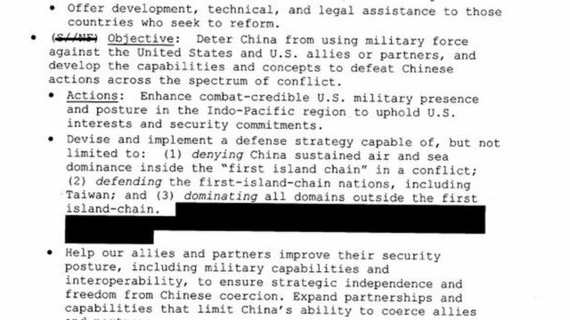
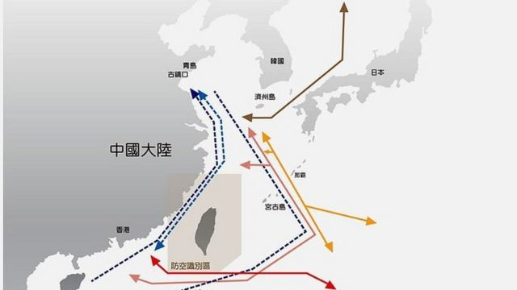
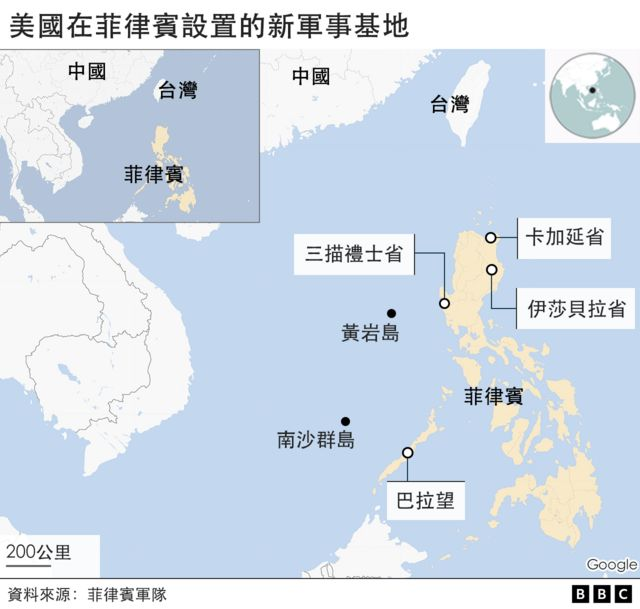
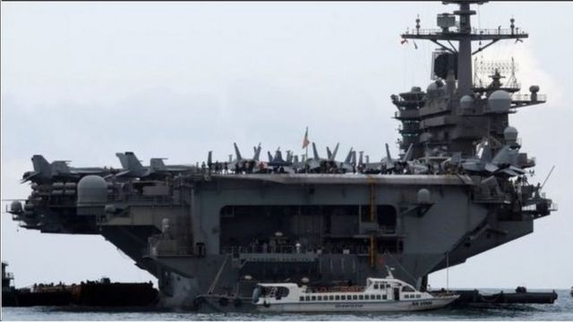
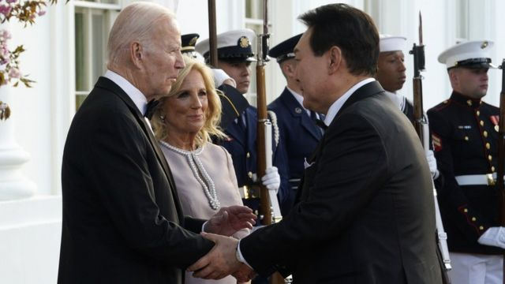

# [World] 第一岛链：拜登重新串连亚洲盟友与中国的突围

#  第一岛链：拜登重新串连亚洲盟友与中国的突围

> 图像来源，  Reuters
>
> 图像加注文字，4月10日，中国媒体播报“山东号”航母在台湾附近巡逻的画面。

**美国总统拜登（Joe Biden）上台后持续美国在印太地区的军事部署，以“结盟”各国为其外交主战略。其中，在西太平洋的“第一岛链”与菲律宾，日本，韩国及台湾等盟友的军事合作，近日持续受到全球关注。**

舆论关心的是，拜登能否成功串连第一岛链，吓阻北京在台海发动战争。而对中国来说，解放军如何突破第一岛链的封锁，在区域间与美国抗衡是现在军事部署的重要核心。

在美国多年来提倡“岛链战略”用以牵制北京的美国海军战争学院海洋策略教授詹姆斯·霍尔姆斯（James R. Holmes）接受BBC中文采访时称，现在美军部署的的情况类似于冷战初期的态势。

他解释，当时西方的政治和军事领导人利用岛屿地理、盟友关系和军事技术的结合来阻碍共产主义在亚洲沿海南北向的或近海和西太平洋之间东西向的活动，而现在“回到了海上战略领域的未来”。

他个人同意以“威慑”（deterrance）作为美国在第一岛链的战术： “ 无人愿意战争，但我们（美国）基本上只是希望北京按照大家都同意的游戏规则玩国际外交游戏。 ”

> 图像来源，  White House
>
> 图像加注文字，2021年白宫解密文件显示美国的第一岛链战略部署。

台湾智库“国防安全研究院”研究员苏紫云则认为，最近美国在菲律宾新增的四个可进驻基地分别面向南海和台湾，在距离台湾最近的巴斯可岛(Basco)，菲律宾陆战队配置了印度提供的布拉莫斯(BrahMos)超音速反鉴飞弹，搭配美国的海马斯炮兵火箭。若战争爆发，可与台湾的雄风飞弹封锁巴士海峡阻绝解放军进入台湾东岸。苏紫云告诉记者说，说到底“第一岛链议题，核心是中共由陆权走向海权，其实是威权与民主两种体制之竞争”。

##  “第一岛链”战略

所谓“第一岛链” （The First Island Chain）即从北太平洋千岛群岛开始，向南经日本，台湾，菲律宾到加里曼丹岛等在西太平洋的岛屿。1950年代朝鲜战争爆发，后来担任美国国务卿的杜勒斯在1951年提出在海上遏制共产主义苏联和中国的岛链，被视为这一战略的开端。

但是，当下中国的军事力量早不可同日而语， 美国能否连结盟友，借此遏阻解放军往印太区域的移动？

霍尔姆斯认为，太平洋上各大岛屿连结的岛链，提供了美国及盟友绝佳的战略地理空间以抵御中国解放军往太平洋移动。

> 图像来源，  TAIWAN MINISTRY OF NATIONAL DEFENSE
>
> 图像加注文字，朝鲜战争爆发后，美国将军麦克阿瑟曾把在第一岛链中间的台湾岛比作在遏制共产主义战略中“不沉的航空母舰”。

但解放军的军力持续增强，中国航母“山东号”最近甚至穿越了第一岛链，接近美军陆战队驻点的关岛周遭海域。因此，美国如何能够串连相关盟友，牵制解放军在太平洋上的军事扩张成为主要问题。

霍尔姆斯又说，美军在1991年菲律宾皮纳图博火山（Pinatubo Volcano）爆发后撤离基地，30年后“重返”菲律宾，使得美军开始接近南海“灰色地带”的冲突区域，增强美军支持马尼拉以及该地区潜在的其他军事伙伴的能力，“特别是越南”。此外，在岛链北端，与美军合作紧密的日本自卫队正加强在冲绳群岛的防御工作。譬如，美国的海军陆战队正在部署能够沿岛链移动的沿海军团，而这些部队配备了传感器和反舰防空武器：“你可以说自卫队是站岗的哨兵，而美国海军陆战队是机动部队，可以在人民解放军试图突围时支撑沿线的薄弱环节。”

美国军方人士对于通过强化第一岛链抵御中国的信心，是以拜登在重新连结战略伙伴的工作为背景。

今年4月，马尼拉同意开放四个新据点给美军使用，引发国际关注及北京强烈抗议。4月底，拜登与韩国总统尹锡悦在华府达成协议，并首次同意开放美国核潜艇部署在韩国，这是1983年以来的第一次，但也引发中国外交部公开批评美国制造区域紧张。

有分析称，美韩协议除了应对朝鲜的核威胁之外，也剑指北京。加以日韩领袖正在首尔碰面，双方会前表示，盼望两国过去不够好的外交关系能够“破冰”，加深在印太区域的军事外交合作等。许多分析因此认为，这些都能证实美国正在串连第一岛链各国。

苏紫云告诉BBC，台湾周边一年有175万架民航机通过、欧洲- 东北亚海运占全球26%，印太海运占全球60%。此外，日本92%及韩国65%能源需经过台海与南海：“因此，菲律宾与美国的合作补上了第一岛链的完整防线，成为新月形的围堵网。”

> 图像来源，  EPA
>
> 图像加注文字，中国部署的东风-21D弹道导弹。五角大楼认为中国通过部署导弹和太空侦测系统加强了第一岛链内的反介入能力

##  台湾的角色

处在岛链中心点的台湾，当年冷战期间麦克阿瑟当年称为岛链上“不沉的航空母舰”。哈德森智库（Hudson Institute）非常驻资深研究员长尾贤（Satoro Nagao）告诉BBC，美国最近在岛链的种种部署及串连，重点其实都是在遏止解放军在台湾东部，亦即西太平洋一带部署军队。

长尾贤解释，台湾军方在东部的弹药和其他军武的部署非常短缺，“如果解放军能在台湾太平洋一侧长期部署兵力下来，那么台湾民众将失去防卫信心。北京也有操控台湾舆论的可能性，譬如操纵台湾对于解放军部署在一侧的恐惧，中国就可以和平吞并台湾。”

此外，以防御角度来看，台湾自己如何不成为岛链破口，也是关键。

台湾海军新江舰前舰长吕礼诗告诉记者，当务之急是美、日、台、菲间如何透过“共通作业能力”（interoperability），建立“共同作战图像”（Common Operational Picture, COP）或“共同战术图像”（Common Tactical Picture, CTP），这是阻抗解放军海空战力向第二岛链投射的重中之重。

吕礼诗向BBC分析，从日本强化西南诸岛的防空及制海能力、台湾雄二及雄三增程型飞弹的投产，及岸置鱼叉飞弹的采购所建构的“刺猬战术”（Hedgehog Defense Tactics），加上菲律宾与美国达成4座菲国军事基地提供美军使用的协议，显示第一岛链的“群岛防御”（archipelagic defense）战略已逐渐成形。

长尾贤也呼应了相似说法，他强调，岛链盟国要遏阻解放军对台发动战争，如何多方位分配中国的注意力和军事资源是重要关键。他以上个月美国在印度卡莱昆达空军基地（Kalaikunda）与印度进行联合演习为例，表示这是一个非常重要的演习，但少有人意识到这与第一岛链的战略关系。

他分析，二战期间，美国在卡莱昆达空军基地部署了B-29轰炸机轰炸在中国的日军，现在这个基地同样能够瞄准中国，只是换了能够发射带有常规弹头的远程巡航导弹，被称为美国现在最强的B-1B轰炸机首次在与印度联合演习中出现：“美国将B-1B带到印度，或是向中国发出信息：美军可以从中国南部发动攻击， 那么，解放军可以专心的在台湾打战吗？”

##  北京的战略

> 图像加注文字，今年新增的四个对美军开放的菲律宾军事基地

美国智库“战略与预算评估中心”（Center for Strategic and Budgetary Assessments, CSBA）资深研究员Toshi Yoshihara 在一篇研究报告中指出，“第一岛链”的存在确实影响了中国军力。因为其不仅激发了北京对于被此战略包围圈的恐惧，也凸显了台湾地缘战略价值，制定了中国在海上重要的军事战略。

他认为，这会继续推动北京在东亚海域的军事动作，对该区域政治产生很持久影响。

换句话说，北京当局对于“第一岛链”发生的种种变化一直都严阵以待，该如何突破第一岛链的结盟，或结盟之后造成的紧压，一直是解放军现在的当务之急。上个月，解放军在台湾东部外海的一连串演习，包含航母山东号穿越第一岛链，往中太平洋美军军事要塞关岛迈进，便带有抗衡美国在第一岛链种种动作的味道。

根据中国官媒央视军事 新闻网报导  ，山东号航空母舰编队，连日来赴台湾以东海空域开展远海战备训练。这是山东舰航母编队首次成体系、成规模远赴西太平洋海域。

央视称，行动显示解放军有足够能力冲破美国与其盟友为封锁解放军而构筑的封锁线。

> 图像来源，  Reuters
>
> 图像加注文字，美国印太司令部最近向美国国会提交了太平洋威慑计划，其中的核心建议是在第一岛链内加强对中国的常规威慑。(图为美国罗斯福号航母)

台湾淡江大学战略研究所助理教授揭仲去年接受美国媒体采访时称，解放军的“拒止作战”能力持续提升，一方面开发了鹰击-21、东风-100与东风-17等所谓高超音速滑翔载具，让对手难以拦截。此外，中国卫星系统也不断改善，解放军在第一岛链周边越来越具备24小时不间断的追踪侦查与监视能力，对进入第一岛链范围内的美国海空军都能造成威胁。

新加坡南洋理工大学海洋军事研究员许瑞麟则向美媒分析称，目前解放军的055型舰具有非常全面的防御和进攻的能力，并备有100多个垂直发射系统单元，能够携带大量的防御和进攻导弹系统，让解放军拥有更自主的执行能力。他表示，解放军海军对于台海作战充满信心，认为可以在第一岛链内的冲突中占上风，所以正研究第一岛链到第二岛链之间的军事部署。

不过，苏紫云认为，解放军的航舰及水面舰在战时还是很难突破第一岛链。原因是宫古海峡目前由台日掌控、巴士海峡则由台菲掌控。他向BBC强调，解放军的水下舰队则有较高机会穿越突破第一岛链，接近关岛实施打击。

> 图像来源，  EPA
>
> 图像加注文字，美国总统拜登和韩国总统尹锡悦达成一项新协议。

霍尔姆斯教授则认为，如果美国在琉球群岛和菲律宾群岛沿线部署地面部队，并在机动部队的支持下在岛链岛屿之间的海峡及其周围保留潜艇、小型水面巡逻艇、飞机和雷区，那么这些部署确实会给解放军海军和空军带来很大阻碍。

“目前，我还没见到中国已解决了试图强行通过那些海峡所涉及的种种棘手问题的迹象。”他说。

不过，也有评论称美国正在将自己的兵力移出第一岛链，比如将部署在日本冲绳的约5千名美国陆战队移到关岛。有批评者认为如果战事发生，美国在第一岛链不会动员到自己的兵力。

霍尔姆斯向BBC强调，美国领导人必须仔细调整他们的行动，并面对任何军事行动发出的信息小心以待。他说自己能理解将将海军陆战队从冲绳转移到关岛的理由，但美国必须做一些事情来消除“如果情况变糟，我们将准备撤军”的这种印象。 他认为，如果让美国盟友有这种印象，后者很可能会松绑与美国的连结，转而寻求与强势的中国达成协议。

