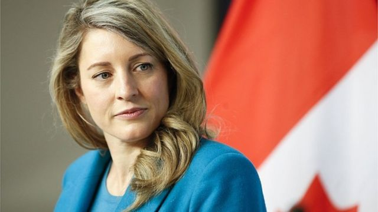

# [World] 庄文浩事件：加拿大与中国互相驱逐领事

#  庄文浩事件：加拿大与中国互相驱逐领事

> 图像来源，  AFP
>
> 图像加注文字，乔美兰强调，驱逐中国外交官的决定已经过慎重考虑。

**加拿大与中国就联邦议会众议员庄文浩（Michael Chong）在港家属怀疑被骚扰事件互相驱逐外交人员。**

加拿大《环球邮报》（The Globe and Mail）上周援引加方情报文件称，中国外交人员在庄文浩发起有关新疆人权状况的议案后，遭中方针对，并搜集其在港家属情报，以便实施打击，阻吓其“反华立场”。

加拿大外长乔美兰（Mélanie Joly）星期一（5月8日）宣布，将被指与此事有关的中国驻加拿大多伦多总领事馆领事赵巍列为“不受欢迎人物”（persona non grata），并将其驱逐出境。
 中国外交部继而在星期二（9日）午间宣布  将加拿大驻上海总领馆领事甄逸慧（Jennifer Lynn Lalonde）同样列为“不受欢迎的人”，并限令她在5月13日前离境。

北京称加方驱逐赵巍属“无理行径”，“已向加方提出严正交涉和强烈抗议”。加拿大外长乔美兰则称，加方“经过慎重考虑所有相关因素”后，才作出驱逐中方外交官的决定。她重申加拿大不会接受其内政“遭到任何形式的外国干预”。

稍早前，中国驻加拿大大使馆发表声明称，渥太华是“基于个别政客和媒体所谓‘中国干涉加内政’的谎言”驱逐其领事，“这严重违反国际法和国际关系基本准则，严重违反中加双边相关协定，蓄意破坏中加关系”，“严重损害中国外交领事人员合法权益”。

中国驻多伦多总领馆也分别发表声明反驳渥太华政府称：“加方无中生有、以己度人，诬称我馆领事官员干涉加内政……是赤裸裸政治挑衅，注定不得人心。”

据中国驻加拿大多伦多总领事馆官网，赵巍是领馆政新领侨处的政治与新闻负责人。《环球邮报》报道称，赵巍被委派负责搜集有关庄文浩的情报。

另据网上资料显示，甄逸慧为加拿大驻上海总领事馆政治、经济和公共事务领事。中国外交部公告并未交代为何选择驱逐甄逸慧。

乔美兰在Twitter上转发其书面声明称：“我们依然坚信，捍卫我们的民主至关重要。”

##  谁是庄文浩？

> 图像来源，  Toronto Star via Getty Images
>
> 图像加注文字，庄文浩目前是在野加拿大保守党的影子外相。

庄文浩1971年生于安大略省溫莎市（Windsor, Ontario），父亲于1952年从香港移民加拿大，靠勤工苦读成为医生，曾任职护士的母亲则是来自荷兰的移民。

庄文浩加入了加拿大保守党，2004年首次当选联邦议会众议院（下议院）议员，曾在总理哈珀（Stephen Harper）任内担任部长。他目前是保守党影子内阁外长，也是众议院加中关系特别委员会副主席。
 2021年2月  ，加拿大下议院投票以压倒性多数通过一项议案称，中国对待维吾尔少数民族的手段是“种族灭绝”，庄文浩是议案发起人。 同年3月  ，加拿大联同英美等国就新疆问题制裁中国，中国外交部宣布反制措施，制裁庄文浩等人。
 根据中方制裁令  ，庄文浩被禁止入境中国大陆及香港、澳门特区，禁止中国公民及机构同庄文浩交易或往来。庄文浩其后在BBC中文的专访中说：“我视（中共的）制裁为一个荣誉的标记。”
 加拿大《环球邮报》5月1日报道  ，根据CSIS的一份情报以及知情人士说法，庄文浩在发起新疆议案后即被中国当局针对，其目的是要透过对付庄文浩做到“杀一儆百”，阻吓他人采取反华立场。

报告也指出，中国视身为“五眼联盟”成员的加拿大为首要情报目标之一。

庄文浩4日表示，CSIS已向他通报情况。他在一份声明中说：“与许多加拿大人一样，我在海外有亲戚。（中国）针对这些亲属得以恐吓和胁迫本土加拿大人，是严重的国家威胁。”

相关报道和庄文浩本人都没有透露更多细节。

特鲁多称他是在《环球邮报》报道发表后才得悉事件。他说：“CSIS认定这事情没有必要向上汇报，因为它还不够严重。”
 今年3月  ，特鲁多宣布对中国“干预加拿大近届大选”展开独立调查。中国否认对选举有任何干预，称相关的指控“完全是子虚乌有，无稽之谈”。
 同样在3月  ，加拿大皇家骑警证实在调查魁北克蒙特利尔（Montreal, Quebec）两处疑似中国“海外警察局”。中方否认有关设施为“海外警察局”，称实际上是“服务中心”。

